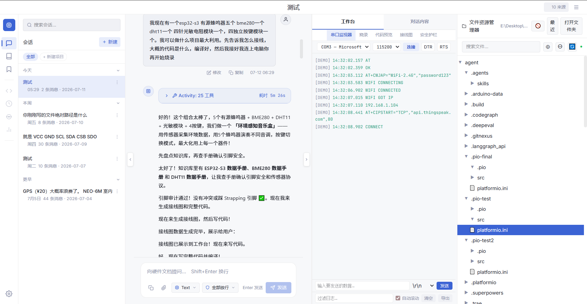
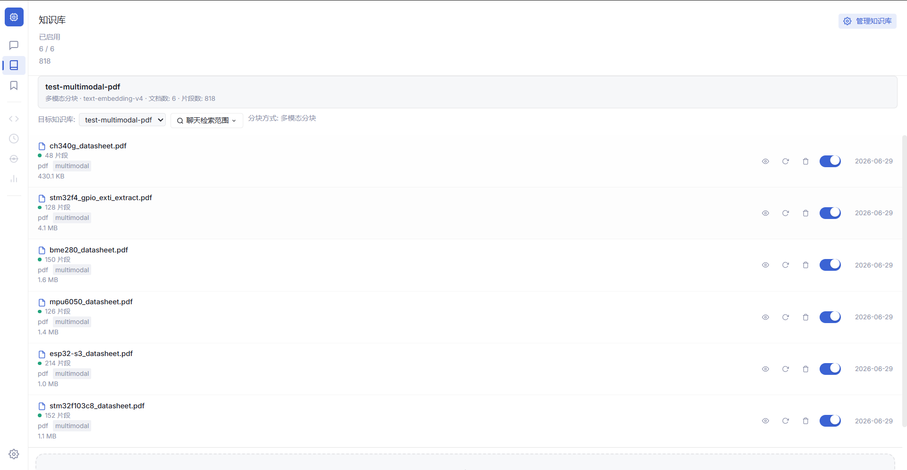
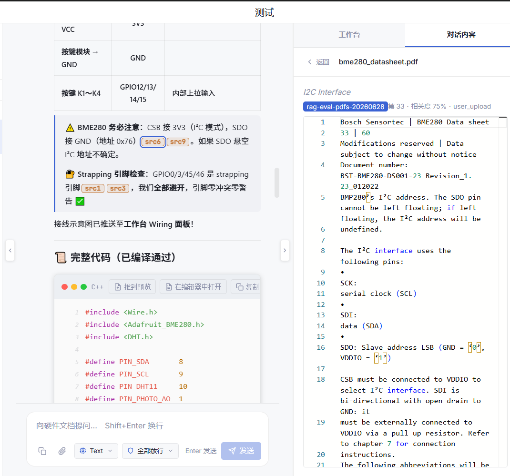

# Hardware RAG Agent

> 面向嵌入式开发者的硬件知识库 AI Agent：查手册、写驱动、审接线、看串口，全部在一个屏幕里完成。



---

## 嵌入式开发的痛点

做过硬件开发的都知道这种割裂感：

- **查手册要切浏览器** —— 几百页 PDF 里找 GPIO 速率、I2C 时序，翻半天找不到关键参数。
- **写代码要切 IDE，看日志要切串口监视器** —— 来回切换打断心流，Agent 给的建议也没法和实时日志对照。
- **AI 回答没来源** —— 不知道这是手册原文还是模型瞎编，出了问题不敢直接用到板上。

**Hardware RAG Agent 把它们放进同一个屏幕**：左侧对话，右侧工作台（串口 / 编译烧录 / 代码预览 / 接线图 / 安全检查），回答强制标注 `[srcN]` 来源页码。

---

## 核心亮点

### 1. 单屏集成工作台


左侧是 Agent 对话流，右侧工作台内置 5 个 tab：

- **串口监视**：实时 WebSocket 透传，ANSI 颜色解析，8 种波特率。
- **编译烧录**：PlatformIO 构建 / 烧录 SSE 流式输出。
- **代码预览**：Agent 生成的驱动代码一键推到编辑器。
- **接线图**：SVG 原理图，支持缩放拖拽和 BOM 表。
- **安全检查**：引脚冲突、Strapping 误用、上拉电阻风险审计。

连接受支持的开发板后，可以一边看回答，一边看右侧串口输出。串口连接和日志接收已在真实开发板上验证；烧录流程尚未完成实机验收，详见[测试说明](docs/testing.md)。

### 2. 知识库自主管理 + 检索范围控制



不只能查，还能自己往里塞东西、删东西、挑分块策略：

- **多知识库独立管理**：建多个 KB，每个独立配置 embedding 模型和分块策略。
- **上传 / 删除文件**：支持 PDF / DOCX / MD / TXT，上传时可选 `hybrid` / `agent` / `multimodal` 三种分块方式。
- **分块策略可选**：hybrid（规则切分，快）、agent（语义切分，准）、multimodal（Vision-LLM 看图识章，最强）。
- **分块详情查看**：上传完后展开就能看每个 chunk 的具体内容、页码、chunk_index，确认表格/图片/引脚定义是否被正确切出来。
- **检索范围限定**：对话时指定 `doc_filter`，让 Agent 只在某份手册里查，避免跨文档污染、控制 token、减少大模型幻觉。

不靠"全量检索 + 祈祷相关结果排第一"，而是把检索范围的控制权交给用户。

### 3. src 来源引用真实性



RAG 回答里的 `[src1]`、`[src2]` 不是装饰，每个角标都对应知识库里的真实原文片段：

- 点击角标展开 source 卡片，显示原文、所属文档、页码。
- 回答末尾汇总所有来源，优先展示 cross-encoder 重排后的高相关片段。
- 没有匹配到手册的问题，模型会明确说 "我不确定"，而不是硬编。

### 4. Vision-LLM 多模态 PDF 切分

上传芯片手册 PDF 后，系统会把每页渲染成图片让 Vision-LLM「看图识章」，再从原始 PDF 抽取真实文本做 embedding：

- **2 阶段分析**：低分辨率提取目录结构，高分辨率分析章节详情。
- **2 轮投票**：多模型投票决定章节边界，避免一刀切把表格或引脚图拦腰截断。
- **4 级 fallback**：Vision-LLM 不可用时自动降级到 PyMuPDF / OCR / 纯文本。
- 跨页表格合并、图片描述 chunk、章节边界精确到页码。

这样引脚定义图、寄存器表、时序图都能被检索到，而不是只能搜到正文文字。

### 5. 混合检索链路

检索不是简单的向量相似度，而是多层融合的工业级链路：

1. **BM25 关键词召回** + **Chroma 向量召回** 双路并行。
2. **RRF 融合排序**，BM25-only 的候选会被惩罚，避免假高分。
3. **bge-reranker cross-encoder 重排**，把真正相关的片段顶上来。
4. **ParentDocument 检索**：用小 chunk 做精准召回，用大 chunk 喂给 LLM 做完整上下文。

配合第 3 点的 `doc_filter` 范围限定，检索既准又不超 token。

### 6. SVG 接线图 + 引脚审计

对 Agent 说 "画一张 ESP32-S3 接 BME280 的接线图"，它会自动生成 KiCad/Fritzing 风格的 SVG：

- MCU 在左，外设在右，电源/GND 自动着色。
- 并查集合并电气等效节点，上拉电阻自动绘制。
- 前端支持缩放、拖拽、右侧 BOM 表。

引脚审计覆盖 ESP32 全系列 + STM32 F4/F7/H7，检测引脚冲突、Strapping 误用、5V/3.3V 混接风险。

### 7. 硬件工作台

工作台的软件功能已经接入，真实开发板上的串口连接、日志接收和断开已验证。固件烧录及烧录后的自动重连仍需实机验收。

Agent 不只会写代码，还能真的和板子交互：

- **串口扫描**：代码通过 pyserial 枚举可用串口。
- **实时日志**：代码提供 WebSocket 串口转发和 ANSI 颜色解析。
- **编译烧录**：代码通过 PlatformIO 构建 / 烧录，并用 SSE 返回进度。

软件链路覆盖提问 → 检索手册 → 生成驱动代码 → 编译 → 烧录 → 查看串口日志；目前只完成其中串口连接、日志接收和断开的实机检查，整条链路尚未实机验收。

---

## 快速开始

需要 Python 3.10+、Node.js 20+。以下命令会把 Python 依赖装进项目自己的隔离环境，不会弄乱电脑里其他 Python 项目。

```powershell
# 后端
cd backend
python -m venv .venv
.\.venv\Scripts\python -m pip install -r requirements.txt
.\.venv\Scripts\python main.py --web --port 58080

# 前端（新终端）
cd frontend
npm ci
npx vite --port 5173
```

macOS / Linux 请把 `.\.venv\Scripts\python` 换成 `./.venv/bin/python`。

浏览器打开 http://127.0.0.1:5173，Vite 会自动把 `/api/*` 代理到后端的 58080。
首次使用请在界面中创建知识库并上传自己的芯片手册 PDF。预构建的内置知识库尚未发布，不是启动必需项。

---

## 配置说明

编辑 `backend/.env`：

| 字段 | 说明 | 示例 |
|------|------|------|
| `LLM_API_KEY` | 大模型 API Key | `sk-xxx` |
| `LLM_BASE_URL` | 大模型 Base URL | `https://api.openai.com/v1` |
| `LLM_MODEL` | 模型名 | `gpt-4o-mini` |
| `EMBEDDING_API_KEY` | Embedding API Key | `sk-xxx` |
| `EMBEDDING_BASE_URL` | Embedding Base URL | `https://api.openai.com/v1` |
| `EMBEDDING_MODEL` | Embedding 模型 | `text-embedding-3-small` |
| `TAVILY_API_KEY` | Tavily API Key（web_search 工具，可选） | `tvly-xxx` |
| `CHROMA_MODE` | ChromaDB 模式 | `persistent` |
| `OCR_ENABLED` | 是否启用 OCR（需额外安装依赖） | `false` |

> 提示：可参考 `backend/.env.example` 了解所有可配置项。

---

## 首次使用提示

- 首次编译 ESP32 固件时 PlatformIO 会自动下载工具链（约 200-500MB，需 5-10 分钟）。
- 首次启动后端时后台会自动下载 Reranker 模型（约 280MB，用于提升检索质量）。国内用户可设置 `HF_ENDPOINT=https://hf-mirror.com` 加速。

---

## Agent 部署指南

> 如果你是 AI Agent（被用户要求帮忙部署本项目），请按以下步骤操作。每一步都标注了预计耗时和注意事项。

### 步骤 1：检查环境

```bash
python --version   # 需要 3.10+，低于则提示用户升级
node --version     # 需要 20+，低于则提示用户升级
```

### 步骤 2：克隆项目

```bash
git clone https://github.com/zxyzx0430/Hardware-RAG-Agent.git
cd Hardware-RAG-Agent
```

### 步骤 3：安装后端依赖

```bash
cd backend
python -m venv .venv
# Windows
.\.venv\Scripts\python -m pip install -r requirements.txt
# macOS / Linux
# ./.venv/bin/python -m pip install -r requirements.txt
```

### 步骤 4：启动服务

```bash
# 终端 1：后端（在 backend/ 目录下）
# Windows
.\.venv\Scripts\python main.py --web --port 58080
# macOS / Linux
# ./.venv/bin/python main.py --web --port 58080

# 终端 2：前端（在项目根目录下）
cd frontend
npm ci
npx vite --port 5173
```

### 步骤 5：验证

打开 http://127.0.0.1:5173 ，能看到界面即部署成功。API Key 在前端设置页配置，无需手动编辑 .env。

### 部署成功后，Agent 请向用户转达以下提示

> 📢 以下内容请 Agent 在部署完成后，用大白话告诉用户：

- **首次提问会慢一点**：后端正在后台下载 Reranker 模型（280MB），下完后检索质量会更好，耐心等第一次就好。
- **首次点"编译"会卡 5-10 分钟**：PlatformIO 在下载 ESP32 工具链（200-500MB），这是正常的，下完后续编译就快了。
- **硬件工作台需要插板子**：烧录和串口监视需要 ESP32 通过 USB 连到电脑，没插板子这两个功能用不了。
- **API Key 在设置页可以换**：如果默认 Key 不够用，前端右上角设置页可以添加自己的模型供应商。
- **知识库可以自己加**：左侧知识库页面上传 PDF 就能加自己的手册，支持多模态切分（图+表+文字）。

---

## 贡献指南

### 开发环境

```powershell
# Windows 一键启动
.\scripts\dev.ps1

# 或手动
cd backend  && python main.py --web --port 58080
cd frontend && npx vite --port 5173
```

### 测试命令

完整测试步骤、保留的黄金样例、生成结果的去向和最近一次有记录的测试结果见[测试说明](docs/testing.md)。

```bash
# 后端测试
cd backend
pytest

# 前端测试、静态检查与生产构建
cd frontend
npm run test
npm run lint
npm run build
```

### Commit 规范

使用 Conventional Commits：

```
<type>(<scope>): <一句话描述>
```

常用 type：`feat`、`fix`、`docs`、`refactor`、`style`、`build`。
常用 scope：`frontend`、`backend`、`docs`、`scripts`、`build`。

---

## License

[Apache License 2.0](LICENSE) with [Commons Clause](LICENSE).

- 允许自由修改、研究、个人或非商业场景使用。
- 提供专利授权保护。
- **禁止**将本软件或其衍生品作为商品销售，或作为商业云服务对外收费。

完整协议文本见 [LICENSE](LICENSE) 文件。
