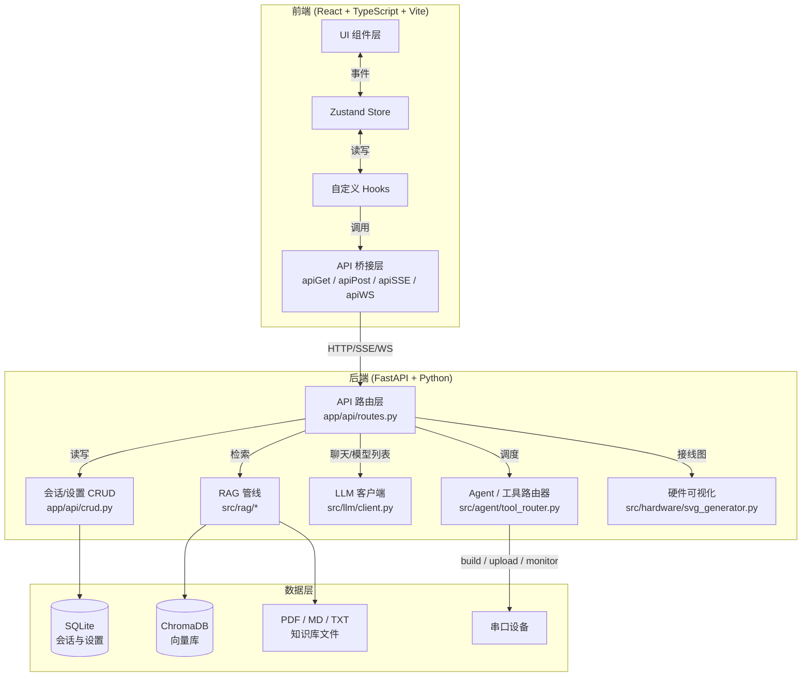
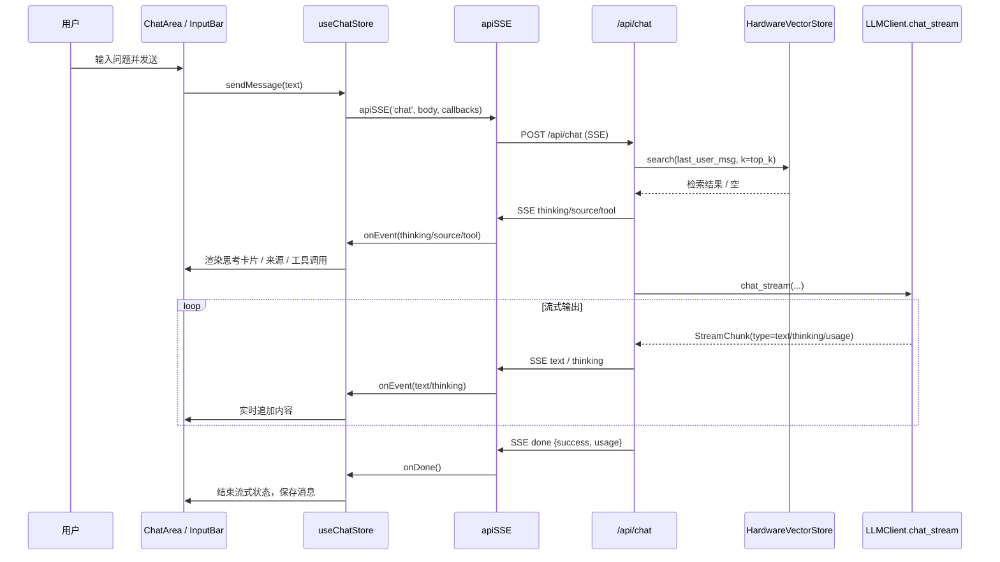
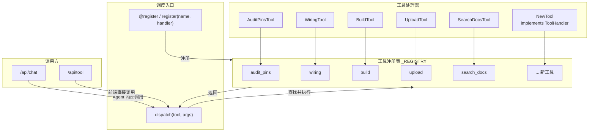
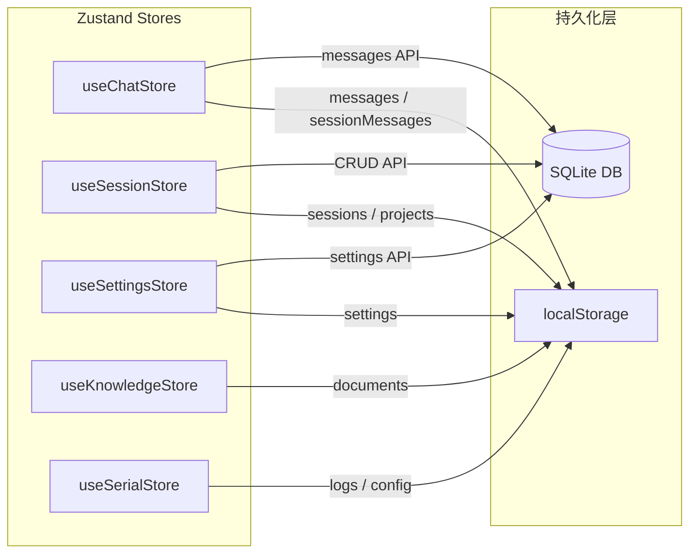

# Hardware RAG Agent 架构设计

本文档用 Mermaid 图表描述系统整体结构、核心数据流与可扩展点。阅读前建议先了解 [api-contract.md](./api-contract.md) 中的接口约定。

---

## 1. 前后端整体架构



### 关键说明

- **前端**：React 19 + TypeScript + Vite + Tailwind CSS 4，状态管理使用 Zustand，API 通信封装在 `src/api/client.ts`。
- **后端**：FastAPI 应用工厂位于 `backend/app/main.py`，业务路由集中在 `backend/app/api/routes.py`。
- **数据层**：SQLite 用于会话、消息和设置持久化；ChromaDB 用于知识库向量检索；PDF/MD/TXT 文件保存在 `data/uploads/`。
- **硬件层**：串口扫描、编译、烧录、监视器通过工具路由器统一调度。

---

## 2. 聊天 SSE 数据流



### 关键说明

- `/api/chat` 是 SSE 流式接口，返回的事件类型包括 `thinking`、`source`、`tool`、`text`、`done`、`error`。
- RAG 检索在 LLM 调用之前执行，检索结果注入到 `system_prompt` 中。
- `useChatStore` 在 `sendMessage` 时用闭包捕获 `requestSessionId`，防止用户在流式过程中切换会话导致内容写入错误会话。
- `apiSSE` 使用外部传入的 `AbortController`，确保用户主动停止流式时能真正中断请求。

---

## 3. 硬件工作台数据流

硬件工作台的核心流程：**Preview（代码预览）→ Diagnose（代码诊断）→ Wiring（接线图）→ Flash（编译烧录）→ Serial（串口监视）**。

```mermaid
flowchart LR
    subgraph Workbench["硬件工作台 WorkbenchPanel"]
        Preview["PreviewPane<br/>代码编辑器"]
        Diagnose["DiagnosePane<br/>代码诊断"]
        Wiring["WiringPane<br/>接线图"]
        Flash["FlashPane<br/>编译/烧录"]
        Serial["SerialPane<br/>串口监视器"]
        Audit["SafetyAudit<br/>引脚审计"]
    end

    Preview -->|推送代码| Flash
    Preview -->|/api/diagnose| Diagnose
    Diagnose -->|输出引脚分配| Wiring
    Diagnose -->|输出引脚分配| Audit
    Audit -->|/api/audit_pins| AuditResult["冲突/警告"]
    Wiring -->|/api/wiring| SVG["SVG + BOM"]
    Flash -->|/api/build| BuildLog["编译日志 SSE"]
    Flash -->|/api/upload| FlashLog["烧录日志 SSE"]
    Flash -->|成功后| Serial
    Serial -->|WS /api/monitor/{port}| SerialData["实时串口数据"]
```

### 关键说明

- **Preview**：提供代码编辑区，支持"推送到烧录"，将当前代码传递到 Flash 面板。
- **Diagnose**：调用 `/api/diagnose`，对代码做 GPIO 安全、编译预检、引脚冲突、内存与 Flash 兼容性五类静态扫描。
- **Wiring**：调用 `/api/wiring`，由 `src/hardware/svg_generator.py` 生成接线图 SVG 和 BOM 列表。
- **Flash**：编译调用 `/api/build`（SSE），烧录调用 `/api/upload`（SSE），支持实时进度和日志。
- **Serial**：通过 WebSocket `/api/monitor/{port}?baud=` 实时接收串口数据，支持发送、过滤、导出。
- **SafetyAudit**：调用 `/api/audit_pins` 检查引脚分配冲突和 Strapping 风险。

---

## 4. 工具路由器可扩展结构



### 关键说明

- **协议定义**：`ToolHandler` 协议要求实现 `name: str` 和 `async def run(self, args: dict) -> dict`。
- **注册方式**：支持三种注册方式：
  - `@register`：以类默认 `name` 注册。
  - `@register("custom_name")`：指定名称注册。
  - `register("name", handler)`：函数式注册。
- **调度入口**：`dispatch(tool, args)` 统一负责查找工具、执行、计算耗时并返回标准格式 `{output, duration_ms}`。
- **扩展方式**：新增工具只需：
  1. 实现 `ToolHandler` 协议；
  2. 使用 `@register` 注册；
  3. 在 `docs/api-contract.md` 中更新 `/api/tool` 支持的工具列表。
- **当前内置工具**：`audit_pins`、`wiring`、`build`、`upload`、`search_docs`。其中 `build`、`upload`、`monitor` 在 Phase 1 为 stub 实现，后续会接入真实硬件操作。

---

## 5. 数据持久化架构



### 关键说明

- 前端优先使用 `localStorage` 做本地缓存，保证刷新页面后状态不丢失。
- 会话、消息、设置通过 `/api/sessions*`、`/api/settings*` 等 CRUD 接口与后端 SQLite 同步。
- `useChatStore` 是消息的唯一数据源，`useSessionStore` 不再重复存储 `sessionMessages`。
