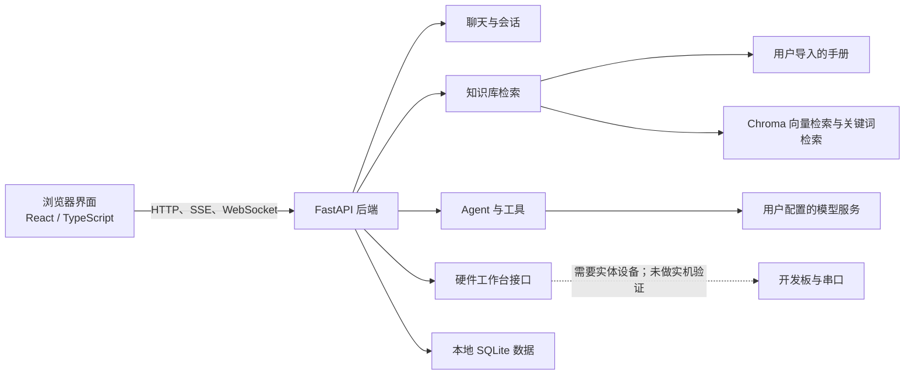

# 项目架构总览

> 更新日期：2026-10-03。此页说明当前代码的主要组成，不是开发计划。

## 项目做什么

这是一个在用户电脑本地运行的硬件知识助手。网页端负责提问和工作台操作；后端负责检索芯片手册、组织 Agent 工具、保存会话，并提供硬件工作台接口。

## 主要组成

```mermaid
flowchart LR
  U[浏览器界面<br/>React / TypeScript] -->|HTTP、SSE、WebSocket| API[FastAPI 后端]
  API --> CHAT[聊天与会话]
  API --> RAG[知识库检索]
  API --> AGENT[Agent 与工具]
  API --> HW[硬件工作台接口]
  RAG --> DOCS[用户导入的手册]
  RAG --> VDB[Chroma 向量检索与关键词检索]
  API --> DB[本地 SQLite 数据]
  AGENT --> MODEL[用户配置的模型服务]
  HW -.需要实体设备；未做实机验证.-> DEVICE[开发板与串口]
```

开发时网页由 Vite 提供；Vite 将 `/api` 请求转发到本机 FastAPI 服务。RAG 检索结合向量召回、关键词召回和重排，并在回答中提供来源。

## 代码从哪里看

| 目录 | 内容 |
| --- | --- |
| `backend/app/api/` | HTTP 与 WebSocket 路由，包括聊天、知识库、硬件和构建等接口 |
| `backend/src/agent/` | Agent 执行流程与工具 |
| `backend/src/skills/` | 技能格式、仓储、固定 GitHub SHA 导入与兼容诊断 |
| `backend/src/mcp/` | 本机 stdio 协议与仅驻留内存的子进程管理 |
| `backend/src/hardware/` | 编译、烧录等硬件工具 |
| `backend/app/db/` | 本地数据访问 |
| `frontend/src/` | React 页面、组件、状态管理和 API 调用 |
| `backend/tests/` | 后端自动化测试与 RAG 评测样例 |
| `scripts/` | 手动索引、检查和评测辅助工具 |
| `data/` | 本地知识库、数据库和生成的评测结果；大多数内容不属于公开源码 |

## 主要数据流

1. 用户在网页提问，后端读取会话和配置。
2. 检索流程从用户导入的手册中找相关片段，并把来源带回回答。
3. 需要工具时，Agent 调用后端工具；网页通过 SSE 显示进度和结果。
4. 硬件工作台通过 HTTP、WebSocket 或 SSE 调用串口与构建接口。
5. 会话等应用数据保存在本地数据库；向量索引保存在本机数据目录。

手动记忆保存到本地设置，普通聊天和 Agent 使用同一请求快照。只读 Skills 按请求发现元数据、加载说明和资料，正文不进入客户端轨迹；只读工具白名单在 Router 再次检查。普通 Agent 的 MCP 工具快照绑定实际子进程连接；HITL 按调用 ID、参数和实例逐一确认，Router 消费一次性授权。任务局部上下文通过 ContextVar 传递，不把 client 或授权对象保存进 checkpoint。MCP 配置/确认快照随后端重启消失，旧请求不能靠客户端载荷恢复授权。

## 验证范围

代码功能、自动化和真实服务检查的最近记录见[测试说明](../testing.md)。组件测试不代替实际浏览器点击，安全 stdio 样例不代替任意第三方 MCP 兼容性或系统沙箱验收。

COM5 开发板的串口连接、日志接收和正常断开已验证；烧录及烧录后自动重连仍未实机验收。界面截图、模拟数据和软件测试都不等于硬件验收。

## 正式文档

- [用户安装与使用](../../README.md)
- [项目现状](../completed.md)
- [测试说明](../testing.md)
- [API 契约](../api-contract.md)
