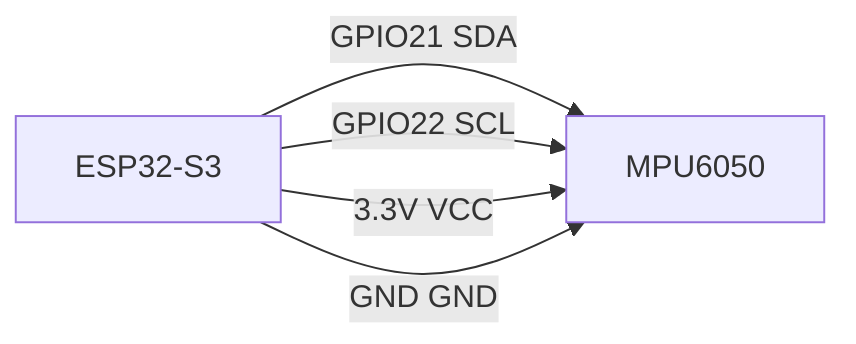

# Hardware RAG Agent — v3 详细计划

## 智能进化阶段：跑得久、社区活

> 前置条件：v2 已完成（硬件调试闭环：USB 烧录 + OTA + 结构化比对 + 踩坑检索）
> 定位：从"个人开发搭档"进化为"社区驱动的硬件 AI 平台"
> 部署：本地部署 + 社区数据共享模式
> **平台支持：继承 v2 首发 Windows-only。macOS / Linux 适配在 v3 期间评估，不阻塞功能开发。**

---

## 架构全景

```
用户电脑（本地部署）
┌──────────────────────────────────────────────────────────────────┐
│                   Hardware RAG Agent v3                          │
│                                                                  │
│  界面层  │ Web UI                                               │
│          │   - 问答界面                                          │
│          │   - 代码编辑器 + 烧录面板（v2）                        │
│          │   - 串口监视器（v2）                                   │
│          │   - 🆕 接线可视化 / 🆕 知识库覆盖率面板               │
│          │   - 🆕 项目模板选择器                                 │
│                                                                  │
│  智能层  │ LangChain ReAct Agent（新增 v3 工具）                  │
│          │   v1 工具：search / generate / review / compare / diag │
│          │   v2 工具：compile_flash / read_serial / ota / guard   │
│          │   🆕 v3 工具：                                         │
│          │   - generate_code_smart（多语言智能选择+Jinja2模板）   │
│          │   - self_heal（编译错误自愈）                           │
│          │   - scaffold_project（项目模板生成）                    │
│          │   - visualize_wiring（接线可视化）                      │
│          │   - manage_experiment（用户实验数据管理）               │
│          │   - version_rollback（代码版本回退）                    │
│                                                                  │
│  知识库  │ ChromaDB （扩展）                                     │
│          │   - 官方 datasheet（v1）                               │
│          │   - 踩坑记录（v2）                                     │
│          │   - 🆕 用户实验数据库                                  │
│          │   - 🆕 GitHub Issues 知识库                            │
│                                                                  │
│  模板层  │ 🆕 Jinja2 模板引擎（代码不靠 LLM 手写）               │
│          │   - micropython/ 模板                                  │
│          │   - arduino/ 模板                                      │
│          │   - esp-idf/ 模板                                      │
│                                                                  │
│  烧录层  │ esptool / mpremote / arduino-cli / pyserial（v2 继承） │
└──────────────────────────────────────────────────────────────────┘
```

---

## v3 核心能力

| 新能力 | 说明 | 来源 |
|--------|------|------|
| 多语言代码智能选择 | 根据需求判断用 MicroPython / Arduino C / ESP-IDF | Gemini 建议 |
| Jinja2 模板引擎 | 代码靠模板渲染，不是 LLM 从零写，编译通过率 ~95% | Gemini 建议 |
| 编译错误自愈 | 错误缓存 + 修复方案复用，从错误中学习 | 自拟 |
| 项目模板/脚手架生成 | 一句话 → 完整项目结构（含 README + BOM + 接线图） | 自拟 |
| 接线方案可视化 | ASCII + Mermaid 接线图，多模态输出 | 自拟 |
| 用户实验数据库 | 用户实测数据 > datasheet 标称，社区积累价值 | 自拟 |
| 知识库覆盖率面板 | 用户一眼看到知识库覆盖了什么 | 自拟 |
| 多板协同项目 | 不只是单芯片，是多模块组合项目 | 自拟 |
| 代码版本管理 | 每次调试迭代可追溯，支持回退 | 自拟 |
| GitHub Issue 自动入库 | Issues 自动分析→纳入知识库/错误缓存 | 自拟 |

---

## 里程碑规划

### Phase 3-A：模板驱动代码生成（核心升级）

**目标：** 用 Jinja2 模板替代 LLM 手写标准外设代码，编译通过率从 ~60% 提升到 ~95%。

#### 第 1 步：搭建模板体系

项目新增 `templates/` 目录：

```
templates/
├── micropython/
│   ├── i2c_sensor.py.jinja2          # I2C 传感器
│   │   ├── blink.py.jinja2           # GPIO 输出（点灯）
│   │   ├── button_input.py.jinja2    # GPIO 输入（按键）
│   │   ├── pwm.py.jinja2             # PWM 输出
│   │   ├── adc_read.py.jinja2        # ADC 读取
│   │   ├── wifi_connect.py.jinja2    # WiFi 连接
│   │   ├── mqtt_publish.py.jinja2    # MQTT 发布
│   │   ├── oled_display.py.jinja2    # OLED SSD1306 显示
│   │   └── deep_sleep.py.jinja2      # 低功耗
│   └── common/
│       └── boot.py.jinja2            # 启动配置
├── arduino/
│   ├── i2c_sensor.cpp.jinja2
│   ├── ota_firmware.cpp.jinja2
│   └── server_config.cpp.jinja2
└── esp-idf/
    ├── main.c.jinja2
    ├── CMakeLists.txt.jinja2
    ├── sdkconfig.defaults.jinja2
    └── partitions.csv.jinja2
```

**模板示例（`i2c_sensor.py.jinja2`）：**

```jinja2
{# i2c_sensor.py.jinja2 — I2C 传感器读取模板 #}
from machine import Pin, I2C
from time import sleep
import {{ sensor_lib | default("math") }}

# 初始化 I2C（总线 {{ i2c_bus | default(0) }}）
i2c = I2C({{ i2c_bus | default(0) }},
          scl=Pin({{ scl_pin }}),
          sda=Pin({{ sda_pin }}),
          freq={{ freq | default(400000) }})

# 传感器地址：{{ "0x%02X" | format(sensor_addr) }}
sensor = {{ sensor_class | default("Sensor") }}(i2c)

while True:
    try:
        {# 不同传感器有不同读取方式，由 Agent 选择具体代码块 #}
        
        sensor.measure()
        temp = sensor.temperature()
        hum = sensor.humidity()
        print("Temp: {:.1f}C, Hum: {:.1f}%".format(temp, hum))
        
        accel = sensor.accel.xyz
        gyro = sensor.gyro.xyz
        print("Accel: {}, Gyro: {}".format(accel, gyro))
        
        temp = sensor.temperature
        press = sensor.pressure
        hum = sensor.humidity
        print("{:.1f},{:.1f},{:.1f}".format(temp, press, hum))
        
    except Exception as e:
        print("Error: {}".format(e))
    sleep({{ interval | default(2) }})
```

**模板参数来源：**
```json
{
  "sensor_type": "dht11",
  "i2c_bus": 0,
  "scl_pin": 22,
  "sda_pin": 21,
  "freq": 400000,
  "sensor_lib": "dht",
  "sensor_class": "DHT11",
  "sensor_addr": null,
  "interval": 2
}
```

> 参数由 Agent 的 RAG 检索 datasheet 后填充。不是 LLM 猜的，是从 datasheet 里查出来的。

#### 第 2 步：generate_code_smart 工具

```python
@tool
def generate_code_smart(requirement: str, board: str) -> dict:
    """
    根据需求自动选择语言和模板，生成完整代码。

    规则：
    - GPIO / I2C / ADC 等简单外设 → MicroPython（最快上手）
    - OTA / low-power / BLE → ESP-IDF（功能最全）
    - 用户明确说"我要用 xxx" → 尊重用户
    """
```

**验收：** 以下场景全部生成可编译/可运行的代码：
```
"读 DHT11" → MicroPython，直接跑
"做个 OTA 更新" → Arduino C / ESP-IDF
"低功耗温度传感器，每 30 分钟上报一次" → MicroPython deep sleep
```

#### 第 3 步：编译错误自愈

```python
# error_patterns/ 缓存目录结构
error_patterns/
├── micropython.json     # MicroPython 常见错误
├── arduino.json         # Arduino 常见错误
└── esp-idf.json         # ESP-IDF 常见错误

# 每条缓存：
{
  "error": "NameError: name 'Pin' is not defined",
  "fix": "在文件开头添加：from machine import Pin",
  "language": "micropython",
  "chip": "all",
  "times_hit": 5,
  "first_seen": "2026-07-01",
  "last_seen": "2026-07-15"
}
```

**工作流：**
```
1. 编译报错 → 提取错误信息
2. 检查错误缓存：
   ├── 有匹配 → 直接应用修复方案，跳过 LLM
   └── 无匹配 → Agent 分析错误 → 生成修复 → 验证 → 写入缓存
3. 缓存命中率统计 ≥ 70%
```

**验收：** 连续 10 个常见编译错误，至少 7 个不需要 LLM 参与就能自动修复（靠缓存）。

---

### Phase 3-B：项目级能力

**目标：** 从"生成一个文件"升级到"生成一个完整项目"。

#### 第 4 步：项目模板 / 脚手架生成

```python
@tool
def scaffold_project(description: str) -> dict:
    """一句话生成完整项目"""

    # "温湿度监控站" →
    weather_station/
    ├── main.py              # 主程序
    ├── lib/
    │   ├── dht11.py         # 传感器驱动
    │   ├── oled.py          # 显示驱动
    │   └── wifi.py          # 网络管理
    ├── config.yaml          # 配置：WiFi SSID + 上传地址
    ├── README.md            # 项目说明书
    ├── wiring.md            # 接线图 + 物料清单
    ├── BOM.md               # 物料清单 + 淘宝链接
    └── .gitignore
```

#### 第 5 步：接线可视化

**三种输出模式，根据场景自动选择：**

**模式 1：ASCII 接线图（快速）**
```
ESP32-S3          MPU6050
  GPIO21  ──────  SDA
  GPIO22  ──────  SCL
  GND     ──────  GND
  3.3V    ──────  VCC
```

**模式 2：Mermaid 框图（美观，可嵌入 README）**



**模式 3：HTML SVG 电路图（交互式，前端可缩放）**

```python
@tool
def visualize_wiring(components: list[str], connections: list[dict]) -> str:
    """
    components: ["ESP32-S3", "MPU6050", "OLED"]
    connections: [{"from": "GPIO21", "to": "SDA"}, ...]
    return: ASCII / Mermaid / HTML（配置可选）
    """
```

#### 第 6 步：多板协同项目

```python
@tool
def generate_multi_board_project(components: list[str], description: str) -> dict:
    """
    components: ["esp32-s3", "dht11", "oled-ssd1306", "relay"]
    description: "自动浇水系统"
    → 生成：主程序 + 各模块驱动 + 接线方案 + 配置文件
    """
```

**多板上下文隔离陷阱：**
多个板子共用同一会话时，Agent 的记忆会将 A 板的引脚配置和 B 板的代码模板混在一起。

**修复方案：**
```python
# 每轮推理前注入当前目标板上下文
# 不需要改 Memory 系统，只改 Prompt 拼接
CURRENT_BOARD_CONTEXT = "当前正在处理：板 A（ESP32-S3，MicroPython）"
SYSTEM_PROMPT += f"\n## {CURRENT_BOARD_CONTEXT}\n在回答问题时，请特别注意当前处理的是哪块板子。"
```

**验收：** 多板协同项目中，Agent 不会把 A 板的引脚配置误用于 B 板。

**验收：** 用户说"做个自动浇水系统，ESP32 + DHT11 + OLED + 继电器"，Agent 能生成完整的接线方案 + 代码 + 项目结构。

#### 第 7 步：代码版本管理

每次烧录迭代自动保存快照：

```python
@tool
def version_rollback(project: str, target_version: str) -> str:
    """回退到指定版本"""

@tool
def version_log(project: str) -> str:
    """查看版本历史"""
```

**输出示例：**
```
v1: 基础版，读 DHT11 打印到串口
v2: 加了 OLED 显示
v3: 修复了 DHT11 时序问题
v4: 加了 WiFi 上传功能
v5: 优化功耗，加了 deep sleep
```

---

### Phase 3-C：社区数据积累

**目标：** 让 Agent 越用越聪明，不只是个人工具。

#### 第 8 步：用户实验数据库

用户做了实测，发现 datasheet 的某个参数不准，可以记录到知识库：

```yaml
# user_experiments/esp32/dht11_real_test.yaml
sensor: DHT11
tested_by: "忠心于中心"
test_date: 2026-06-15
device: "ESP32-S3"
environment:
  temperature: 25
  humidity: 60
findings:
  - parameter: "精度"
    datasheet_value: "±2°C"
    actual_value: "±3°C"
    notes: "和 BME280 对比测量了 100 组数据，偏差最大 3.2°C"
  - parameter: "采样间隔"
    datasheet_value: "≥1s"
    actual_value: "≥1.5s"
    notes: "1s 间隔时偶尔读到 0，改为 1.5s 稳定"
```

Agent 查询时，**用户实验数据优先级 > 官方 datasheet**。

#### 第 9 步：知识库覆盖率面板

```python
@tool
def knowledge_base_coverage() -> str:
    """返回当前知识库覆盖情况"""
```

**输出：**
```
当前知识库覆盖：
  ✅ ESP32-S3     → datasheet + 引脚 + WiFi + BLE + I2C
  ✅ MPU6050      → datasheet + 寄存器 + 接线 + 驱动代码
  ⚠️ DHT11        → 基本参数，缺时序说明
  ❌ BME280       → 未入库
  ❌ OLED SSD1306 → 未入库
  ❌ HC-SR04      → 未入库

覆盖率：43%（6/14 常用器件）
上次更新：2026-07-01

下一步建议入库：OLED SSD1306（用户提问 12 次，排名第 1）
```

**为什么值钱：** 让用户知道 Agent 能干什么、不能干什么，也让维护者知道下一步该做什么。

#### 第 10 步：GitHub Issue 自动入库

用户在 GitHub 提 Issue，Agent 自动拉取、分析、入库：

```python
# GitHub Webhook 收到 Issues 事件
# → Agent 分析 Issue 内容
# → 分类：知识库缺失 / Bug / 建议 / 错误修复
# → 如果是"知识库缺失"→ 记录到覆盖率仪表盘
# → 如果是"错误修复"→ 写入 error_patterns 缓存
# → 自动评论：感谢反馈，已纳入知识库更新计划
```

**验收：** 提一个 Issue "ESP32 用不了这个传感器"，Agent 自动判断是知识库缺失，更新覆盖率面板。

---

## v3 技术栈汇总

| 组件 | 用途 | 新增于 |
|------|------|--------|
| **Jinja2** | 代码模板引擎（核心） | Phase 3-A |
| **Mermaid.js** | 接线图可视化 | Phase 3-B |
| **GitPython** | 代码版本管理 | Phase 3-B |
| **PyGithub** | GitHub Issues 集成 | Phase 3-C |
| **YAML** | 用户实验数据格式 | Phase 3-C |

---

## v2 → v3 的无痛迁移

```
v2 项目结构               v3 新增
─────────────────────    ──────────────────────────
hardware-rag-agent/
├── backend/...           # 不变
├── agent/
│   ├── tools.py          # +generate_code_smart
│   ├── tools.py          # +self_heal
│   ├── tools.py          # +scaffold_project
│   ├── tools.py          # +visualize_wiring
│   ├── tools.py          # +version_rollback
│   ├── tools.py          # +knowledge_base_coverage
│   └── error_cache.py    # +self_heal 缓存系统
├── hardware/...          # 不变
├── templates/            # 大量扩展（完整模板库）
│   ├── micropython/      # +10+ 个模板
│   ├── arduino/          # +5+ 个模板
│   └── esp-idf/          # +5+ 个模板
├── user_data/            # ← 新增
│   ├── experiments/      # 用户实验数据库
│   └── projects/         # 用户项目 + 版本历史
├── webui/...             # +覆盖率面板 + 接线可视化
└── docs/
    └── community-guide.md # 社区贡献指南
```

---

## v3 验收标准

### Phase 3-A（模板驱动代码生成）

- [ ] Jinja2 模板覆盖 10+ 常用场景（I2C/GPIO/PWM/ADC/WiFi/OLED/DHT11/MPU6050/BME280）
- [ ] 模板填入参数后编译通过率 ≥ 90%（50 次随机测试）
- [ ] 错误自愈缓存命中率 ≥ 70%（常见错误不需要 LLM 参与）
- [ ] generate_code_smart 正确选择语言（MicroPython/Arduino/ESP-IDF）

### Phase 3-B（项目级能力）

- [ ] scaffold_project 生成完整项目结构（含 README + 接线图 + BOM）
- [ ] visualize_wiring 输出 3 种模式（ASCII/Mermaid/HTML）
- [ ] 多板协同项目能正确生成接线方案和代码
- [ ] version_rollback 能回退到任意历史版本

### Phase 3-C（社区数据积累）

- [ ] 用户实验数据优先级高于 datasheet
- [ ] 知识库覆盖率面板准确反映实际覆盖情况
- [ ] GitHub Issue 自动分析正确分类（知识库缺失/Bug/建议）

---

## 三阶段回顾

v1 → v2 → v3 的进化本质：

```
v1: LLM + RAG                    = "AI 知道怎么回答"
v2: LLM + RAG + 硬件烧录         = "AI 知道怎么动手"
v3: LLM + RAG + 硬件 + 模板 + 社区  = "AI 知道怎么做完整项目"
```

| 阶段 | 一句话 | 用户得到什么 |
|------|--------|-------------|
| v1 | 查得到、答得准 | 不再翻 500 页 datasheet |
| v2 | 写得出、跑得通 | 不再手动敲命令行烧录 |
| v3 | 跑得久、社区活 | Agent 越用越聪明，项目越做越快 |

---

## 最后的话

v3 是天花板，不是终点。做到 v3 已经是一个完整的垂直领域 AI 产品了。但如果你到了那个阶段，可能已经在做比这个计划更大的事了——别被它框住。

**现在做的：先把 v1 Week 1 Day 1 跑通。**
