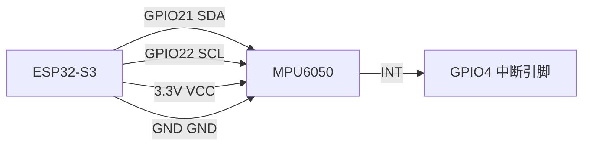

# Hardware RAG Agent — 全生命周期路线图

> 一个开源硬件开发搭档的完整进化路径。
> v1 查得到 → v2 跑得通 → v3 跑得久。
> 节奏你定，这是任务清单，不是时间表。

---

## 项目定位

### 一句话

一个面向嵌入式初学者的硬件开发搭档，能查参数、写代码、审查问题、烧录调试，从官方文档到可运行代码一站搞定。

### 用户是谁

| 群体 | 需求 |
|------|------|
| **嵌入式初学者**（大一/大二电子类学生） | 看不懂 datasheet，不知道怎么开始 |
| **硬件爱好者/创客**（业余做 ESP32 项目的） | 想快速找到引脚定义、接线方案、代码示例 |
| **准备嵌入式实习/校招的学生** | 需要一个有深度的项目写进简历 |

### 简历话术

> "我做了一个硬件知识库 AI Agent，把几十份官方芯片手册做成可检索的知识库，Agent 能自主检索、生成驱动代码、审查代码问题，回答全部标注来源，支持 USB/WiFi 直接烧录到开发板并读取调试结果。技术栈 LangChain + ChromaDB + FastAPI，支持用户自选模型，Docker 一键部署。"

---

## 三阶段全景

```
v1（12 周 MVP）        v2（Phase 2）           v3（Phase 3）
━━━━━━━━━━━━━━━━━━━━━━━━━━━━━━━━━━━━━━━━━━━━━━━━━━━━━━━━━━━━
查得到 → 答得准          写得出 → 跑得通          跑得久 → 社区活

RAG 知识库               USB/WiFi 烧录           多语言代码生成
5 Agent 工具             硬件调试闭环             编译错误自愈
BM25 混合检索            串口实时读取             项目模板生成
三类测试集               硬件安全护栏             接线可视化
规则验证器               外设元数据注入           用户实验数据库
Web UI + 设置面板        结构化精确比对           知识库覆盖率面板
Docker 一键启动          多芯片覆盖               多板协同项目
                        踩坑记录检索             代码版本管理
                                               GitHub Issue 自动入库
```

---

## v1：查得到、答得准（12 周 MVP）

**目标：** 用户能问硬件问题，系统基于官方文档准确回答，带来源标注。
**定位：** 硬件文档 RAG 问答系统 + ReAct Agent（5 工具）。
**部署：** `git clone → python main.py → localhost:8000`

### 核心能力

| 能力 | 实现 |
|------|------|
| 知识库问答 | LangChain + ChromaDB + BM25 混合检索（RRF 融合） |
| Agent 工具 | search_kb / generate_code / review_code / compare / diagnose |
| 记忆系统 | SummaryBufferMemory（多轮对话不截断） |
| 多知识库路由 | 6 类：dev-boards / sensors / protocols / peripherals / troubleshooting / my-notes |
| 模型自由 | 用户自配 API Key + Base URL，前端拉取模型列表，动态切换 |
| 流式输出 | SSE 打字机效果，实时逐字显示 |
| 代码高亮 | 生成的代码自动语法高亮 + 一键复制 |

### 技术栈

```
后端：FastAPI + SQLite（对话存储）+ LangChain + ChromaDB
前端：HTML + HTMX + SSE（用户自设计 UI）
检索：BM25（jieba 分词）+ 向量检索（API Embedding）+ RRF 融合
解析：Docling（布局感知 PDF 解析，支持双栏表格）
评测：三类测试集（边缘/泛化/深度）+ 规则验证器
部署：Docker Compose（FastAPI + ChromaDB）
```

### 已借鉴的开源设计

| 来源 | 借鉴点 | 落地 Week |
|------|-------|-----------|
| **stm32-rag-bot** | BM25 查询扩展（触发词→关键词） | Week 5 |
| **stm32-rag-bot** | 自定义 tokenizer（寄存器名拆前缀） | Week 5 |
| **stm32-rag-bot** | 表格块检测+标记保留 | Week 3 |
| **stm32-rag-bot** | config.yaml 配置驱动 | Week 5 |
| **stm32-rag-bot** | 三类测试集（边缘/泛化/深度） | Week 6 |
| **stm32-rag-bot** | 外设结构化元数据注入 | Week 5 |
| **Hardware-DataBase** | 配置系统 .env + 热重载 | Week 2 |
| **Hardware-DataBase** | LangChain EnsembleRetriever（BM25+Vector） | Week 5 |
| **Hardware-DataBase** | Docling PDF 解析器 | Week 3 |
| **Hardware-DataBase** | RERANKER_TYPE 三档开关 | Week 6 |
| **rag-esp32-llm** | 规则验证器（不依赖 LLM） | Week 6 |
| **rag-esp32-llm** | CLI 多模式输出（quiet/json） | Week 6 |
| **SonettoHere** | YAML CRUD 记忆系统（借鉴，不直接抄） | Week 7 |
| **SonettoHere** | 统一 ToolBase + 格式规范 | Week 7 |

### MVP 完成线

- [ ] Web 上能问硬件问题，回答准确且有来源标注
- [ ] Agent 能调工具，多问多轮不走歪
- [ ] 三类测试集（50+ 题）通过率 ≥ 70%，按类别有拒绝率统计
- [ ] Docker 一键启动

---

## v2：写得出、跑得通（Phase 2 — 硬件接入）

**目标：** Agent 能写代码、烧录到开发板、读回结果、自动调试。
**定位：** 从"问答助手"进化为"硬件开发搭档"。
**部署：** 本地部署优先（用户电脑 + 串口/WiFi 直接访问硬件）

### 核心升级

#### 1. USB 烧录 + 串口读取

```python
@tool
def compile_and_flash(code: str, board: str, port: str, mode: str = "micropython") -> dict:
    """
    编译并烧录代码到开发板。
    board: "esp32-s3" / "esp32-c3" / "stm32f4"
    port: "COM3" (Windows) 或 "/dev/ttyUSB0" (Linux)
    mode: "micropython" | "arduino" | "idf"
    """
    # MicroPython → mpremote
    # Arduino C  → arduino-cli compile && arduino-cli upload
    # ESP-IDF    → idf.py build && idf.py flash

@tool
def read_serial(port: str, baud: int = 115200, timeout: int = 5) -> str:
    """读取开发板串口输出"""

@tool
def monitor_serial(port: str, duration: int = 10) -> str:
    """持续监听串口输出"""
```

#### 2. WiFi OTA 烧录

```python
@tool
def ota_flash(code: str, esp_ip: str) -> dict:
    """
    通过 WiFi OTA 烧录代码到 ESP32。
    前置：开发板需预置 OTA 基础固件（第一次通过 USB 烧录）
    """
```

#### 3. 硬件调试闭环（最核心差异）

```
用户："帮我写个读 DHT11 的代码"
  → Agent 生成代码
  → compile_and_flash → 烧录
  → read_serial → "CRC check failed"
  → Agent 分析错误，修改代码
  → compile_and_flash → 重新烧录
  → read_serial → "Temperature: 26.5°C"
  → Agent 确认成功
```

#### 4. 硬件安全护栏（Guardrails）

```python
def hardware_guardrails(code: str, chip: str) -> list[str]:
    """代码输出前过硬件安全检查"""
    violations = []
    # GPIO 引脚号不超过芯片最大值
    # 0x 地址在合法区间内
    # I2C 地址是常见合法地址
    # 电源引脚没有被误配置为 GPIO
    # 中断引脚没有被多个外设共用
    return violations
```

#### 5. 外设结构化元数据注入（已在 v1 Week 5 预留）

v1 的 `hardware_config.yaml` 在 v2 进一步发挥价值：
- 检测到 TIM2 → 自动注入：挂在 APB1 总线，基地址 0x40000000，时钟使能 RCC_APB1ENR bit0
- Agent 写代码时，这些信息直接进 prompt，防止"把 APB1 的定时器挂到 APB2 上"这种低级错误

#### 6. 结构化精确比对工具

```python
def compare_pins(chip_a: str, chip_b: str) -> dict:
    """从 JSON/CSV 引脚表精确比对，不用 LLM 猜"""
```

#### 7. 踩坑记录检索

用户遇到 bug，Agent 不仅从 datasheet 检索，还从**用户自己的踩坑笔记**中检索。真实踩坑数据比公开文档值钱 10 倍。

### 技术栈新增

```
硬件工具链：esptool / mpremote / arduino-cli / ESP-IDF
OTA 固件：MicroPython OTA / ArduinoOTA 模板
串口通信：pyserial
数据格式：JSON/CSV 引脚表 + 寄存器表
安全规则：正则 + 地址范围校验 + 引脚合法性检查
```

### Phase 2 完成线

- [ ] USB 烧录 MicroPython 代码到 ESP32，串口读到结果
- [ ] WiFi OTA 推送代码，无需 USB 线
- [ ] Agent 完成"生成→烧录→报错→修改→再烧录"闭环
- [ ] 硬件安全护栏阻止违规代码输出
- [ ] 结构化比对工具（JSON 表格精确 diff）
- [ ] 支持 ESP32-S3 / ESP32-C3 / STM32F4 三款芯片

---

## v3：跑得久、社区活（Phase 3 — 智能进化）

**目标：** 从"工具"进化为"生态"。Agent 能从错误中学习、能生成完整项目、能接多块板子。
**定位：** 垂直领域 AI 开发平台（硬件方向）。

### 核心升级

#### 1. 多语言代码智能选择 + Jinja2 模板引擎

Agent 根据用户需求自动选择最合适的语言，**不靠 LLM 手写整段代码**，而是用 Jinja2 模板填充：

```python
# Template-driven code generation（不是 LLM 从零写）
# 原理：RAG 检索传感器参数 → 填入 Jinja2 模板 → 输出可编译代码
# 优势：编译成功率从 ~60%（LLM 裸写）提升到 ~95%

templates/
├── micropython/
│   ├── i2c_sensor.py.jinja2      # I2C 传感器读取模板
│   ├── wifi_upload.py.jinja2     # WiFi 上传数据模板
│   └── oled_display.py.jinja2    # OLED 显示模板
├── arduino/
│   ├── i2c_sensor.cpp.jinja2
│   └── ota_firmware.cpp.jinja2   # OTA 基础固件模板
└── esp-idf/
    ├── i2c_sensor.c.jinja2
    └── CMakeLists.txt.jinja2
```

Agent 的任务：
1. RAG 检索传感器参数（引脚号、I2C 地址、时序要求）
2. 填充到 JSON 配置中
3. Jinja2 渲染 → 完整可编译工程

**不依赖 LLM 写标准外设代码**——LLM 只做参数映射和异常处理逻辑，固定框架交给模板。

#### 2. 编译错误自愈学习

Agent 从编译错误中自动学习，错误缓存 + 修复方案复用：

```python
class ErrorPatternCache:
    """编译错误 → 修复方案 缓存"""
    
    # 缓存结构：
    # error_patterns/
    # ├── micropython.json
    # └── arduino.json
    
    # 示例：
    {
        "error": "NameError: name 'Pin' is not defined",
        "fix": "改为 from machine import Pin",
        "chip": "esp32",
        "language": "micropython",
        "times_hit": 3
    }
```

**工作流程：**
```
编译报错 → 检查缓存是否有匹配的错误模式
  ├── 有 → 直接应用修复方案，跳过 LLM 推理（省钱省时）
  └── 没有 → Agent 分析错误 → 生成修复 → 验证通过 → 写入缓存
```

**简历亮点：** "Agent 具备错误自愈能力，能从历史编译错误中学习，逐步降低调试成本。"

#### 3. 项目模板/脚手架生成

用户说"帮我做一个温湿度监控站"，Agent 生成完整项目：

```
weather_station/
├── main.py              # 主程序
├── lib/
│   ├── dht11.py         # 传感器驱动
│   ├── oled.py          # 显示驱动
│   └── wifi.py          # 网络管理
├── config.yaml          # WiFi SSID + 上传地址
├── README.md            # 项目说明 + 接线图
├── wiring.md            # 详细接线方案
├── BOM.md               # 物料清单 + 购买链接
└── .gitignore
```

**简历亮点：** "支持一句话生成完整硬件项目结构，包含驱动、配置、文档、物料清单。"

#### 4. 接线方案可视化

文字 + ASCII 接线图 + Mermaid 框图，多模态输出：

```
ESP32-S3          MPU6050
  GPIO21  ──────  SDA
  GPIO22  ──────  SCL
  GND     ──────  GND
  3.3V    ──────  VCC
```



**简历亮点：** "Agent 输出包含接线图、物料清单、项目结构，不只是代码。"

#### 5. 用户实验数据库

用户把实测数据写进知识库，Agent 查询时优先检索用户数据：

```yaml
# user_experiments/esp32/dht11_real_test.yaml
- sensor: DHT11
  test_date: 2026-06-15
  notes: "实际精度 ±3°C，比官方标的 ±2°C 差"
  measurement: "和 BME280 对比测量了 100 组"
  author: "忠心于中心"
```

**价值：** 真实数据 > datasheet 标称参数。社区积累越多越值钱。

#### 6. 知识库覆盖率面板

用户一眼看到知识库覆盖了什么：

```
当前知识库覆盖：
  ✅ ESP32-S3     → datasheet + 引脚 + WiFi + BLE + I2C
  ✅ MPU6050      → datasheet + 寄存器 + 接线 + 驱动
  ⚠️ DHT11        → 基本参数，缺寄存器说明
  ❌ BME280       → 未入库
  ❌ OLED SSD1306 → 未入库

覆盖率：43%（6/14 常用器件）
```

#### 7. 多板协同项目支持

不只是"单芯片"，而是"ESP32 + 传感器 + OLED + 继电器"组合项目：

```python
# Agent 自动生成多模块代码
@tool
def generate_multi_board_project(components: list[str], description: str) -> dict:
    """
    生成多模块协同项目。
    components: ["esp32-s3", "dht11", "oled-ssd1306", "relay"]
    description: "自动浇水系统"
    """
    # → 生成主程序 + 各模块驱动 + 接线方案 + 配置文件
```

#### 8. 代码版本管理

调试过程中每次修改都有记录，支持回退：

```
v1: 基础版，读 DHT11 打印到串口
v2: 加了 OLED 显示
v3: 修复了 DHT11 时序问题
v4: 加了 WiFi 上传功能
v5: 优化了低功耗，加了 deep sleep
```

#### 9. GitHub Issue 自动入库

用户在 GitHub Issues 提交的 bug/建议，Agent 自动分析并纳入知识库或错误缓存：

```
Issue: "ESP32-S3 I2C 扫描不到 MPU6050"
  → Agent 分析：可能是 I2C 引脚配置错误
  → 写入 troubleshooting 知识库
  → 下次用户问类似问题，Agent 直接给出修复方案
```

### 技术栈新增

```
项目模板引擎：Jinja2 模板 + 文件树生成
接线可视化：ASCII + Mermaid / PlantUML
错误缓存：SQLite + 向量检索
版本管理：本地 Git（用户项目目录）
GitHub 集成：PyGithub（读取 Issues）
```

### Phase 3 完成线

- [ ] 多语言代码生成（MicroPython/Arduino/ESP-IDF 自动选择）
- [ ] 编译错误自愈缓存系统
- [ ] 项目模板生成（一句话→完整项目结构）
- [ ] 接线方案 ASCII/Mermaid 可视化
- [ ] 用户实验数据入库
- [ ] 知识库覆盖率面板
- [ ] 多板协同项目支持
- [ ] 代码版本管理
- [ ] GitHub Issue 自动分析入库

---

## 三阶段对比总览

| 维度 | v1 | v2 | v3 |
|------|----|----|-----|
| **一句话** | 查得到、答得准 | 写得出、跑得通 | 跑得久、社区活 |
| **定位** | 硬件文档 RAG + Agent | 硬件开发搭档 | 垂直领域 AI 开发平台 |
| **Agent 工具数** | 5 | 8（+3） | 12（+4） |
| **知识库来源** | 官方 datasheet | +踩坑记录 | +用户实验数据 +GitHub Issues |
| **代码能力** | 生成代码 | +烧录调试 +自愈 | +多语言选择 +项目模板 |
| **硬件交互** | 无 | USB/WiFi 烧录 +串口读取 | +多板协同 +接线可视化 |
| **测试覆盖** | 三类测试集（50+题） | +硬件集成测试 | +自愈缓存测试 +社区反馈测试 |
| 部署 | 本地 Docker（纯问答） | 本地部署（用户电脑 + 串口/WiFi 直接访问硬件） | 本地部署 + 社区模式 |
| **社区** | GitHub 开源 | Issues 收集需求 | 用户贡献知识库 +踩坑记录 |

---

## 现在该做什么

v2 v3 的功能清单再好，**你现在只有一个任务：**

> **把 v1 Week 1 Day 1 跑通。**

打开本地 Codex，输入：

```
我是 Hardware RAG Agent 后端开发线程。
目标：完成 12 周计划 v2 的 Week 1 Day 1。
今天只做：创建项目目录、虚拟环境、config.py 读 .env、写第一个 pytest 测试。
不跳过任何步骤。只做今天该做的。
```

v2 v3 等你 v1 跑通了再回来翻这个文件。
