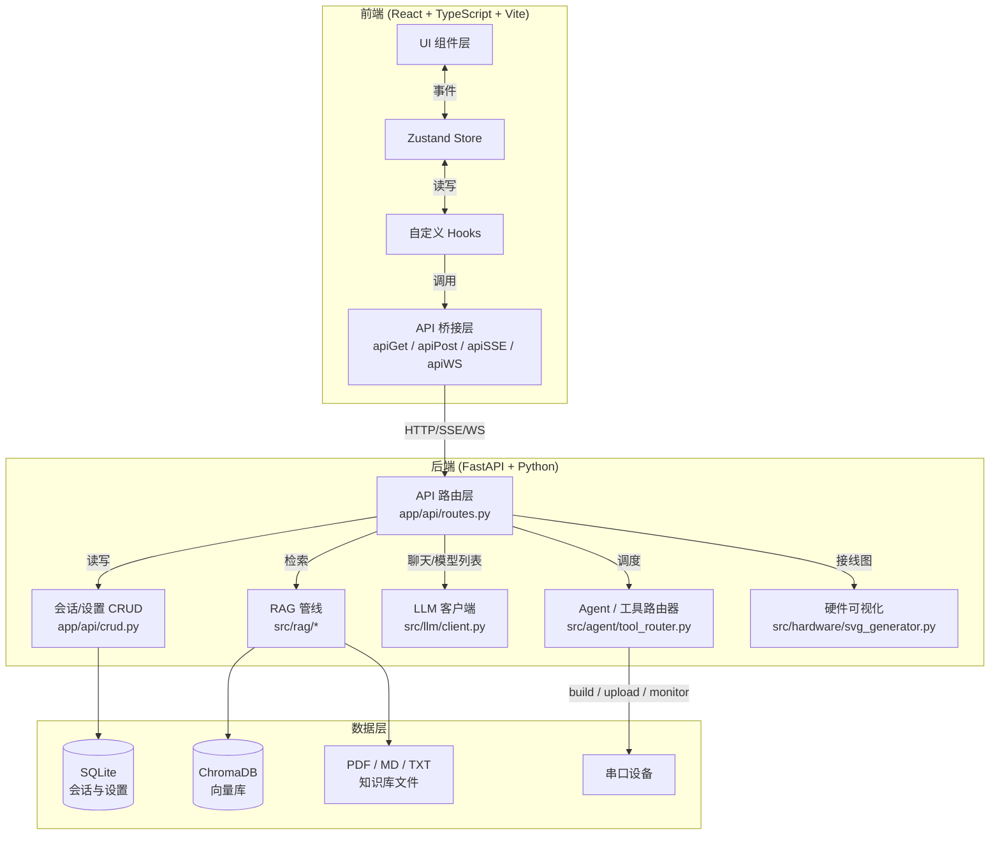
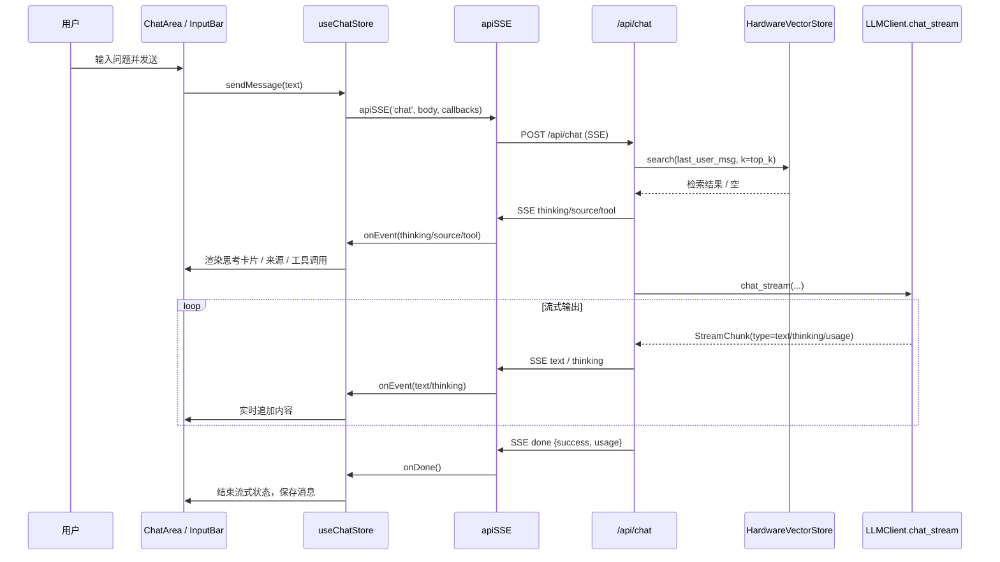
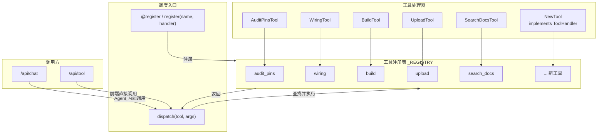
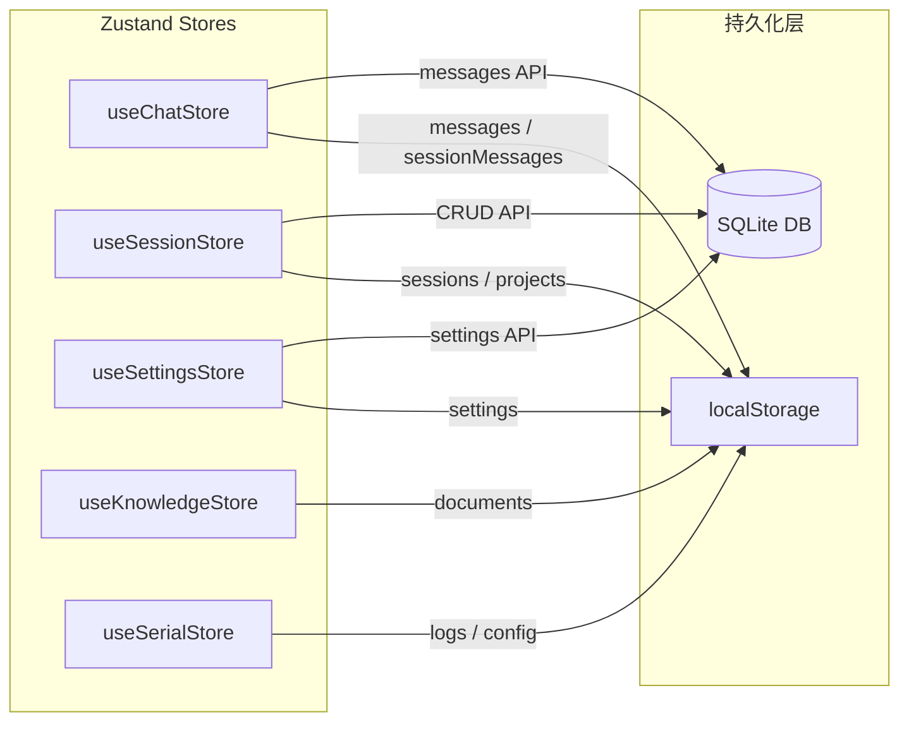
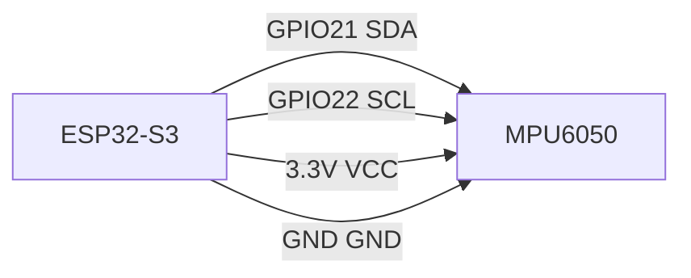

# Hardware RAG Agent — 路线图

> 最后更新：2026-06-23
> 当前阶段：Phase 2 RAG 知识库
> 本文档合并自：硬件路线图 / V1-V3 详细计划 / 架构设计 / 快速上手指南

---

## 目录

- [Phase 1：基建（已完成）](#phase-1基建已完成)
- [Phase 2：RAG 知识库（当前）](#phase-2rag-知识库当前)
- [Phase 3：Agent](#phase-3agent)
- [Phase 4：收尾](#phase-4收尾)
- [依赖关系表](#依赖关系表)
- [架构设计](#架构设计)
- [快速上手指南](#快速上手指南)
- [附录 A：V1 详细计划](#附录-av1-详细计划)
- [附录 B：V2 详细计划](#附录-bv2-详细计划)
- [附录 C：V3 详细计划](#附录-cv3-详细计划)

---

## Phase 1：基建（已完成）

| 模块 | 状态 |
|---|---|
| FastAPI 后端骨架 | 完成 |
| React 前端骨架 | 完成 |
| SSE 流式聊天 | 完成 |
| 模型列表 + 设置面板 | 完成 |
| 路由拆分 | 完成 |
| 工具注册表（5 个 stub） | 完成 |
| 文档框架（AGENTS.md + TODO 系统） | 完成 |

---

## Phase 2：RAG 知识库（当前）

### 第一波：单库搜索质量打稳

**目标：** 在一个知识库里把搜索质量做到满意，再扩到多库。

#### 1.1 切片策略优化
- 改 vector_store.py ingest() 方法
- 按章节语义边界切，不按 1000 字硬切
- 表格保持完整，不从表格中间断开
- separator 顺序修：空格在句号前，避免 "3.3 V" 被误伤
- **依赖：** 无 | **估算：** 半天

#### 1.2 BM25 混合检索
- 安装 rank_bm25（零依赖）
- vector_store.py 新增 hybrid_search()
- 向量 top_k=10 + BM25 top_k=10 → RRF 融合
- **依赖：** 1.1（切片好 BM25 才有意义）| **估算：** 半天

#### 1.3 来源标注前端修复
- 检查 ChatArea.tsx 的 case "source" handler 是否还在
- 如果被之前删按钮误删了 → 复原
- **依赖：** 无 | **估算：** 2 小时

#### 1.4 单库质量验证
- 上传 3-5 篇硬件 PDF → 提 10 个问题 → 检查召回率
- **依赖：** 1.1-1.3 | **估算：** 半天

---

### 第二波：LangChain + 多库架构

**前置：** 第一波做完，搜索质量已验证。

#### 2.1 手写 RAG → LangChain RetrievalQA Chain
- 学习过渡：行为不变，API 换成 LangChain
- **依赖：** 1.4 | **估算：** 半天

#### 2.2 多知识库后端
- 新增 KnowledgeBaseManager，管理多个 HardwareVectorStore
- 每个 KB 独立 ChromaDB collection + 独立 embedding 模型
- 新增 /api/kb/collections 增删查接口
- **依赖：** 2.1 | **估算：** 2 天

#### 2.3 前端知识库管理页面
- KnowledgePanel.tsx 大改：列表/新建/上传/删/搜
- 新建时选 embedding 模型
- **依赖：** 2.2 | **估算：** 2 天（可和后端并行）

---

### 第三波：出厂知识库 + 图片 OCR

#### 3.1 出厂知识库打包
- 选硬件文档（ST/ESP32/RPi），固定 embedding 模型算好
- 打包到 data/builtin_kb/，首次启动自动加载
- **依赖：** 无 | **估算：** 文档收集 + 1 天

#### 3.2 PDF 图片 OCR
- PyMuPDF 提取图片 + pytesseract OCR
- OCR 文字入库，保留原图路径 metadata，前端展示
- **依赖：** 无（建议放切片优化之后）| **估算：** 2 天

---

## Phase 3：Agent

### RAG 从强制注入 → Agent tool
- 删除 chat_routes.py 的自动检索逻辑
- tool_router.py 注册 search_hardware_kb 工具
- LLM 自主决定搜不搜
- SSE 发 tool_start / tool_result / tool_output
- **依赖：** Phase 2 | **估算：** 2 天

### ReAct Agent + 多工具编排
- 工具集：search_kb / execute_code / diagnose / wiring
- LangChain create_react_agent
- 前端显示思考链
- **依赖：** RAG tool | **估算：** 3 天

---

## Phase 4：收尾

| 任务 | 时机 |
|---|---|
| README.md | Phase 2 收尾时 |
| Docker Compose | 功能稳定后 |
| 测试补全 | 每阶段提交时 |
| pre-commit hook | 任何提交前 |

---

## 依赖关系表

| 波次 | 依赖 |
|---|---|
| 第一波 | 1.2 BM25 依赖 1.1 切片优化 |
| 第二波 | 全部依赖第一波完成 |
| 第三波 | 3.2 OCR 建议放切片优化之后 |
| Agent | 依赖 Phase 2 全部完成 |

---

## 架构设计

### 1. 前后端整体架构



### 2. 聊天 SSE 数据流



### 3. 硬件工作台数据流

```mermaid
flowchart LR
    subgraph Workbench["硬件工作台 WorkbenchPanel"]
        Preview["PreviewPane<br/>代码编辑器"]
        Diagnose["DiagnosePane<br/>代码诊断"]
        Wiring["WiringPane<br/>接线图"]
        Flash["FlashPane<br/>编译/烧录"]
        Serial["SerialPane<br/>串口监视器"]
        Audit["SafetyAudit<br/>引脚审计"]
    end

    Preview -->|推送代码| Flash
    Preview -->|/api/diagnose| Diagnose
    Diagnose -->|输出引脚分配| Wiring
    Diagnose -->|输出引脚分配| Audit
    Audit -->|/api/audit_pins| AuditResult["冲突/警告"]
    Wiring -->|/api/wiring| SVG["SVG + BOM"]
    Flash -->|/api/build| BuildLog["编译日志 SSE"]
    Flash -->|/api/upload| FlashLog["烧录日志 SSE"]
    Flash -->|成功后| Serial
    Serial -->|WS /api/monitor/{port}| SerialData["实时串口数据"]
```

### 4. 工具路由器可扩展结构



### 5. 数据持久化架构




---

## 快速上手指南

本文档面向第一次使用本项目的新用户，帮助你从 0 到 1 跑通前后端，并完成一次聊天与硬件工作台体验。

### 1. 环境准备

| 依赖 | 版本要求 | 说明 |
| --- | --- | --- |
| Python | 3.10+ | 后端运行环境 |
| Node.js | 18+ | 前端构建与开发服务器 |
| Git | 任意 | 克隆仓库 |
| ChromaDB | 可选 | 知识库向量化存储；不安装则上传功能仅保存文件并返回 chunks 数量 |

**推荐环境：** Windows 10/11、macOS 或 Linux，已安装 pip 和 npm，有一个可用的 OpenAI 兼容 API Key（OpenAI、DeepSeek、Ollama 等均可）。

### 2. 克隆与启动

```bash
git clone <仓库地址>
cd Hardware-RAG-Agent

# 后端
cd backend
pip install -r requirements.txt
python main.py --web --port 58080

# 前端（另一个终端）
cd frontend
npm install
npx vite --port 5173
```

> 前端访问 http://127.0.0.1:5173，Vite 自动把 /api/* 代理到后端 58080。

### 3. 配置模型

1. 点击 Settings（设置）图标
2. 填写 API Key、Base URL（如 https://api.openai.com/v1）、Model
3. 前端自动调用 /api/models 校验连通性

### 4. 开始聊天

底部输入框输入问题，按 Enter 发送。SSE 实时显示：
- **thinking**：模型思考 / RAG 检索状态
- **source**：知识库来源片段
- **text**：逐 token 正文输出
- **done**：流式结束

### 5. 硬件工作台

侧边栏 Workbench 图标进入，包含五个核心流程：
- **Preview**：代码编辑器，支持推送到烧录
- **Diagnose**：代码静态扫描（GPIO 安全/编译预检/引脚冲突/内存/Flash 兼容）
- **Wiring**：接线图 SVG 生成 + BOM 列表
- **Flash**：编译（SSE）/ 烧录（SSE）
- **Serial**：WebSocket 串口监视器

### 6. 知识库上传

Knowledge 面板 → 上传 PDF/MD/TXT（最大 50MB）→ 后端切分并返回 chunks 数量。

### 常见问题

| 问题 | 排查 |
|------|------|
| 前端提示"后端未连接" | 确认后端已启动，health 接口返回 200 |
| 模型列表获取失败 | 检查 API Key 和 Base URL 是否正确 |
| 无流式输出 | 检查模型是否支持流式，查看后端日志 |
| 串口无数据 | 确认设备已连接，波特率一致，无其他程序占用 |
| 编译/烧录报错 | 确认已安装对应平台工具链，查看 SSE 完整错误日志 |


---

## 附录 A：V1 详细计划

> 以下内容来自 V1 阶段详细计划，包含 12 周工程大纲、产品定义、架构决策、竞品分析。


> 交叉认证修订版：砍掉手写轮子，RAG 逐项优化有数据支撑，LangGraph 删除。
> 修订 v2：砍掉手写轮子 + 传感器实时数据，专注硬件文档垂直 RAG + Agent。
> 一个产品：Hardware RAG Agent。节奏你定，这是任务清单。

---

## Boss 直聘真实需求分析

> 这个项目不是自嗨——每个技能点都对应真实岗位需求。以下是 Boss 直聘上 AI Agent / 嵌入式 AI / RAG 相关岗位的高频技能要求。

### 高频技能要求

| 技能 | 出现频率 | 优先级 | Week 覆盖 |
|------|----------|--------|-----------|
| Python | ⭐⭐⭐⭐⭐ | 必须 | Week 1 |
| LangChain | ⭐⭐⭐⭐⭐ | 必须 | Week 4-5 |
| RAG | ⭐⭐⭐⭐⭐ | 必须 | Week 3-4 |
| LLM API 调用 | ⭐⭐⭐⭐⭐ | 必须 | Week 1 |
| Prompt Engineering | ⭐⭐⭐⭐ | 高 | Week 1-3 |
| 向量数据库（ChromaDB） | ⭐⭐⭐⭐ | 高 | Week 3-4 |
| Docker / 部署 | ⭐⭐⭐⭐ | 高 | Week 9-10 |
| FastAPI / Web 后端 | ⭐⭐⭐⭐ | 高 | Week 2 |
| 多 Agent 协作 | ⭐⭐⭐ | 中 | —（未来拓展） |
| Function Calling / Tool Use | ⭐⭐⭐ | 中 | Week 5-6 |
| 记忆系统 / Memory | ⭐⭐⭐ | 中 | Week 6 |

### 这个项目在简历上的差异化优势

| 亮点 | 对面试官的说服力 | 稀缺度 |
|------|-----------------|--------|
| 硬件 + AI 结合 | 不是纯 Chatbot 项目，有垂直领域深度 | 极高 |
| 低空经济场景 | 国家新兴支柱产业，与电子信息工程专业直接对口 | 高 |
| 数据工程能力 | Datasheet PDF 清洗/切分/向量化入库，体现数据基本功 | 中高 |
| 全链路项目 | Python → RAG → Agent → Web UI → Docker，一条线完整度 | 高 |
| 开源社区贡献 | 面向嵌入式开发者的知识库 Agent，有实际用户价值 | 中 |

> **一句话面试话术：** "我做了一个硬件知识库 AI Agent，把几十份官方芯片手册做成可检索的知识库，Agent 能自主检索、生成驱动代码、审查代码问题，回答全部标注来源。用的 LangChain + ChromaDB + FastAPI，支持用户自选模型，Docker 一键部署。"

---

## 最终产品说明书

### 一句话
一个能回答硬件参数、接线方案、生成驱动代码、审查代码问题的 AI Agent，基于官方文档解决通用 LLM 在硬件垂直领域的深度不足和幻觉问题。
用户自配 API Key + Base URL，前端自动拉取模型列表，选哪个用哪个。
每一条回答都标注来源。

### 使用方式（self-hosted web app）

```bash
git clone https://github.com/xxx/hardware-rag-agent
cd hardware-rag-agent
pip install -r requirements.txt   # 或 docker compose up
python main.py
# 启动后浏览器打开 http://localhost:8000
```

1. 打开网页 → 设置面板填入 API Key + Base URL → 拉取模型列表 → 选模型
2. 开始提问。不用改 `.env`，不用碰命令行，全部在网页上操作。
3. 如果你想部署到服务器给更多人用：`docker compose up -d` + Nginx 反向代理即可。

### 三层架构

```
┌──────────────────────────────────────────────────────────┐
│              Hardware RAG Agent                          │
│                                                          │
│  界面层  │ Web UI（HTMX + SSE）                          │
│          │   - 设置面板（API Key / Base URL / 模型选择） │
│          │   - 拉取模型列表 → 前端 <select> 渲染         │
│          │   - 每次请求携带 X-API-Key / X-Model 头       │
│          │   - 对话界面 + 前端设计（周 2 用户自行设计）  │
│                                                          │
│  智能层  │ LangChain ReAct Agent                         │
│          │   - search_hardware_kb  参数/接线查询          │
│          │   - generate_hardware_code  生成驱动代码       │
│          │   - review_hardware_code  审查代码问题         │
│          │   - compare_hardware_components  对比器件      │
│          │   - diagnose_hardware_problem  排错向导        │
│          │   - Memory: ConversationSummaryBufferMemory    │
│                                                          │
│  知识库  │ ChromaDB + 官方硬件文档（覆盖芯片/协议/外设）  │
│                                                          │
│  能力：参数查询 / 接线方案 / 器件对比 / 代码审查 / 排错   │
│        多轮上下文记忆（100轮不断）                        │
└──────────────────────────────────────────────────────────┘
```

### 最终产出物

| 产出 | 形式 | 说明 |
|------|------|------|
| RAG 检索服务 | Python 模块 | LangChain + ChromaDB + 来源标注 |
| ReAct Agent | Python 模块 | 5 工具 + SummaryBufferMemory + 降级 |
| Web UI | HTML + HTMX | 对话 + 设置面板（API Key / 模型选择）+ 代码复制 |
| 动态模型路由 | Python 模块 | 前端拉模型列表 + 后端动态实例化 LLM |
| Docker 编排 | Dockerfile + Compose | FastAPI + ChromaDB |
| GitHub 仓库 | Open Source | README + 架构图 + 启动文档 |
| 知识库 | /references/ | 官方硬件文档（按芯片/协议/传感器跟踪覆盖率） |
| 抖音视频 | 3-4 条 | 硬件助手 / 学习实录 / 总结 |

### MVP 完成线（先到这里再说）

以下 4 项全部达成 = MVP 完成，之后的时间用来优化和打磨：

1. Web 上能问硬件问题，回答准确且有来源标注
2. Agent 能调知识库工具，多问多轮不走歪
3. 20 题评测，准确率 ≥ 70%
4. Docker 一键启动

---

## 关于节奏

**"Day N" 是任务编号，不是日历日期。**
有些 Day 你 20 分钟跑完，有些 Day 卡在 bug 上两天才过。正常。

学习原则：

1. **先跑通，再理解** — 跑通之后再回头看原理
2. **用框架写代码，但理解框架在干什么** — chunk_size 500 和 2000 的区别要能说清楚
3. **一次改一个，测了再加下一个** — 不堆叠优化，不猜
4. **踩坑就记，不问就不存在**
5. **卡住不急，停比绕强**

---

## Phase 1：基建（Week 1-2）

### Week 1：Python + HTTP + LLM API

**目标：** 能用 Python 调通 LLM，有 CLI 工具
**产出：** `main.py`（CLI 对话工具）+ pytest 测试

---

#### Day 1：环境 + 函数 + 类型注解

**做什么：**
1. 创建 `hardware-rag-agent/` 项目目录和虚拟环境
2. `pip install python-dotenv httpx rich pytest`
3. 写 `app/config.py`：用 `pathlib` 管理路径，`python-dotenv` 读 `.env`
4. 练习类型注解：`def greet(name: str) -> str`

**验收：**
- `.venv` 创建成功
- 能读 `.env` 里的变量
- 能解释 `str | None` 是什么意思

---

#### Day 2：HTTP 请求

**做什么：**
1. 用 `httpx` 请求公开 API（GitHub API 等）
2. 封装 GET/POST，设 Header、设超时
3. 处理状态码：200 / 400 / 401 / 500

**验收：**
- GET 和 POST 都能跑通
- 能捕获 `httpx.TimeoutException`

---

#### Day 3：LLM API 调通（支持动态 API Key）

**做什么：**
1. 封装 `LLMClient`：`chat(messages, api_key=None, base_url=None, model=None) -> dict`
2. 支持动态传 Key：如果调用时传了 `api_key`，就用传的；没传就用 `.env` 的默认值
3. DeepSeek API（OpenAI-compatible 格式）
4. API Key 从 `.env` 读，不硬编码
5. 流式输出：`chat_stream(messages, api_key=None, ...) -> Generator[str]`

**验收：**
- 发消息给 DeepSeek，拿到回复
- 流式输出：文字逐个出现
- API Key 不在代码里

---

#### Day 4：SSE 流式输出

**做什么：**
1. SSE 格式：`data: {"content": "..."}\n\n`
2. FastAPI `StreamingResponse`（先建 FastAPI 骨架，Day 5 补全）
3. `curl -N http://localhost:8000/chat/stream` 测试

**验收：**
- 能看到文字逐个出现在终端
- SSE 格式正确

---

#### Day 5：CLI 工具 + FastAPI 骨架

**做什么：**
1. `main.py`：`input("你: ")` 交互循环 + rich 美化
2. `app/main.py`：`GET /health` + `POST /chat` + `POST /chat/stream`（SSE）
3. 对话历史保存到 `data/history.json`
4. `.env.example` + `.gitignore` + `README.md`

**验收：**
- CLI 能问能答
- `localhost:8000/docs` Swagger 能打开
- `/health` 返回 200

---

#### Day 6：错误处理 + 重试

**做什么：**
1. 重试：`tenacity` 库或手写 `retry(max_retries=3)`
2. 指数退避
3. 异常分类：网络 / 认证 / 频率限制 / 模型不可用
4. 每种异常给清晰错误提示

**验收：**
- 断网 → "网络连接失败"
- Key 错 → "API Key 无效"
- 超时 → "已重试 3 次"

---

#### Day 7：测试 + Git

**做什么：**
1. `pytest` 测试 config、history
2. `git init` → `git commit -m "feat: Week 1 LLM CLI + FastAPI"`
3. 复盘

**验收清单 Week 1：**
- [ ] LLM API 调通（含流式）
- [ ] CLI 工具
- [ ] FastAPI 能启动
- [ ] 错误处理 + 重试
- [ ] pytest 通过
- [ ] Git 仓库初始化

---

### Week 2：FastAPI + Web UI

**目标：** 浏览器里能问问题、能看到回答（哪怕很丑）
**产出：** 一个能用的 Web 聊天页面

---

#### Day 1：Pydantic 模型

**做什么：**
1. `app/schemas/chat.py`：
   ```python
   class ChatRequest(BaseModel):
       message: str = Field(..., min_length=1, max_length=2000)
   class ChatResponse(BaseModel):
       reply: str
       sources: list[str] = []
   ```
2. 请求校验：空消息 → 422 + 清晰错误

---

#### Day 2：SQLite 存储（直接存，不上 ORM）

做什么：
1. 用标准库 `sqlite3`，不装 SQLAlchemy
2. 建两张表：
  ```sql
  CREATE TABLE conversations (
      id INTEGER PRIMARY KEY,
      created_at TIMESTAMP DEFAULT CURRENT_TIMESTAMP
  );
  CREATE TABLE messages (
      id INTEGER PRIMARY KEY,
      conversation_id INTEGER,
      role TEXT,
      content TEXT,
      created_at TIMESTAMP DEFAULT CURRENT_TIMESTAMP
  );
  ```
3. `db.execute("INSERT ...")` 和 `db.execute("SELECT ...")` 直接写

**关键架构原则：对话与模型解耦（模型可切换，对话不丢失）**

```
对话表（SQLite）          设置（.env / localStorage）
┌──────────────────────┐   ┌──────────────────────┐
│ conv_id | role | msg │   │ api_key | base_url   │
│ abc123  | user | ... │   │ sk-xxx  | deepseek..│
│ abc123  | asst | ... │   │ model = deepseek-chat │
└──────────────────────┘   └──────────────────────┘
        ↑ 持久独立                     ↑ 换模型只改这里
```

用户切换模型时，对话历史原样保留在 SQLite，下次请求只换「发给谁」，不换「读哪里」。
实现方式：
```python
# POST /chat 时：从 SQLite 拉历史 + 从请求头读当前模型，合并发出去
history = db.get_conversation(conv_id)  # 永远不因换模型而清空
llm = ChatOpenAI(model=request.headers["X-Model"], ...)
```
和 Hermes 的逻辑一模一样：对话存在独立数据库里，模型只是「读这份对话的人」。

**为什么不上 SQLAlchemy：** 连 RAG、Agent、UI 都没写出来，现在设计的表结构到 Week 8 大概率要改。先用 sqlite3 直接存 JSON，跑通了再考虑 ORM。

---

#### Day 3：前端设计 + HTMX 聊天页面

**做什么：**
1. 这部分**用户自行完成**：对话界面 UI 设计、配色、响应式、交互细节
2. 核心功能对接：`form hx-post="/chat"` + SSE 流式是你要做的
3. 建议：
   - 暗色主题（参考 Discord / GitHub Dark）
   - 消息气泡（用户右对齐蓝色，AI 左对齐灰色）
   - 代码框用语法高亮（可以等 Week 10 精修，Day 3 先跑通）
4. `GET /` 返回这个页面
5. `POST /chat` 返回 HTML 片段（不是 JSON）

---

#### Day 4：SSE 流式回答

**做什么：**
1. `hx-ext="sse"` 扩展或自己写 EventSource
2. 服务端：`StreamingResponse` 推 SSE
3. 客户端：收到 chunk 追加到当前消息气泡

---

#### Day 5：设置面板 — API Key + Base URL + 模型选择

**做什么：**
1. 前端 `index.html` 加一个设置面板（弹出式/侧边栏），包含：
   ```html
   <form id="settings-form">
     <input type="text" name="api_key" placeholder="API Key">
     <input type="url" name="base_url" placeholder="Base URL（如 https://api.deepseek.com/v1）">
     <select name="model" id="model-select" disabled>
       <option>— 先输入 API Key 和 Base URL —</option>
     </select>
     <button type="button" id="fetch-models">拉取模型列表</button>
     <button type="submit">保存设置</button>
   </form>
   ```
2. `「拉取模型列表」` 按钮 → `POST /api/models` 传 `api_key` + `base_url` → 返回可用模型列表 → 渲染到 `<select>`
3. 设置保存到 `localStorage`（刷新不丢）
4. 每次请求聊天时，前端在请求头里带上 `X-API-Key`、`X-Base-URL`、`X-Model`

---

#### Day 6：后端模型列表 + 动态 LLM 路由

**做什么：**
1. `POST /api/models`：
   ```python
   @app.post("/api/models")
   def list_models(req: ModelListRequest):
       """用用户提供的 API Key + Base URL 拉取 OpenAI-compatible 模型列表"""
       client = OpenAI(api_key=req.api_key, base_url=req.base_url)
       models = client.models.list()
       return {"models": [m.id for m in sorted(models, key=lambda m: m.id)]}
   ```
2. `POST /chat` 改为从请求头读取 `X-API-Key` / `X-Base-URL` / `X-Model`，动态创建 LLM 实例：
   ```python
   @app.post("/chat")
   def chat(request: ChatRequest):
       api_key = request.headers.get("X-API-Key") or config.DEFAULT_API_KEY
       base_url = request.headers.get("X-Base-URL") or config.DEFAULT_BASE_URL
       model = request.headers.get("X-Model") or config.DEFAULT_MODEL
       llm = ChatOpenAI(model=model, openai_api_key=api_key, openai_api_base=base_url)
       ...
   ```
3. **安全规则：** 后端不存储用户的 API Key。只记录 `api_key_prefix`（前 8 位）用于日志排查
4. 如果用户没传任何 Header → 用 `.env` 里的默认配置

---

#### Day 7：测试 + Git + 复盘

**验收清单 Week 2：**
- [ ] 浏览器打开能问问题
- [ ] SSE 流式回答（打字机效果）
- [ ] 设置面板可填 API Key + Base URL
- [ ] 拉取模型列表成功（能显示 DeepSeek/Qwen/GPT 等）
- [ ] 选模型后聊天使用该模型
- [ ] 切换模型后，之前的对话记录还在（对话与模型解耦）
- [ ] 刷新页面设置不丢（localStorage）
- [ ] 不传 Header 时用默认 .env
- [ ] SQLite 存储正常
- [ ] Git commit

---

## Phase 2：RAG（Week 3-6）

### Week 3：数据准备（LLM Prompt + PDF 解析 + 文档入库）

**目标：** 第一批硬件文档处理好，准备进 RAG
**产出：** 10+ 篇中文硬件文档 + ChromaDB 知识库

---

#### Day 1：Jinja2 Prompt 模板

**做什么：**
1. `pip install jinja2`
2. `templates/hardware_assistant.j2`：
   ```jinja2
   你是嵌入式硬件助手。你精通 ESP32、传感器、通信协议。
   
   请根据以下检索到的文档回答问题。
   如果文档中没有相关信息，请说明"知识库中没有找到相关信息"。
   回答末尾标注引用来源，格式：来源：[文档名]
   
   用户问题：{{ query }}
   
   检索到的相关文档：
   
   [{{ doc.source }}] {{ doc.content }}
   
   ```
3. system prompt 变量注入

**验收：**
- prompt 不硬编码在 Python 里
- 变量通过 Jinja2 动态注入

---

#### Day 2：PDF 解析（用 Marker / LlamaParse，不手写）

**做什么：**
1. **不装 PyMuPDF 自己写正则** — 对双栏、跨页表格必崩
2. 选一个：
   - **🆕 Docling（推荐）** — LlamaIndex 生态的布局感知 PDF 解析器（IBM 开源）
     ```python
     # pip install llama-index-readers-docling
     from llama_index.readers.docling import DoclingReader
     from llama_index.node_parser.docling import DoclingNodeParser
     reader = DoclingReader(export_type=DoclingReader.ExportType.JSON)
     node_parser = DoclingNodeParser()
     ```
     能理解 PDF 布局结构（标题层级/表格/代码块），输出语义分块而不是纯字符切割。
     Hardware-DataBase 验证过：双栏 datasheet 表格解析对齐效果最好。
   - **Marker**（开源本地，pip install marker-pdf）
   - **LlamaParse**（LlamaIndex 云端 API，免费额度够用）
   - **直接用 LLM 多模态**：把 PDF 截图发给多模态模型，它直接提取结构化数据
3. 对比这四种方案的输出质量（选 1 页复杂表格测试）
4. 🆕 **表格块检测 + 标记保留（来自 stm32-rag-bot）**
   Datasheet 最有价值的往往是表格——引脚定义、寄存器映射、时序参数——但 PDF 解析后表格容易被识别成"噪声"。

   ```python
   def is_table_chunk(text: str) -> bool:
       """检测文本块是否是表格。特征：自然语言行 < 30%"""
       lines = text.strip().split('\n')
       if len(lines) < 3:
           return False
       natural_count = sum(1 for l in lines if len(l.split()) >= 3 and any(c in l for c in '()[]/,;:'))
       return natural_count / len(lines) < 0.3
   ```

   处理策略：**表格块不丢弃，标记后保留为补充上下文。**
   - 自然语言块排前面（LLM 优先参考）
   - 表格块排后面（有结构化数据，作为补充素材）
   - Prompt 里标注："以下为表格数据，可能包含关键寄存器/引脚信息"

**验收：**
- 引脚表格提取后行列对齐
- 双栏内容不混乱
- 表格块被正确检测并标记保留，不丢弃

---

#### Day 3：LLM 翻译 datasheet

**做什么：**
1. Prompt：
   ```
   从以下 datasheet 内容中提取关键信息，用中文输出 JSON：
   {
     "name": "芯片型号",
     "summary": "一句话总结",
     "pins": [{"name": "", "number": "", "function": ""}],
     "voltage": "",
     "interfaces": [],
     "features": [],
     "gotchas": ["常见踩坑点"]
   }
   内容：{clean_text}
   ```
2. 结果保存为 Markdown 格式

---

#### Day 4-5：批量翻译 + 统一格式

**做什么：**
1. 统一 Markdown 格式：
   ```markdown
   ---
   type: dev-board
   name: ESP32-S3
   manufacturer: Espressif
   ---
   # ESP32-S3
   ## 概述
   ## 引脚定义
   | 引脚 | 名称 | 功能 |
   ## 电气特性
   ## 通信接口
   ## 常见踩坑
   ```
2. 逐个翻译保存到 `references/` 目录
3. 目标清单：
   - `references/dev-boards/esp32-s3.md`
   - `references/dev-boards/esp32.md`
   - `references/components/dht11.md`
   - `references/components/bme280.md`
   - `references/components/mpu6050.md`
   - `references/components/inmp441.md`
   - `references/protocols/i2c-spi-uart.md`
   - `references/wiring/common-wiring.md`
   - `references/troubleshooting/common-errors.md`
   - `references/cases/my-project-notes.md`（你自己的踩坑笔记）

**关键：** 最后两篇（troubleshooting + 自己的笔记）才是最有价值的数据。公开 datasheet LLM 训练集里已经有了，你自己的踩坑记录才是独家的。

---

#### Day 6：LangChain + ChromaDB 建库

**做什么：**
1. `pip install langchain langchain-community langchain-chroma chromadb`
2. 用 LangChain 的 `MarkdownHeaderTextSplitter`（对 Markdown 效果最好，不自己写切分器）：
   ```python
   from langchain.text_splitter import MarkdownHeaderTextSplitter
   splitter = MarkdownHeaderTextSplitter(headers_to_split_on=[("##", "section")])
   chunks = splitter.split_text(content)
   ```
3. 用 `OpenAIEmbeddings`（指向 DeepSeek 或 9Router 的 embedding 端点）：
   ```python
   from langchain_openai import OpenAIEmbeddings
   embeddings = OpenAIEmbeddings(model="text-embedding-v2",
       openai_api_base="https://api.deepseek.com/v1",
       openai_api_key=os.getenv("DEEPSEEK_API_KEY"))
   ```
4. 存入 ChromaDB：
   ```python
   from langchain_chroma import Chroma
   vector_store = Chroma.from_documents(
       documents=chunks,
       embedding=embeddings,
       persist_directory="./data/chroma_db"
   )
   ```

**你要理解的参数（不是手写，但要懂）：**
- `chunk_size`：每个多长。太短丢上下文，太长检索不准。硬件文档建议 500-800 字符
- `chunk_overlap`：相邻 chunk 重叠多少。防止关键信息被切成两半。建议 50-100
- `n_results`（top_k）：检索取几个。15 篇文档时 top_k=3-5 就够

---

#### Day 7：测试 + Git

**验收清单 Week 3：**
- [ ] PDF 解析工具选好（Marker / LlamaParse / 多模态）
- [ ] 10+ 篇中文文档入库
- [ ] ChromaDB 可检索
- [ ] `vector_store.similarity_search("MPU6050 I2C 地址")` 返回相关文档
- [ ] 理解 chunk_size / chunk_overlap / top_k 各参数含义
- [ ] Git commit

---

### Week 4：RAG v1 — LangChain 基础问答

**目标：** 用户问硬件问题，系统基于知识库回答，带来源标注
**产出：** `app/rag.py`（RAG 管道）+ Web UI 能问答

---

#### Day 1：RetrievalQA（LangChain 一行跑通 RAG）

**做什么：**
1. ```python
   from langchain.chains import RetrievalQA
   from langchain_openai import ChatOpenAI
   
   llm = ChatOpenAI(model="deepseek-chat", openai_api_base="...",
       openai_api_key="...")
   retriever = vector_store.as_retriever(search_kwargs={"k": 3})
   
   qa_chain = RetrievalQA.from_chain_type(
       llm=llm,
       chain_type="stuff",
       retriever=retriever,
       return_source_documents=True  # 关键：返回来源
   )
   
   result = qa_chain.invoke({"query": "ESP32-S3 有几个 GPIO"})
   print(result["result"])          # 回答
   print(result["source_documents"]) # 来源
   ```
2. 来源展示格式：`来源：esp32-s3.md / 引脚定义`（不搞 LLM 审 LLM 的幻觉检测）

---

#### Day 2：接入 Web UI

**做什么：**
1. `POST /chat` 调 `qa_chain.invoke()`
2. 回答后面附上来源：`[来源：esp32-s3.md]`
3. 浏览器里问 "MPU6050 I2C 地址" → 回答 + 来源

---

#### Day 3：理解检索参数 + 调参实验

**做什么：**
1. 改 `chunk_size`（试 500 vs 1000），重新建库，问同一个问题看回答质量
2. 改 `top_k`（试 3 vs 5 vs 10），看是更多文档更好还是更少更好
3. 把实验结果记录下来：`chunk_size=500, top_k=3` 对我的文档集效果最好
4. **这不是手写代码，是理解参数影响**

---

#### Day 4：多轮对话（ConversationBufferMemory）

**做什么：**
1. ```python
   from langchain.memory import ConversationBufferMemory
   memory = ConversationBufferMemory(k=5, return_messages=True)
   ```
2. `k=5`：只保留最近 5 轮，防止无限增长
3. 追问："它的 I2C 地址呢" → 根据上下文理解是 MPU6050

---

#### Day 5：结构化输出

**做什么：**
1. Prompt 要求 JSON 输出
2. `PydanticOutputParser` 或手写 `json.loads()` + fallback
3. 问 "ESP32-S3 的参数" → 返回结构化 JSON（电压/flash/接口等）

---

#### Day 6：上下文溢出处理

**做什么：**
1. 检索到 10 个文档时，context 不能超过模型限制
2. LangChain 的 `stuff` chain 有默认限制；或者改用 `map_reduce` chain
3. 截断时按完整 chunk 边界切，不从中间断

---

#### Day 7：10 题评测基线 + Git

**做什么：**
1. 准备 10 个测试问题：
   ```python
   test_cases = [
       {"query": "ESP32-S3 有几个 GPIO", "expected": "45"},
       {"query": "MPU6050 的 I2C 地址", "expected": "0x68"},
       {"query": "DHT11 用什么协议", "expected": "单总线"},
       {"query": "ESP32-S3 接 BME280 怎么接线", "expected": "I2C"},
       {"query": "INMP441 是什么传感器", "expected": "麦克风"},
       # ... 共 10 个
   ]
   ```
2. 自动跑一遍，记录哪些答对哪些答错
3. **这是 Baseline，后面每次优化都和它比**
4. Git commit：`feat: Week 4 RAG v1 baseline`

**验收清单 Week 4：**
- [ ] RetrievalQA 一行跑通
- [ ] Web UI 能问答 + 显示来源
- [ ] 追问能用上下文
- [ ] 10 题评测 Baseline 记录完成
- [ ] 理解 chunk_size / top_k / memory k 各参数

---

### Week 5：RAG v2 — 加 BM25 混合检索

**目标：** 在 v1 基础上只加一个改进：BM25 关键词检索
**产出：** 混合检索 + 10 题对比

**规则：只加 BM25 这一项。跑评测，看有没有变好。没变好就不合并。**

---

#### Day 1：BM25 基础

**做什么：**
1. `pip install rank-bm25 jieba`（不手写词频统计，jieba 做中文分词）
2. ```python
   from rank_bm25 import BM25Okapi
   import jieba
   
   # 中文必须分词，否则 BM25 搜索不到任何内容（Hardware-DataBase 验证过的坑）
   tokenized_docs = [list(jieba.cut(doc)) for doc in all_docs]
   bm25 = BM25Okapi(tokenized_docs)
   
   query_tokens = list(jieba.cut("MPU6050 I2C 地址"))
   scores = bm25.get_scores(query_tokens)
   ```
3. 理解 BM25 vs 向量检索的区别：
   - BM25：精确关键词匹配，"MPU6050" 搜得到，"陀螺仪" 搜不到
   - 向量：语义匹配，"陀螺仪" 和 "MPU6050" 能关联上

---

#### Day 2：混合检索

**做什么：**
1. 不是简单相加分数（量纲不同，会报废）
2. 正确方法：RRF（Reciprocal Rank Fusion）：
   ```python
   def rrf_merge(vector_results, bm25_results, k=60):
       """RRF：只看排名，不管分数，避免量纲问题"""
       scores = {}
       for rank, doc in enumerate(vector_results):
           doc_id = doc.metadata["id"]
           scores[doc_id] = scores.get(doc_id, 0) + 1 / (k + rank + 1)
       for rank, doc in enumerate(bm25_results):
           doc_id = doc.metadata["id"]
           scores[doc_id] = scores.get(doc_id, 0) + 1 / (k + rank + 1)
       return sorted(scores.items(), key=lambda x: x[1], reverse=True)
   ```
3. 🆕 **推荐用 LangChain 内置 `EnsembleRetriever`，不要手写 RRF：**
   ```python
   from langchain.retrievers import EnsembleRetriever
   from langchain_community.retrievers import BM25Retriever

   # BM25 检索器（用 jieba 分词）
   bm25 = BM25Retriever.from_documents(docs)
   bm25.k = 20

   # 向量检索器（Chroma）
   vector = vectorstore.as_retriever(search_kwargs={"k": 20})

   # 混合检索（weights 直接设权重）
   ensemble = EnsembleRetriever(
       retrievers=[vector, bm25],
       weights=[0.5, 0.5]  # 向量 vs BM25 权重，可调
   )
   results = ensemble.invoke("MPU6050 I2C 地址")
   ```
   为什么用内置的：它实现了 RRF，而且直接兼容 LangChain 管线，不用自己写 `rrf_merge` 函数。
   注意：手写 RRF 的代码留着作为学习资料，理解原理后用内置实现。

---

#### Day 3：10 题对比

**做什么：**
1. 跑同样 10 个测试问题，对比：
   - v1（纯向量）vs v2（向量 + BM25 混合）
2. 记录结果：哪些题变好了，哪些没变，有没有变差的
3. **如果混合检索没变好 → 不合并，记录原因，下周换个方向**

---

#### Day 4-5：调参 + 修 bug + 🆕 查扩展 + 🆕 自定义 tokenizer

**做什么：**
1. 调整 BM25 和向量的权重（RRF 的 k 参数）
2. 🆕 **BM25 查询扩展（来自 stm32-rag-bot）**
   
   问题是：用户说中文「基地址」，但手册里是英文 `base address`，BM25 匹配不到。
   
   解决：配置文件里定义"触发词 → 扩展关键词"，用户命中触发词时自动补搜：

   ```yaml
   # hardware_config.yaml — 放在项目根目录，可扩展
   # 换芯片/换手册时只改这个文件，不改代码
   
   chip_info:
     name: "ESP32-S3"
     family: "ESP32-S3"
     reference_manual: "ESP32-S3_Technical_Reference_Manual"
   
   bm25_query_expansions:
     clock:
       triggers: ["时钟", "SYSCLK", "MHz", "频率", "主频", "晶振"]
       keywords: "SYSCLK 240 MHz max PLL crystal oscillator XTAL clock tree"
     memory_map:
       triggers: ["基地址", "地址", "memory map", "映射"]
       keywords: "base address 0x4000 0x5000 memory map register"
     gpio:
       triggers: ["GPIO", "引脚", "复用", "引脚功能"]
       keywords: "GPIO pin function AF1 AF2 matrix multiplexing"
     i2c:
       triggers: ["I2C", "IIC", "I²C"]
       keywords: "I2C SDA SCL clock stretching 7-bit address 10-bit address"
     # 以后加新芯片/新模块，只需要在 yaml 里加新的 expansion
   ```

   使用方式：检索前判断用户问题是否命中 `triggers`，命中则把 `keywords` 拼接到 BM25 搜索词中。

3. 🆕 **自定义 tokenizer（解决寄存器名分词问题）**

   芯片寄存器名（`RCC_AHB1ENR`、`GPIOFEN`、`TIMx_SMCR`）jieba 不认识，会把整个当一词，用户搜 `GPIOF` 却搜不到 `GPIOFEN`。

   ```python
   def tokenize_for_bm25(text: str) -> list[str]:
       """硬件领域的专用分词器：保留 jieba 的分词能力，额外处理寄存器名"""
       tokens = list(jieba.cut(text))
       result = []
       for token in tokens:
           result.append(token)
           # 对字母数字组合（寄存器名），拆前缀
           if token.isalnum() and len(token) >= 5:
               # GPIOFEN → gpiof, gpiofe, gpiofen
               for i in range(3, len(token)):
                   result.append(token[:i].lower())
       return result
   ```

   **应用到 BM25：**
   ```python
   tokenized_docs = [tokenize_for_bm25(doc) for doc in all_docs]
   bm25 = BM25Okapi(tokenized_docs)
   ```

4. 🆕 **config.yaml 结构化元数据注入（可选，不阻塞 MVP）**

   除了 BM25 查扩展，config.yaml 还可以存芯片的**结构化元数据**（外设基地址、总线归属、时钟使能位），在回答时注入 prompt，让 LLM 不用自己去知识库翻寄存器配置表。

   ```yaml
   peripherals:
     GPIOA: {bus: AHB1, base: "0x4002 0000", clock_reg: RCC_AHB1ENR, clock_bit: "bit 0"}
     GPIOB: {bus: AHB1, base: "0x4002 0400", clock_reg: RCC_AHB1ENR, clock_bit: "bit 1"}
   ```

   ⚠️ **不是刚需**，知识库存了文档 Agent 也能搜到。这是提效优化——MVP 阶段可以先不加，等 Week 8 优化再补。

---

#### Day 6：文档扩充

**做什么：**
1. 补充更多硬件文档到 `references/`
2. **重点补充：你自己的踩坑记录**（比公开 datasheet 有价值 10 倍）
3. 重新建库

---

#### Day 7：Git + 复盘

**验收清单 Week 5：**
- [ ] rank-bm25 库用上了
- [ ] RRF 合并实现（不是硬加分数）
- [ ] 10 题对比报告
- [ ] 如果有效 → 合并；如果无效 → 记录原因
- [ ] 知识库扩充到 15+ 篇
- [ ] 🆕 BM25 查询扩展已配置（hardware_config.yaml）
- [ ] 🆕 自定义 tokenizer 替换了裸 jieba

---

### Week 6：RAG v3 — 三类测试集 + 错误分析 + 规则验证

**目标：** 不看广告看疗效。64 题三类测试，统计每道题为什么错，然后针对性修复。
**产出：** 三类测试集（边缘/泛化/深度）+ 错误分析报告 + 规则验证器 + 1-2 项针对性修复 + Reranker API（如果召回确实是瓶颈）

---

#### Day 1：构建三类测试集（来自 stm32-rag-bot）

**做什么：**

写 `tests/` 目录，按三类分层测试，不靠单一批次 20 题瞎跑：

**测试集 1：`test_edge_cases.py` — 边缘情况（10 个维度）**

| 维度 | 测试查询示例 |
|------|-------------|
| 极短查询 | "GPIOF地址" |
| 中英混合 | "GPIOF的clock enable在哪个register" |
| 否定/反问 | "如果不使能时钟，会怎样" |
| 比较类 | "SPI1和SPI2挂载的总线有什么不同" |
| 极长/啰嗦 | "我想用ESP32做一个项目...（100字以上的自然语言问题）" |
| 非技术闲聊 | "你好，今天天气怎么样" |
| 纯寄存器名 | "RCC_AHB1ENR" |
| 数值精度 | "PLL的VCO输出频率范围是多少MHz" |
| 多问题合并 | "GPIOA基地址是什么？挂载在哪个总线？时钟使能在哪？" |
| 模糊查询 | "那个控制时钟的东西怎么配置" |

**测试集 2：`test_generalization.py` — 系统短板（4 类）**

| 类别 | 测试查询示例 |
|------|-------------|
| 冷门外设 | "SAI音频接口支持哪些协议" |
| 表格密集型 | "EXTI0和EXTI1中断向量号分别是多少" |
| 复合问题 | "如何用TIM6触发DAC转换，同时用DMA搬运数据" |
| 跨章节关联 | "配置TIM1_CH1输出PWM到PA8，列出寄存器清单" |

**测试集 3：`test_deep.py` — 刁钻角度（10 类）**

| 类别 | 测试查询示例 |
|------|-------------|
| DMA通道映射 | "USART2_TX用的是DMA1的哪个stream和channel" |
| NVIC中断 | "STM32F407支持多少级中断优先级" |
| 看门狗 | "窗口看门狗的上窗口和下窗口是什么意思" |
| 定时器高级功能 | "TIM1的刹车输入BRK和BRK2有什么区别" |
| RTC/备份域 | "备份域包括哪些外设，备份SRAM有多少字节" |
| 寄存器位域 | "USART_SR的TC位和TXE位有什么区别" |
| 陷阱问题 | "CAN1的基地址是什么"（需要精确检索） |

每题记录：问题、LLM 回答、检索文档、来源页码。

**验收：**
- 三类测试集文件全部写好，能跑通
- 一共 50+ 题覆盖全面

---

#### Day 2：错误分类统计

**做什么：**
1. 跑三类测试集，每题检查 5 个维度：

| 检查项 | 说明 |
|--------|------|
| 空回答 | 啥都没答 |
| 过于简短拒绝 | 直接说"不知道"（几个字） |
| 回答过长 | 超过 1000 字（废话太多） |
| 含错误提示 | 回答里出现"错误"/"出错" |
| 无来源页 | 没标注来自手册哪一页 |

2. **错误分类**（四类根因）：

| 错误类型 | 标志 | 应对 |
|---------|------|------|
| **召回失败** | 检索到的文档里没有答案 | 检文档切分/embedding 策略 |
| **生成失败** | 文档里有答案但 LLM 答错了 | 检 Prompt / 模型选择 |
| **文档错误** | 文档本身数据有误 | 修文档 |
| **理解错误** | LLM 理解偏了问题意图 | 检 Query Rewrite / few-shot |

3. **按类别统计拒绝率**（来自 stm32-rag-bot 的关键洞察）：

```python
print(f"边缘测试通过率: {pass_edge}/{total_edge}")
print(f"泛化测试通过率: {pass_general}/{total_general}")
print(f"深度测试通过率: {pass_deep}/{total_deep}")
print(f"冷门外设拒绝率: {refused_obscure}/{total_obscure}")
print(f"表格密集拒绝率: {refused_table}/{total_table}")
print(f"复合问题拒绝率: {refused_composite}/{total_composite}")
print(f"跨章关联拒绝率: {refused_cross}/{total_cross}")
```

> "冷门外设拒绝率 50%"说明知识库缺冷门外设文档。
> "跨章关联拒绝率 75%"说明 Agent 不会组合多段信息。
> 这比单一准确率有用 10 倍。

4. 统计哪类错误最多 → **这就是你的优化方向**

---

#### Day 3：按错误占比决定优化方向

**做什么：**
1. 如果召回失败占比最高（>30%）→ 切换 RERANKER_TYPE 为 `api`（Jina/混元，不本地装）
   - 支持三种模式，不改代码切换（Hardware-DataBase 验证过的）：
     ```bash
     # .env
     RERANKER_TYPE=none      # MVP 阶段不加，省钱
     RERANKER_TYPE=local     # 本地模型（BAAI/bge-reranker-v2-gemma，需显存）
     RERANKER_TYPE=api       # 云端 API（Jina，按量计费）
     ```
2. 如果生成失败占比最高 → 优化 Prompt / 换模型 / 加 few-shot 示例
3. 如果文档错误占比最高 → 修数据
4. 如果理解错误占比最高 → 加 Query Rewrite

**关键原则：一次只改一个，改了重新跑测试集看有没有变好。**

---

#### Day 4：针对性修复

**做什么：**
根据 Day 3 的判断选 1-2 项实施：

**如果加 Reranker：**
   ```python
   import requests
   def rerank(query: str, documents: list[str], top_n: int = 3) -> list:
       response = requests.post("https://api.jina.ai/v1/rerank", ...)
       return response.json()["results"]
   ```

**如果加 Query Rewrite：**
   ```python
   def rewrite_query(query: str, history: list) -> list[str]:
       prompt = "请生成 1-3 个更精确的搜索查询。"
       ...
   ```

**如果改 Prompt：**
   - 加 few-shot 示例
   - 加输出格式约束
   - 加"知识库没看到就说没看到"

---

#### Day 5：🆕 规则验证器（来自 rag-esp32-llm）

**做什么：**

在 LLM 回答之后，加一道**规则验证**——纯规则、不调 LLM、几毫秒出结果：

```python
# tests/rag_validate.py — 规则验证器
# 两步流程：detect_rule_key → 对应验证函数

VALIDATE_MAP = {
    "register_query": validate_register_answer,   # 寄存器查询类
    "pin_mapping": validate_pin_answer,            # 引脚映射类
    "general": validate_general_answer,            # 通用回答
}

def validate_answer(question: str, answer: str) -> dict:
    """验证 LLM 回答质量，返回 {status: 'ok'|'ng', errors: []}"""
    rule_key = detect_rule_key(question)
    return VALIDATE_MAP[rule_key](answer)

# 每个验证函数检查：
# 1. 有没有来源页码引用？
# 2. 回答里有没有寄存器名/地址格式？（0x4002xxxx）
# 3. 长度是否合理？（不短于50字，不长于1000字）
# 4. 有没有说"错误"/"出错"？（说明推理失败）
```

**作用：** 用户问完问题，规则验证器立刻扫一遍回答。如果不过关，前端直接提示"这个回答可能不完整，请核实"，不用等用户发现问题。

**CLI 模式：**
```bash
python -m rag.validate input.txt           # 正常输出
python -m rag.validate input.txt --quiet   # 只返回 exit code（0=ok, 1=ng）
python -m rag.validate input.txt --json    # {"status":"ok","rule":"register_query","errors":[]}
```

---

#### Day 6：回测 + LangSmith

**做什么：**
1. 用修复后的版本重跑三类测试集
2. 对比修复前后：各类别通过率变化
3. 注册 LangSmith（免费）→ `smith.langchain.com`
4. 4 行环境变量配好，所有 LangChain 调用自动记录
5. 某次回答不对 → 打开 LangSmith → 看当时检索了什么 → 定位问题

---

#### Day 7：Git + 复盘

**验收清单 Week 6：**
- [ ] 三类测试集全部写好（边缘/泛化/深度，50+ 题）
- [ ] 按类别统计拒绝率（冷门外设/表格密集/复合问题/跨章关联）
- [ ] 错误分类统计完成（四类根因）
- [ ] 针对性修复实施（最多 2 项）
- [ ] 🆕 规则验证器实现（不依赖 LLM）
- [ ] 修复后三类测试集回测，有前后对比数据
- [ ] LangSmith 追踪启动
- [ ] Git commit

---

## Phase 3：Agent（Week 7-8）

### Week 7：Tool Calling + ReAct Agent

**目标：** Agent 能自主调用工具回答问题
**产出：** ReAct Agent + 2 个工具 + 降级策略

---

#### Day 1：定义工具（@tool 装饰器）

**做什么：**
1.   ```python
   from langchain.tools import tool
   
   @tool
   def search_hardware_kb(query: str) -> str:
       """搜索硬件知识库。当用户问及开发板参数、传感器信息、接线方案、通信协议时调用。
       不适用于：代码执行、实时数据。"""
       docs = retriever.invoke(query)
       return "\n\n".join([d.page_content for d in docs])
   
   @tool
   def generate_hardware_code(requirement: str, board: str = "esp32-s3") -> str:
       """根据需求生成 MicroPython / Arduino 驱动代码。
       适用于：用户需要读取传感器、控制外设、初始化通信的代码。"""
       prompt = f"""
       生成嵌入式代码。目标板：{board}
       需求：{requirement}
       要求：完整可运行代码，引脚用变量定义在顶部，中文注释。
       """
       return llm.chat(prompt)

   @tool
   def review_hardware_code(code: str, board: str = "") -> str:
       """审查嵌入式代码，检查引脚分配、协议使用、常见错误。
       适用于：用户想检查自己写的代码有没有问题、引脚对不对、有没有隐患。
       会用知识库查该板子的引脚定义和常见踩坑。"""
       search_result = retriever.invoke(f"{board} 引脚定义 常见错误 注意事项") if board else ""
       review_prompt = f"""
       你是一个嵌入式代码审查员。
       审查这段代码，重点检查：
       1. 引脚号是否在目标板的有效范围内
       2. I2C/SPI/UART 协议使用是否正确
       3. 有没有常见踩坑（上拉电阻、电平匹配、去抖等）
       4. 有没有潜在的内存泄漏或死锁

       参考文档：{search_result}

       代码：
       {code}

       输出 JSON：
       {{"issues": [{{"line": 行号, "severity": "high/medium/low", "desc": "问题描述", "fix": "修复建议"}}], "summary": "总体评价", "recommendation": "修改建议"}}
       """
       return llm.chat(review_prompt)

   @tool
   def compare_hardware_components(component_a: str, component_b: str) -> str:
       """对比两个硬件器件/芯片的参数、适用场景、优劣势。
       适用于：用户想选型、想知道两个芯片的区别、想对比传感器精度等。
       会自动检索知识库中这两个器件的文档。"""
       docs_a = retriever.invoke(f"{component_a} 参数 引脚 特性")
       docs_b = retriever.invoke(f"{component_b} 参数 引脚 特性")
       prompt = f"""
       对比以下两个硬件器件：
       器件 A：{component_a}
       器件 B：{component_b}

       器件 A 文档：{docs_a}
       器件 B 文档：{docs_b}

       请对比：参数、接口、适用场景、优劣势、价格参考（如果有）。
       输出 Markdown 表格格式。
       """
       return llm.chat(prompt)

   @tool
   def diagnose_hardware_problem(phenomenon: str, board: str = "", components: str = "") -> str:
       """排查硬件问题。用户描述现象（如读数为0、烧录失败、不出声等），
       按步骤引导排查。自动检索知识库中相关的排错信息。
       适用于：接线后不工作、代码烧不进去、传感器读数异常等故障场景。"""
       search_query = f"{board} {components} {phenomenon} 常见问题 排查 解决方法"
       docs = retriever.invoke(search_query)
       prompt = f"""
       用户遇到以下硬件问题：
       现象：{phenomenon}
       板子：{board}
       涉及器件：{components}

       参考文档（排错部分）：{docs}

       请按步骤输出排查方案，每一步说明：
       1. 可能的原因
       2. 怎么验证（用什么工具测、看什么现象）
       3. 如果这一步通过 → 跳到下一步
       4. 如果这一步不通过 → 修复方案
       """
       return llm.chat(prompt)
   ```

2. **Tool description 的关键：** 写清"什么时候用"和"什么时候不用"，LLM 靠 description 选工具

---

#### Day 2：Pydantic 校验层（工具调用前）

**做什么：**
1. ```python
   from pydantic import BaseModel, validator
   
   class SearchInput(BaseModel):
       query: str
       
       @validator('query')
       def query_not_empty(cls, v):
           if not v.strip():
               raise ValueError("查询不能为空")
           return v
   ```
2. LLM 传了 Schema 里没有的参数（比如 board="stm32"）→ Pydantic 拦住 → 返回错误而不是 500

---

#### Day 3：ReAct Agent

**做什么：**
1. ```python
   from langchain.agents import create_react_agent, AgentExecutor
   from langchain.prompts import PromptTemplate
   
   tools = [search_hardware_kb, generate_hardware_code, review_hardware_code,
            compare_hardware_components, diagnose_hardware_problem]
   agent = create_react_agent(llm=llm, tools=tools, prompt=agent_prompt)
   agent_executor = AgentExecutor(
       agent=agent,
       tools=tools,
       max_iterations=5,           # 最多 5 步，防死循环
       max_execution_time=60,      # 总时间不超过 60s
       handle_parsing_errors=True, # LLM 格式错误时自动重试
       verbose=True,
   )
   result = agent_executor.invoke({"input": "ESP32-S3 接 MPU6050 怎么接线"})
   ```

---

#### Day 4：asyncio 超时 + 降级

**做什么：**
1. ```python
   import asyncio
   
   async def run_tool_with_timeout(tool, args, timeout=10):
       try:
           return await asyncio.wait_for(
               asyncio.to_thread(tool.invoke, args),
               timeout=timeout
           )
       except asyncio.TimeoutError:
           return {"error": f"工具超时（{timeout}s），返回知识库参考答案"}
   ```
2. **不用 threading.Thread + join(timeout)** — 那个不杀子线程，内存泄漏
3. 降级策略：工具挂了 → 纯 LLM 回答 + 标注"降级模式"

---

#### Day 5：端到端测试

**做什么：**
1. 7 个测试问题（覆盖全部 5 个工具 + Memory 追问）：
   - "ESP32-S3 接 MPU6050 怎么接线"（→ search_hardware_kb）
   - "帮我写一段读取 BME280 的 MicroPython 代码"（→ generate_hardware_code）
   - "帮我看看这段代码有没有问题：`i2c = I2C(0, scl=Pin(1), sda=Pin(2))`"（→ review_hardware_code）
   - "ESP32-S3 和 STM32F103 有什么区别"（→ compare_hardware_components）
   - "MPU6050 读出来一直是 0，接线看起来没问题"（→ diagnose_hardware_problem）
   - **追问："它需要多少伏电压"**（→ Agent 从 memory 中知道"它"是 MPU6050，调 search_hardware_kb）
   - **追问："如果我用 5V 供电会怎么样"**（→ Agent 继续从 memory 追上下文）
2. 看 Agent 能否自主选择正确工具
3. LangSmith 检查每一步追踪

---

#### Day 6：Agent Memory — 上下文总结式记忆

**做什么：**
1. ```python
   from langchain.memory import ConversationSummaryBufferMemory
   from langchain_openai import ChatOpenAI

   # SummaryBufferMemory 比其他 Memory 更适合 Agent：
   # - 近几轮完整保留（获取精确的工具调用历史）
   # - 更旧的对话自动用 LLM 总结成摘要（保留上下文不丢）
   # - 总结时保留关键信息：用户在用什么板子、什么传感器、什么问题

   llm_for_summary = ChatOpenAI(model="deepseek-chat", ...)  # 用一个便宜的模型做总结

   memory = ConversationSummaryBufferMemory(
       llm=llm_for_summary,                 # 负责总结的 LLM（可以比主模型便宜）
       max_token_limit=4000,                 # 超过这个 token 量 → 自动总结旧内容
       return_messages=True,
       memory_key="chat_history",
   )
   
   agent_executor = AgentExecutor(
       agent=agent,
       tools=tools,
       memory=memory,
       max_iterations=5,
       max_execution_time=60,
       handle_parsing_errors=True,
   )
   ```
2. **工作原理：**
   - 前几轮对话少 → 全部保留在 memory 中
   - 对话变长（总 token > `max_token_limit=4000`）→ 最早的对话被 LLM 总结成一段摘要
   - 再继续变长 → 旧摘要 + 新内容超过限额 → 重新总结（摘要再摘要）
   - 结果是：**100 轮的对话，memory 里是：老摘要（几行文字）+ 最近 N 轮完整内容**
   - 信息没有丢失，只是被压缩了

3. **测试 3 轮追问（验证 memory 不断）：**
   ```
   用户：ESP32-S3 接 MPU6050 怎么接
   → Agent 调 search_hardware_kb
   → 回答：VCC→3.3V, GND→GND, SDA→GPIO8, SCL→GPIO9

   用户：I2C 地址是多少
   → Agent 从 memory 知道上文是 MPU6050
   → 调 search_hardware_kb("MPU6050 I2C 地址")
   → 回答：0x68

   用户：如果 AD0 接高电平呢
   → Agent 从 memory 知道还是 MPU6050
   → 调 search_hardware_kb("MPU6050 AD0 高电平 地址")
   → 回答：0x69
   ```

4. **对话 30 轮后测试：** 随便插入几个早期话题（"我前面说的那个 STM32 项目还记得吗"），看 Agent 能否从摘要中恢复上下文

**为什么不是 `ConversationBufferMemory(k=10)`：**
- k=10 到第 11 轮就把第 1 轮扔了，用户问"我一开始说的那个 STM32 项目还记得吗" → Agent 断片
- `SummaryBufferMemory` 会保留总结："用户在做 STM32F103 项目，接 MPU6050，问过接线和 I2C 地址"
- 100 轮甚至 1000 轮对话都不会丢失关键上下文

**为什么 Agent Memory 比 RAG Memory 更复杂：**
- RAG 的 memory：只记录"用户说了什么 → LLM 回答了什么"
- Agent 的 memory：还要记录"Agent 调了哪个工具 → 工具返回了什么"，否则 Agent 会重复调用同一个工具
- `SummaryBufferMemory` 自动管理这一切：工具调用历史保留在最近轮次中，旧对话被总结时工具调用细节也被压缩

---

#### Day 7：Git + 复盘

**验收清单 Week 7：**
- [ ] 2 个工具定义完成
- [ ] Pydantic 校验层
- [ ] ReAct Agent 能自主选工具
- [ ] asyncio 超时（不用 threading）
- [ ] 降级策略
- [ ] 5 个复杂问题测试通过
- [ ] 多轮追问
- [ ] Git commit

---

### Week 8：RAG 深度化 + 知识库扩充

**目标：** 把官方硬件文档加满，RAG 深度覆盖更多硬件品类。**支持多知识库**
**产出：** 50+ 篇文档，多知识库管理，RAG 准确率迭代提升

> 这周的目标是让 RAG 的覆盖面够广、够深，为后面 Agent 打好基础。
> 你不搞实时硬件数据，所以专注把知识库做强。

---

#### Day 1-2：知识库分类 + 多知识库支持

**做什么：**
1. 按硬件类型分知识库（不是一个大库）：
   ```
   knowledge_base/
   ├── dev-boards/        # MCU 开发板（ESP32、STM32、RP2040…）
   ├── sensors/           # 传感器（DHT11、BME280、MPU6050…）
   ├── protocols/         # 通信协议（I2C、SPI、UART、CAN…）
   ├── peripherals/       # 外设（OLED、继电器、电机…）
   ├── troubleshooting/   # 踩坑笔记（你的独家价值）
   └── my-notes/          # 自己的项目笔记
   ```
2. ChromaDB 中每个知识库是一个独立 collection：
   ```python
   knowledge_bases = {
       "dev-boards": chroma_client.get_or_create_collection("dev-boards"),
       "sensors": chroma_client.get_or_create_collection("sensors"),
       ...
   }
   ```
3. Agent 工具 `search_hardware_kb` 增加 `kb_name` 参数，支持定向检索：
   ```python
   @tool
   def search_hardware_kb(query: str, kb_name: str = "") -> str:
       """搜索硬件知识库。kb_name 可选：dev-boards / sensors / protocols / peripherals / troubleshooting。不传则搜索全部。"""
       if kb_name and kb_name in knowledge_bases:
           results = knowledge_bases[kb_name].query(...)
       else:
           results = search_all_kbs(query)  # 全部合并
       return format_results(results)
   ```

---

#### Day 3-4：批量数据清洗 + 入库

**做什么：**
1. 统一格式清洗
2. LangChain `MarkdownHeaderTextSplitter` 切分
3. `Chroma.add_documents()` 增量追加（不需重建全库）
4. 验证每个新文档能检索到

---

#### Day 5：脏数据排查

**做什么：**
1. 跑 10 个问题，看有哪些回答明显不对
2. 定位原因：文档内容有误 / 切分破坏了关键信息 / 检索没召回
3. 修复对应的文档

---

#### Day 6：RAG 边界测试

**做什么：**
1. 主动测试边界："这个 datasheet 里没有的信息"
2. 看 LLM 会不会编造 → 如果有，优化 Prompt："知识库中没找到就说没找到"
3. 测试模糊提问："那个传感器温度精度怎么样"

---

#### Day 7：Git + 复盘

**验收清单 Week 8：**
- [ ] 50+ 篇硬件文档入库
- [ ] 覆盖：MCU / 传感器 / 通信协议 / 外设 / 踩坑笔记
- [ ] 增量追加跑通
- [ ] 脏数据修复完
- [ ] 边界测试：LLM 不乱编
- [ ] Git commit

---

## Phase 4：收尾（Week 9-12）

### Week 9：Docker 部署 + 健康检查

**目标：** 一键部署到 VPS
**产出：** Docker Compose + 健康检查

---

#### Day 1：Dockerfile

**做什么：**
1. ```dockerfile
   FROM python:3.11-slim
   WORKDIR /app
   COPY requirements.txt .
   RUN pip install --no-cache-dir -r requirements.txt
   COPY . .
   EXPOSE 8000
   CMD ["uvicorn", "app.main:app", "--host", "0.0.0.0", "--port", "8000"]
   ```

---

#### Day 2：Docker Compose

**做什么：**
1. ```yaml
   services:
     api:
       build: .
       ports: ["8000:8000"]
       env_file: .env
       volumes:
         - ./data:/app/data      # ChromaDB + SQLite 持久化
         - ./logs:/app/logs
   ```

---

#### Day 3：健康检查端点

**做什么：**
1. ```python
   @app.get("/health")
   def health():
       return {
           "status": "ok",
           "components": {
               "rag_engine": check_retriever(),    # 能检索 → ok
               "llm_api": check_llm_api(),         # API 可用 → ok
               "chroma_db": check_chroma(),        # 能连上 → ok
           }
       }
   ```

---

#### Day 4：VPS 部署

**做什么：**
1. `scp` 项目到 VPS
2. `docker compose up -d`
3. 端到端测试：浏览器 → VPS → Agent → 传感器
4. 域名配置（Nginx 反向代理）

---

#### Day 5-6：端到端全链路测试

**做什么：**
1. 20 个测试问题全部跑一遍
2. 重启 VPS 后服务自动恢复
3. 检查内存占用、日志输出

---

#### Day 7：Git + 复盘

**验收清单 Week 9：**
- [ ] Docker Compose 一键启动
- [ ] 健康检查端点
- [ ] VPS 部署成功
- [ ] 域名可访问
- [ ] 端到端测试通过
- [ ] 内存占用正常

---

### Week 10：评测 + 文档 + 开源

**目标：** 写好文档，推上 GitHub
**产出：** GitHub 仓库公开

---

#### Day 1-2：README

**做什么：**
1. 架构图（Mermaid）
2. 功能截图（Web UI 对话 + 代码生成 + 代码审查）
3. 快速启动：`git clone` → `.env` → `docker compose up`
4. 技术栈表
5. 项目结构图

---

#### Day 3：评测报告

**做什么：**
1. 20 题完整评测结果写进 README
2. 各优化版本的对比数据
3. LangSmith 截图（追踪一次 RAG 请求）

---

#### Day 4：Git 整理

**做什么：**
1. clean commit history
2. `git tag v1.0.0`
3. `.gitignore` 完善
4. 推 GitHub

---

#### Day 5-7：踩坑文档

**做什么：**
1. 写 `docs/pitfalls.md`：你实际踩过的所有坑
2. 写 `docs/architecture.md`：为什么这样设计
3. 写 `docs/faq.md`

---

### Week 11-12：抖音 + 机动时间

#### Week 11：抖音内容

**做什么：**
1. 写 3-4 条脚本：
   - \#1：「我用 AI 做了个硬件助手」（展示 Web UI）
   - \#2：「大一电子生的 AI 学习实录」（过程记录）
   - \#3：「Agent 审查我写的 ESP32 代码，指出了 3 个坑」（代码审查演示）
2. 每个脚本：钩子 / 节奏 / 结尾号召
3. 录制 + 发布

#### Week 12：机动

这是弹性时间。可能的情况：
- Week 5-6 RAG 优化没做完 → 继续
- ESP32 硬件联调卡住 → 继续调试
- Docker 部署踩坑 → 继续修
- 还有精力 → 加新工具 / 加新文档 / 做更好看的 UI

---

## 每周日固定流程

1. 对照本周验收清单逐项打勾
2. Git commit：`feat: Week N 完成`
3. 写复盘笔记：踩了什么坑 / 哪个概念最值 / 下周注意什么
4. 确认下周 Day 1 前置条件已满足
5. 如果本周有 RAG 改动 → 跑评测，记录数据

---

## 硬件采购清单

> 本项目核心是软件（RAG + Agent），硬件文档是数据来源。
> 不需要买传感器、OLED 等硬件，除非你自己想做嵌入式副线。
> 下面是如果你将来想做副线时的备选清单：

| 物品 | 价格 | 说明 |
|------|------|------|
| ESP32-S3 N16R8 | ~15 元 | 未来做嵌入式副线用 |
| 面包板 + 杜邦线 | ~8 元 | 备着，需要时再买 |

---

## 相比原版删掉的内容

| 删掉 | 原因 |
|------|------|
| 手写切分器 / Embedding / ChromaDB 操作 | 直接 LangChain，不做两遍 |
| 手写 BM25（词频统计） | 用 rank-bm25 库 |
| CrossEncoder 本地安装 | 改用 Reranker API |
| 引用验证 / 置信度评分 | LLM 审 LLM 不成立，改为来源标注 |
| 幻觉检测 | 同上 |
| LangChain 完整迁移周 | Week 4 已直接用 LangChain |
| LangGraph 整套 | ReAct Agent 够了 |
| 并行工具调用 / Token 预算 | MVP 阶段不需要 |
| SQLAlchemy（Week 2 版本） | 先 sqlite3 直接存 |
| 手写 PDF 清洗（正则） | 用 Marker / LlamaParse |
| Threading 超时 | 改 asyncio.wait_for |
| **ESP32 传感器实时数据** | **项目定位是硬件文档 RAG，不搞 IoT** |
| **MQTT / Mosquitto** | 同上 |
| **硬件采购（传感器/OLED）** | 不需要硬件实物 |

## 相比原版新增的内容

| 新增 | 原因 |
|------|------|
| Week 2 就做 Web UI | 最大正反馈，用户价值优先 |
| RRF 合并算法 | 正确的混合检索方法，不是硬加分数 |
| 评测矩阵（每优化一次跑一次） | 用数据说话 |
| Pydantic 校验层 | 防 LLM 传非法参数 |
| asyncio.wait_for | 正确的超时方式 |
| MVP 完成线 | 有停止点，不无限膨胀 |
| Week 8 知识库大规模扩充 | 替代 ESP32 传感器周，专注 RAG 质量 |
| **5 个 Agent 工具** | search_kb + generate_code + review_code + compare + diagnose |
| **Agent Memory** | SummaryBufferMemory（总结式压缩，100轮不断） |
|| **动态模型路由** | 前端输 API Key → 拉模型列表 → 选模型 → 后端动态实例化 |
|| **Week 11-12 机动时间** | 给踩坑留缓冲 |
|| **对话与模型解耦** | SQLite 存对话，换模型不丢历史 |
|| **借鉴 Hardware-DataBase 配置系统** | .env + settings.py + 热重载 + 智能写入 |
|| **借鉴 Docling 布局感知 PDF 解析** | 保留表格/标题层级，优于 PyMuPDF |
|| **借鉴 BM25+Vector+RRF 混合检索** | 但用 LangChain EnsembleRetriever 实现 |
|| **借鉴 BM25 缓存校验** | 只比对 ID 集合，不重建全文 |
|| **借鉴索引双轨持久化+一致性校验** | Chroma + Docstore 双轨，启动校验修复 |

---

> 最后更新：2026-06-15 by Hermes（v3：加入对话持久化、借鉴清单、Docling、EnsembleRetriever）
> 一个产品：Hardware RAG Agent — 硬件垂直领域文档 RAG
> RAG 用 LangChain 直接实现，错误分析驱动优化
> Agent 用 ReAct + 5 工具 + SummaryBufferMemory（100轮不断）
> 动态模型路由：用户在前端配 API Key，拉模型列表，选模型
> 对话存在 SQLite，换模型不丢历史 → 和 Hermes 一样的体验
> 不搞 IoT 传感器实时数据，专注官方文档质量和 Agent 工具链

---

## 参考项目（GitHub）

以下是同类型项目的梳理，做前端设计和 README 时可以直接参考。

### 1. ZuyangYu/Hardware-DataBase ⭐ 直接竞品

**定位：** 专为硬件技术文档设计的本地轻量化知识库问答系统
**技术栈：** LlamaIndex + Streamlit + BM25(Jieba) + Vector + RRF
**参考价值：** ⭐⭐⭐⭐⭐

**可以做借鉴的：**
- `.env.example` 设计：详细注释、支持 Ollama 和云端两种模式、混合检索参数全部可配置
- `RERANKER_TYPE=none/local/api` 切换：不碰代码换策略
- Jieba 中文分词 + BM25 + RRF：验证过的中文硬件文档混合检索方案
- 多知识库分类管理（dev-boards / sensors / protocols）
- uv + pip 双安装方式

**我们在做他没做的：**
- Agent（5 个工具）：搜索、生成、审查、对比、排错
- Memory：SummaryBufferMemory 多轮上下文
- 更成熟的 Web UI（Streamlit → HTMX / React）

---

### 🔍 深度代码借鉴清单（从 Hardware-DataBase 源码分析）

以下是直接从代码中分析出的具体实现方案，按优先级排列：

**1. 配置系统（`config/settings.py` + `.env` + `streamlit_app.py`）— 全局热重载**

```python
# 关键模式：settings.py 读 .env → 启动时初始化
load_dotenv()
CHUNK_SIZE = int(os.getenv("CHUNK_SIZE", "512"))
VECTOR_TOP_K = int(os.getenv("VECTOR_TOP_K", "20"))

# 关键模式：用户在 UI 改配置 → 写回 .env → 热重载
config.settings.save_settings_to_env(new_settings)  # 保留注释格式只改值
config.settings.reload_settings()  # 内存级全局变量刷新，不用重启

# 关键模式：reload 完后必须清所有缓存（BM25/索引/上下文）
clear_all_index_cache()    # Embedding 变了旧向量无效
_context_cache.clear()     # 检索结果缓存
init_pipeline.clear()      # Pipeline 实例缓存
```

我们的 FastAPI 版实现：
```python
# POST /api/settings 时
save_to_env(request.dict())        # 写 .env
reload_settings()                   # 热重载内存变量
clear_all_caches()                  # 清所有缓存
# 返回 200，前端重新拉模型列表
```

**2. BM25 缓存校验（`hybrid_retriever.py`）— 只比对 ID，不重建全文**

```python
# 启动检索时：检查缓存是否有效
# 比对1：文档数量（collection.count()）
# 比对2：文档 ID 集合（collection.get(ids=None) 只拉 ID，极轻量）
# 不比对文档内容（比哈希要读全部文本，太慢）

if cached_doc_count == current_doc_count:
    cached_ids = cache_get(kb_name)
    current_ids = collection.get(limit=None, include=[])["ids"]
    if set(cached_ids) == set(current_ids):
        # 缓存有效，直接用，不重建索引
        return cached_bm25
# 缓存无效，重建
bm25 = BM25Okapi(valid_docs_tokens)
```

**3. 索引双轨持久化 + 一致性校验（`index_builder.py`）**

```python
# 两份数据：
# Chroma = 向量（用于搜索）
# docstore.json = 完整文档元数据（用于显示、删除、更新）

# 启动时校验一致性：
docstore_count = len(index.docstore.docs)
chroma_count = collection.count()

if docstore_count != chroma_count:
    # 从 Chroma 重建 docstore（Chroma 是主源）
    _rebuild_docstore_from_chroma(collection, vector_store)
```

**4. 资源管理器（`resource_manager.py`）— 线程安全单例**

```python
class ResourceManager:
    _instance = None
    _init_lock = threading.Lock()

    def __new__(cls):
        # 双重检查锁：多线程同时访问只初始化一次
        if cls._instance is None:
            with cls._init_lock:
                if cls._instance is None:
                    cls._instance = super().__new__(cls)
        return cls._instance

    def get_kb_lock(self, kb_name):
        # 每个知识库独立 RLock，避免死锁
        return self._kb_locks[kb_name]
```

**5. .env 智能写入（`settings.py` 的 `save_settings_to_env`）**

```python
# 不用 overwrite：保留原始注释和空行，只更新 VALUE
# 有引号/空格/换行的值自动加引号包裹
# 文件里没有的新 key 追加到末尾
```

**6. 参考来源折叠框 UI（`streamlit_app.py` 的消息渲染逻辑）**

```python
# 助手回答的流式输出结束后，在底部追加：
final_response_suffix = f"\n\n---\n\n**🔍 检索到的上下文：**\n{display_context_str}"
# display_context_str 包含：来源文件名 + 检索分数 + 前 200 字

# 前端渲染时，用分隔符拆分：
# 正文 + 折叠框（HTML <details> 或 Streamlit expander）
```

**7. RerankerType 三档开关（`settings.py` 枚举 + `.env`）**

```python
class RerankerType(Enum):
    NONE = "none"   # 不用（免费，够用）
    LOCAL = "local"  # 本地 CrossEncoder（免费，占内存）
    API = "api"     # 调 API（精度最高，要钱）

# .env 里一行切换：
# RERANKER_TYPE=none
# 改成：
# RERANKER_TYPE=api
```

**8. 配置修改后完整清理链（`streamlit_app.py`）**

```python
# 用户点「应用配置」后的完整清理链：
config.settings.save_settings_to_env(new_settings)  # 1. 写 .env
config.settings.reload_settings()                    # 2. 刷新内存变量
resource_manager.initialize(force=True)              # 3. 重新初始化 LLM
clear_all_index_cache()                              # 4. 清索引缓存
_context_cache.clear()                               # 5. 清检索缓存
init_pipeline.clear()                                # 6. 清 Pipeline 缓存
st.session_state.messages = []                       # 7. 清对话（模型变了，旧上下文无效）
st.rerun()                                           # 8. 重刷页面
```

**⚠️ 我们的差异：第 7 步我们不清对话。** 对话存在 SQLite 独立存储，换模型 = 下次请求用新模型读同一份历史，不需要清空。

---

### 2. infiniflow/ragflow（37k ⭐）

**定位：** 工业级 RAG 引擎，最流行的开源 RAG 项目
**技术栈：** Python + Go + React(Ant Design) + Elasticsearch/Infinity
**参考价值：** ⭐⭐⭐⭐

**可借鉴的：**
- 前端 UI 设计（暗色主题、知识库管理面板、对话界面）
- Docker Compose 多服务编排
- 文档解析管线（PDF / DOCX / 图片 → 结构化数据）
- 架构图放在 README 第一屏

**注意：** 太重了（Go 后端 + MySQL + ES + Redis + MinIO），我们的项目应该保持轻量。

---

### 3. open-webui/open-webui（136k ⭐）

**定位：** 自托管 ChatGPT 替代品，最流行的 LLM 聊天界面
**技术栈：** Svelte + Python + Ollama
**参考价值：** ⭐⭐⭐⭐

**可借鉴的：**
- 聊天界面设计（消息气泡、流式打字机、代码高亮、Markdown 渲染）
- 设置面板体验（输入 API Key → 自动拉模型列表 → 选模型 → 开聊）
- 跨平台自适应（桌面端 + 移动端）

**注意：** 它是通用聊天 UI，没有知识库检索和 Agent 能力，我们做的是垂直领域产品。

---

### 4. rag-web-ui/rag-web-ui（1.5k ⭐）

**定位：** RAG 知识库问答系统
**技术栈：** Vue3 + Python + FastAPI + ChromaDB
**参考价值：** ⭐⭐⭐

**可借鉴的：**
- API Key 管理 UI
- 知识库文档管理页面
- CI/CD 配置

---

### 5. joungminsung/OpenDocuments（1k ⭐）

**定位：** Self-hosted RAG 平台，支持 GitHub/Notion/GDrive 等多数据源
**技术栈：** TypeScript + React(Vite) + Tailwind + LanceDB
**参考价值：** ⭐⭐⭐

**可借鉴的：**
- README 结构（功能对比表、使用案例、FAQ 齐全）
- RAG Profile 设计（fast / balanced / precise 三种预设）
- 支持插件扩展

---

### 6. 🆕 SXZ012/stm32-rag-bot ⭐ 本文最大借鉴来源

**定位：** STM32F407 参考手册的 RAG 智能问答机器人。和我们的项目几乎同构，只是芯片特定。
**技术栈：** PyMuPDF + LangChain + sentence-transformers + ChromaDB + rank-bm25 + RRF + Streamlit + DeepSeek
**参考价值：** ⭐⭐⭐⭐⭐

**已打进计划的 6 个借鉴点：**
- BM25 查询扩展（module_expansions）：触发词 → 扩展关键词，解决中文→英文术语匹配（已打进 Week 5）
- 自定义 tokenizer：寄存器名拆前缀（GPIOFEN → GPIOF, GPIOFE, GPIOFEN），已打进 Week 5
- 表格块检测+标记保留：不丢弃表格，做补充上下文（已打进 Week 3）
- config.yaml 配置驱动：换芯片只改 yaml，不改代码（已打进 Week 5）
- 三类测试集：边缘/泛化/深度，按类别统计拒绝率（已打进 Week 6）
- 外设结构化元数据注入（peripheral knowledge injection）：从查询提取外设名，注入基地址/总线/时钟使能信息（已打进 Week 5 可选）

**我们在做他没做的：**
- Agent（5 个工具）而不是纯 RAG
- SummaryBufferMemory 多轮对话
- 用户自配 API Key + 动态模型选择
- 多芯片通用版（他是 STM32 专用）

---

### 7. 🆕 prestige12025/rag-esp32-llm ⭐ 规则验证模块

**定位：** 包含轻量规则验证模块的 RAG 项目（核心亮点不是 RAG 本身，是验证器）
**技术栈：** FAISS + ChromaDB + pytest
**参考价值：** ⭐⭐⭐⭐

**已打进计划的借鉴点：**
- **规则验证器**（rag/validate.py）：detect_rule_key → VALIDATE_MAP[rule_key](answer_text)，纯规则不依赖 LLM（已打进 Week 6）
- **CLI 多模式输出**：
  ```bash
  python -m rag.validate input.txt           # 正常
  python -m rag.validate input.txt --quiet   # 只 exit code
  python -m rag.validate input.txt --json    # {"status":"ok","errors":[]}
  ```
- **错误日志 JSONL**：`RAG_VALIDATION_LOG=1` 环境变量控制写入 `validation_errors.jsonl`

---

### 快速查找命令

```bash
# 克隆 Hardware-DataBase 直接跑一遍
git clone https://github.com/ZuyangYu/Hardware-DataBase
cd Hardware-DataBase
pip install -r requirements.txt
streamlit run streamlit_app.py

# 看 RAGFlow 的 UI 设计
# 在线 demo: https://cloud.ragflow.io

# 看 Open WebUI 的设置面板
# 在线 demo: https://openwebui.com
```


---

## 附录 B：V2 详细计划

> 以下内容来自 V2 阶段详细计划：硬件接入阶段 — 写得出、跑得通。


## 硬件接入阶段：写得出、跑得通

> 前置条件：v1 MVP 已完成（RAG 问答 + 5 Agent 工具 + 三类测试集通过率 ≥ 70%）
> 定位：从"硬件文档问答"进化为"硬件开发搭档"
> 部署：本地部署（用户电脑 + USB/WiFi 直连硬件）
> **平台支持：v2 首发仅支持 Windows 10/11。macOS / Linux 在 v2 稳定后适配，不阻塞硬件接入开发。**

---

## 架构全景

```
用户电脑（本地部署）
┌──────────────────────────────────────────────────────────┐
│              Hardware RAG Agent（本地）                    │
│                                                          │
│  界面层  │ Web UI（localhost:8000）                       │
│          │   - 问答界面                                   │
│          │   - 代码编辑器（语法高亮 + 一键烧录按钮）       │
│          │   - 串口监视器（实时日志面板）                   │
│          │   - 烧录进度条                                 │
│                                                          │
│  智能层  │ LangChain ReAct Agent（新增 v2 工具）           │
│          │   v1 工具保持不变：                             │
│          │   - search_hardware_kb                         │
│          │   - generate_hardware_code                     │
│          │   - review_hardware_code                       │
│          │   - compare_hardware_components（升级结构化）   │
│          │   - diagnose_hardware_problem                  │
│          │  新增 v2 工具：                                 │
│          │   - compile_and_flash（USB 烧录）               │
│          │   - read_serial（串口读取）                     │
│          │   - ota_flash（WiFi OTA 烧录）                 │
│          │   - hardware_guardrails（输出安全校验）          │
│                                                          │
│  烧录层  │ esptool / mpremote / arduino-cli              │
│          │   ↓ USB / WiFi                                │
│          │   ESP32-S3 / ESP32-C3 / STM32F4               │
│          │       ↓ 串口回传                               │
│          │   pyserial → Agent 分析                         │
└──────────────────────────────────────────────────────────┘
```

---

## v2 核心能力
| 新能力 | 说明 |
|--------|------|
| USB 烧录 | 编译 MicroPython/Arduino C 代码 → 烧录到开发板 → 读回串口 |
| WiFi OTA 烧录 | 不插 USB，通过 WiFi 推送固件 |
| 硬件调试闭环 | Agent 完成"生成→烧录→报错→修改→再烧录"循环 |
| 硬件安全护栏 | 代码输出前检查 GPIO/地址/引脚合法性 |
| 外设元数据注入 | config.yaml 结构化数据注入 prompt，防止低级错误 |
| 结构化精确比对 | JSON 表格 diff，不靠 LLM 猜差异 |
| 踩坑记录检索 | Agent 检索用户个人踩坑笔记 > 公开 datasheet |

---

### 新增工具详解

**`compile_and_flash`：**
```python
def compile_and_flash(code: str, board: str, port: str, mode: str = "micropython") -> dict:
    """
    board:   "esp32-s3" / "esp32-c3" / "stm32f4"
    port:    "COM3" (Windows) / "/dev/ttyUSB0" (Linux/Mac)
    mode:    "micropython" | "arduino" | "idf"
    return:  {"success": bool, "output": "...", "error": "..."}
    """
    # 1. 保存代码到临时目录
    # 2. MicroPython: mpremote connect {port} run {file}
    #    Arduino:    arduino-cli compile --fqbn {board_def} && arduino-cli upload -p {port}
    #    ESP-IDF:    idf.py build && idf.py -p {port} flash
    # 3. 返回烧录结果（成功/失败 + 输出日志）
```

**`read_serial`：**
```python
def read_serial(port: str, baud: int = 115200, timeout: int = 5) -> str:
    """读取串口输出，返回纯文本"""
```

**`monitor_serial`：**
```python
def monitor_serial(port: str, duration: int = 10) -> str:
    """持续监听串口一段时间，返回完整日志"""
```

**`ota_flash`：**
```python
def ota_flash(code: str, esp_ip: str, mode: str = "mp_ota") -> dict:
    """
    通过 WiFi OTA 推送代码。
    前置：开发板预先烧录了 OTA 固件（一次性的，v2 提供模板）
    """
```

**`hardware_guardrails`：**
```python
def hardware_guardrails(code: str, chip: str) -> list[str]:
    """返回违规列表，空列表 = 安全"""
    violations = []
    # GPIO 引脚号 ≤ 芯片最大引脚数
    # 0x 地址在合法区间
    # I2C 地址是常见合法值（0x27, 0x3C, 0x68 等）
    # 电源引脚（VCC/GND）没有被配置为 GPIO
    # 中断引脚没有被重复分配

    # 🆕 Strapping 引脚检查（硬件死机隐患）
    STRAPPING_PINS = {
        "esp32-s3": [0, 2, 3, 5, 12, 15],
        "esp32-c3": [0, 2, 3, 5, 12],
    }
    used_gpios = extract_gpio_pins(code)  # 从代码中提取所有 GPIO 编号
    for pin in used_gpios:
        if pin in STRAPPING_PINS.get(chip, []):
            violations.append(
                f"⚠️ GPIO{pin} 是 {chip} 的 Strapping 引脚，"
                f"上电电平决定启动模式，使用可能导致芯片死机。建议换用其他 GPIO。"
            )

    return violations
```

---

## 里程碑规划

### Phase 2-A：USB 烧录链路打通（核心，不做别的）

**目标：** 能写代码 → 烧录 → 读到串口输出。**先跑通再理解。**

#### 第 1 步：环境就绪

- 本机装 esptool：`pip install esptool mpremote pyserial`
- 确认 ESP32 通过 USB 识别（`esptool.py chip_id`）
- 快闪 MicroPython 固件到 ESP32-S3（一次性的）
- 确认 `mpremote connect /dev/ttyUSB0` 能连上

#### 第 2 步：burn.py — 最小烧录脚本

写一个最简单的脚本，不经过 Agent：

```python
# burn.py — 最小可运行烧录脚本
import subprocess
import sys

code = sys.argv[1]
port = sys.argv[2]

# 保存代码到临时文件
with open("/tmp/blink.py", "w") as f:
    f.write(code)

# 烧录（MicroPython 模式）
result = subprocess.run(
    ["mpremote", "connect", port, "run", "/tmp/blink.py"],
    capture_output=True, text=True
)
print(result.stdout)
```

**验收：** 跑通 `python burn.py "print('hello')" COM3` → ESP32 串口输出 hello

#### 第 3 步：Agent 封装 compile_and_flash 工具

把 burn.py 封装成 LangChain @tool：
- 工具接受 `code` + `port` 参数
- 调用本地 subprocess 执行烧录
- 返回 stdout/stderr 给 Agent

**验收：** Agent 说"帮我烧录这段代码"，然后真的烧进去了。

#### 第 4 步：Agent 封装 read_serial + monitor_serial

```python
@tool
def read_serial(port: str) -> str:
    """用 pyserial 读取串口最近一次输出"""
```

**验收：** ESP32 跑着程序，Agent 能读到它打印的温度值。

#### 第 5 步：Web UI 加烧录面板

- 在聊天界面加"烧录进度"区域
- 显示串口实时日志（WebSocket 推送）
- 加"选择端口"下拉菜单（列出现有 COM 口）
- 加"停止烧录"按钮

---

### Phase 2-B：硬件调试闭环（核心能力）

**目标：** Agent 能自动调试——烧录报错 → 修改代码 → 再烧录。

#### 第 6 步：最小调试循环

```python
# Agent 工作流
1. 用户说"帮我点个灯"
2. generate_code → 生成代码
3. compile_and_flash → 烧录
4. read_serial → 输出日志
5. 如果日志有错误 → diagnose tool 分析 → 修改代码 → goto 3
6. 如果日志正常 → 告诉用户
```

**不增加新代码，只把现有的工具串联起来。**

**验收：** Agent 连续 3 次烧录成功，其中至少 1 次是第一次报错后自动修复的。

#### 第 7 步：硬件安全护栏

```python
# Agent 生成代码 → 输出前过护栏
code = agent.invoke("帮我读 MPU6050")
violations = hardware_guardrails(code, "esp32-s3")
if violations:
    prompt += f"\n【安全警告】以下内容可能有问题：{violations}"
    # 不阻塞输出，但用户能看到警告
```

**验收：** 故意让 Agent 生成错误引脚号，护栏能检出。

#### 第 8 步：外设元数据注入

完善 v1 Week 5 的 `hardware_config.yaml`：

```yaml
peripherals:
  UART1: {bus: APB2, base: "0x4000 4400", rx_pin: 9, tx_pin: 10}
  I2C0:  {bus: APB1, base: "0x4000 5400", sda_pin: 21, scl_pin: 22}
```

检索到用户问 UART 相关问题时，自动注入"UART1 挂在 APB2 总线上，基地址 0x40004400，RX=GPIO9，TX=GPIO10"到 prompt。

**验收：** 用户问"UART1 怎么配置"，Agent 给出的代码里引脚号是 9/10 而不是 1/2。

---

### Phase 2-C：WiFi OTA + 多芯片支持

#### 第 9 步：OTA 预置固件（一次性的）

提供一个 OTA 模板固件，用户第一次用 USB 烧录一次，后面就不用插线了：

```cpp
// arduino/templates/ota_firmware.cpp.jinja2
#include <ArduinoOTA.h>
#include <WiFi.h>

void setup() {
    WiFi.begin("SSID", "PASSWORD");
    ArduinoOTA.begin();
}

void loop() {
    ArduinoOTA.handle();
}
```

**验收：** 通过 `curl -F "firmware=@blink.bin" http://192.168.1.100/update` 成功 OTA 烧录。

#### 第 10 步：ota_flash 工具

```python
@tool
def ota_flash(code: str, esp_ip: str) -> dict:
    """编译代码并通过 WiFi OTA 推送"""
```

**验收：** Agent 通过 OTA 推送代码，不需要 USB。

#### 第 11 步：多芯片支持

新增芯片意味着需要：
- 对应 toolchain（`arduino-cli core install esp32:esp32` 等）
- 引脚 JSON 表
- OTA 模板（如果芯片支持）
- 硬件护栏规则

首批支持：
| 芯片 | 优先级 | 注意 |
|------|--------|------|
| ESP32-S3 | 🥇 你手上有的 | 首批验证目标 |
| ESP32-C3 | 🥇 RISC-V 架构 | 和 S3 共享大部分 toolchain |
| STM32F4 | 🥈 课程主力 | 需要 arm-none-eabi-gcc，不同烧录方式 |

---

### Phase 2-D：结构化比对 + 踩坑记录

#### 第 12 步：结构化比对工具升级

原有的 `compare_hardware_components` 改造：

```python
# 改造前：检索两篇文档 → LLM 比较（容易错）
# 改造后：读两个 JSON 引脚表 → Python diff → LLM 做文案

def compare_pins(chip_a_pins_json, chip_b_pins_json) -> dict:
    """精确比对，返回差异"""
```

#### 第 13 步：踩坑记录检索

追加知识库类型：`references/user-experiments/`

用户遇到过的 bug + 解决方案存成结构化笔记，Agent 检索时优先级最高。

```markdown
## bug: DHT11 第一次读数总是 0

原因：DHT11 上电后需要至少 1s 稳定时间，
    第一次读取前必须 sleep(1)

修复：在 read() 前加 time.sleep(1)
```

---

## 单硬件调试闭环验收标准

以下场景全部跑通 = v2 Phase 2-A + 2-B 完成：

```
场景 1：点灯
用户："写一个 LED 闪烁代码，GPIO2"
→ Agent 生成 → 烧录 → 灯闪了 ✓

场景 2：读传感器（需要自愈）
用户："读 DHT11，GPIO4"
→ Agent 生成代码 → 烧录 → 串口报错 "CRC check failed"
→ Agent 分析 → 修改代码（加延时）→ 再烧录
→ 串口输出 "Temp: 26.5°C, Hum: 65%" ✓

场景 3：硬件护栏拦截
用户："读 MPU6050"
→ Agent 生成 → 护栏检测出 I2C 地址 0x68 合法
→ 烧录成功 ✓

场景 4（故意测试）：护栏拦截非法配置
→ Agent 生成使用 GPIO48（ESP32-S3 只有 45 个 GPIO）
→ 护栏拦截，输出警告 ✓
```

---

## v2 技术栈说明

| 组件 | 用途 |
|------|------|
| **esptool** | ESP32 底层烧录工具（擦除/写入/校验） |
| **mpremote** | MicroPython 设备管理（运行脚本/REPL/文件操作） |
| **arduino-cli** | Arduino 命令行编译烧录 |
| **pyserial** | 串口数据读写 |
| **subprocess** | Python 调用外部工具链 |
| **Jinja2** | 代码模板引擎（v2 提前使用 Mini 版） |

### 依赖安装

```bash
# Python 依赖
pip install esptool mpremote pyserial

# Arduino CLI（如果需要支持 Arduino C）
curl -fsSL https://raw.githubusercontent.com/arduino/arduino-cli/master/install.sh | sh
arduino-cli core install esp32:esp32

# ESP-IDF（如果需要）
# 可选，体积较大（~1GB）
```

---

## v1 → v2 的无痛迁移

v1 代码结构不需要重构，v2 只是在上面加新目录和新工具：

```
v1 项目结构               v2 新增
─────────────────────    ─────────────────────
hardware-rag-agent/
├── backend/...           # 不变
├── agent/
│   ├── tools.py          # +compile_and_flash
│   ├── tools.py          # +read_serial
│   ├── tools.py          # +ota_flash
│   └── guardrails.py     # +hardware_guardrails
├── hardware/             # ← 新增
│   ├── burn.py           # USB 烧录脚本
│   ├── ota.py            # OTA 烧录脚本
│   ├── serial.py         # 串口读取
│   └── board_configs/    # 开发板配置文件
├── templates/            # ← 新增（Jinja2 代码模板）
│   ├── micropython/
│   └── arduino/
├── webui/...             # 不变
└── docs/
    └── hardware-setup.md # v2 硬件指南
```

---

## v2 总结

| 阶段 | 内容 | 完成线 |
|------|------|--------|
| Phase 2-A | USB 烧录链路 | Agent 生成代码 → 烧录到 ESP32 → 读串口 |
| Phase 2-B | 硬件调试闭环 | Agent 自动"生成→烧录→报错→改→再烧" |
| Phase 2-C | WiFi OTA + 多芯片 | 不插 USB 烧录 + 支持 3 款芯片 |
| Phase 2-D | 结构化比对 + 踩坑 | 精确 diff + 用户经验检索 |

**关键原则：**
- Phase 2-A 只做 USB 烧录，不做 OTA、不做多芯片、不做护栏
- **跑通之前不加新功能**
- 每个 Phase 完成后跑一遍 4 个场景的验收测试

---

## v2 防御性编码要点（工业级落地避坑清单）

> 以下来自工程级代码审查，每一条都是实际硬件调试中的真实坑点，不是假设。

---

### 🔴 坑点 1：串口独占死锁（致命）

**问题：** `pyserial` 读串口是 `while True` 阻塞循环。Agent 同步调用 `read_serial` 时，**整个推理线程被死死卡住**，用户新提问直接丢、FastAPI 超时崩溃。

**修复方案：**

```python
# ❌ 错误做法：Agent 直接同步读串口
@tool
def read_serial(port: str) -> str:
    ser = serial.Serial(port, 115200)
    while True:  # 死循环，Agent 永远回不来
        data = ser.readline()
        if data:
            return data

# ✅ 正确做法：Agent 只下达"开启监听"指令，立刻返回
@tool
def start_serial_monitor(port: str) -> dict:
    """启动串口监听（后台异步），Agent 不阻塞"""
    # 检查端口是否可用
    # 在 FastAPI 的 lifespan 中启动后台 task
    # 通过 WebSocket/SSE 推送到前端串口面板
    return {"success": True, "message": f"串口 {port} 已开始监听，请查看串口面板"}

# 前端串口面板独立接收数据流，不走 Agent 推理链
```

**检查清单：**
- [ ] `read_serial` 不是同步阻塞的
- [ ] 串口数据通过 WebSocket/SSE 推送到前端
- [ ] Agent 可以在监听同时接收用户新提问

---

### 🔴 坑点 2：esptool 烧录自动复位失败（高频）

**问题：** esptool 通过控制 DTR/RTS 引脚让 ESP32 进入下载模式。**很多开发板、劣质线、外接电容**都会导致自动复位失败，报错 `Failed to connect to ESP32: Timed out waiting for packet header`。

**修复方案：**

```python
# compile_and_flash 工具内部：
stderr = result.stderr

# 检测握手超时错误
if "Timed out waiting for packet header" in stderr:
    return {
        "success": False,
        "error": "BOOT_TIMEOUT",
        "user_action": "请按住板子上的 BOOT 键（或 GPIO0），然后松开再点重试。"
                    "如果多次失败，请更换 USB 数据线。"
    }

# Agent 收到 BOOT_TIMEOUT → 不自愈代码，直接告诉用户
# 只有收到编译错误时才触发自愈
```

**检查清单：**
- [ ] 编译错误（语法、类型）→ 触发自愈
- [ ] 烧录握手超时 → 引导用户手动按 BOOT 键，不触发自愈
- [ ] 超过 3 次握手失败 → 停止重试，直接提示换线/检查硬件

---

### 🔴 坑点 3：硬件安全护栏缺少运行时规则

**问题：** 当前护栏只检查静态配置（引脚、地址）。但**无延时的 `while True` 死循环**会让芯片高频空转发热，大功率继电器在极短循环里反复开关会导致物理损坏。

**修复方案：**

```python
# 在 hardware_guardrails 中增加硬规则：
import re

def check_infinite_loop_no_delay(code: str) -> str | None:
    """检测 while True/while 1 循环中是否有 sleep"""
    # 找到所有 while True/while 1 循环块
    loop_blocks = re.findall(r'while\s+(?:True|1)\s*:(.*?)(?=\n\S|\Z)', code, re.DOTALL)
    for block in loop_blocks:
        if 'sleep' not in block and 'time.sleep' not in block:
            return "检测到 while True 循环无延时，芯片会高频空转导致过热/外设损坏。" \
                   "请在循环体中添加 time.sleep_ms(10) 或以上。"
    return None

def check_pwm_frequency(pwm_value: int) -> str | None:
    """PWM 频率必须在芯片安全范围内"""
    if pwm_value < 20 or pwm_value > 40000:
        return f"PWM 频率 {pwm_value}Hz 超出安全范围（20~40000Hz）"
    return None
```

**检查清单：**
- [ ] `while True` 无延时 → 硬阻断，不让用户看到代码
- [ ] PWM 频率超出安全范围 → 硬阻断
- [ ] ADC 引脚电压超出 → 警告（不阻断）

---

### 🟡 坑点 4：ESP-IDF 首次编译超时

**问题：** ESP-IDF 首次编译 2-5 分钟，远超 LLM API Timeout（30s）和用户心理等待极限。

**修复方案：**

```python
# 编译工具返回任务 ID，不等结果
@tool
def start_compile_background(code: str, board: str) -> dict:
    """后台异步编译，返回任务 ID"""
    task_id = str(uuid.uuid4())
    # 启动后台进程
    BackgroundTaskQueue.submit(
        task_id=task_id,
        command=f"arduino-cli compile --fqbn {board} {code_path}",
        on_complete=callback_to_ws  # 完成后推送 WebSocket
    )
    return {"task_id": task_id, "message": "已创建工程，后台编译中，请在进度条查看"}

# 前端显示编译进度条，用户可继续提问（不阻塞）
```

**检查清单：**
- [ ] MicroPython `mpremote run`（快速，同步可接受）
- [ ] Arduino C 编译（中等，建议异步）
- [ ] ESP-IDF 编译（慢，**必须异步**）

---

### 🟡 坑点 5：错误自愈缓存"张冠李戴"

**问题：** `OSError: ENODEV` 可能是 MPU6050 引脚错了，也可能是 OLED 引脚错了。只凭错误文本匹配，Agent 会把 OLED 代码改成 MPU6050 的引脚。

**修复方案：**

```python
# 缓存结构必须强绑定上下文标签
error_cache_entry = {
    "error": "OSError: [Errno 19] ENODEV",
    "fix": "检查 SDA/SCL 引脚是否正确，ESP32-S3 默认 I2C: SDA=GPIO21, SCL=GPIO22",
    "context_tags": {
        "chip": "esp32-s3",
        "language": "micropython",
        "peripheral": "mpu6050",       # ← 绑定外设名
        "interface": "i2c",
        "port": "GPIO21/GPIO22"
    },
    "confidence": 0.8
}

# 匹配规则：只有当 chip + peripheral + language 全部匹配时才调用缓存
# 否则走 LLM 现场推理
```

**检查清单：**
- [ ] 缓存标签必须包含：chip、language、peripheral、interface
- [ ] 匹配规则：标签完全匹配才调用，否则走 LLM
- [ ] 缓存置信度 < 0.7 时不自动应用，改为"建议方案"

---

### 🟡 坑点 6：Jinja2 模板覆盖不到的长尾外设

**问题：** 模板系统对基础外设覆盖率高，但冷门传感器（工业 MODBUS 压力计等）没有模板，会退化为 LLM 裸写，成功率雪崩。

**修复方案：**

```python
# 当无模板匹配时，使用"兜底骨架模板"
FALLBACK_TEMPLATE = """
# ==========================================
# Hardware RAG Agent — 通用代码骨架
# 传感器：{{ sensor_name }}
# 芯片：{{ board }}
# 语言：{{ language }}
# ==========================================

import {{ standard_imports }}  # Agent 填充

# --- 标准配置 ---
CONFIG = {{ config_json }}  # 从 RAG 检索参数填充

# --- 标准错误处理 ---
class SensorError(Exception):
    pass

# [LLM CODE GENERATION START]
# ← LLM 在这里填写传感器特定的初始化和读取逻辑
# [LLM CODE GENERATION END]

# --- 标准主循环 ---
def main():
    while True:
        try:
            # [LLM CODE - 读取逻辑]
            pass
        except Exception as e:
            print("Error: {}".format(e))
        time.sleep(2)

if __name__ == "__main__":
    main()
```

**检查清单：**
- [ ] 有模板 → 用模板（成功率 ~95%）
- [ ] 无模板 → 用兜底骨架 + LLM 在标签内填写（成功率 ~70%）
- [ ] 兜底模板包含：标准错误处理 + 标准主循环 + `sleep` 强制

---

### 🟡 坑点 7：串口端口漂移

**问题：** USB 插拔/电脑休眠重启后 COM 口会变（COM5→COM6），硬编码 config.yaml 会大量报错。

**修复方案：**

```python
# 每次调用烧录工具前，先扫描可用端口
import serial.tools.list_ports

def get_available_ports() -> list[dict]:
    """扫描当前所有可用串口"""
    ports = serial.tools.list_ports.comports()
    return [{"port": p.device, "desc": p.description, "hwid": p.hwid} for p in ports]

def auto_detect_board_port() -> str:
    """自动识别 ESP32 端口（通过 USB VID:PID）"""
    ESP32_VIDS = {0x10C4, 0x1A86, 0x303A}  # 常见 ESP32 USB 芯片
    for port in get_available_ports():
        vid_pid = port["hwid"]
        if any(vid in vid_pid for vid in ESP32_VIDS):
            return port["port"]
    return None

# 端口不存在时 → 自动列出所有活跃端口供用户选择
```

**检查清单：**
- [ ] 烧录前自动扫描，config 端口不存在时提示用户选择
- [ ] 前端有"选择端口"下拉菜单（自动刷新）
- [ ] 多个开发板同时插着时，能通过 VID:PID 区分

---

### 🟡 坑点 8：GitHub Issue 垃圾数据入库

**问题：** 80% 的 Issue 是低质量的（"运行不了，求救"、不带日志），直接入库会污染知识库。

**修复方案：**

```python
# 入库门控规则（全部必须满足才入库）
GATEKEEPER = {
    "must_be_closed": True,              # 必须已关闭
    "must_have_label": ["bug-resolved", "verified", "fix"],  # 必须有明确标签
    "must_contain_error_log": True,       # 必须包含 Error 日志代码块
    "must_contain_fix": True,             # 必须包含修复代码块
    "must_not_be_duplicate": True,        # 去重（和已有缓存对比）
    "minimum_body_length": 100,           # 正文至少 100 字符
}

# 只有通过所有门控条件的 Issue 才能入库
```

**检查清单：**
- [ ] 只有 Closed + 有标签 + 有 Error + 有 Fix 的 Issue 才入库
- [ ] 去重：和已有知识库内容对比相似度，重复率 > 80% 跳过
- [ ] 入库前人工审核队列（可选）

---

### 🟡 坑点 9：多模型 Context 窗口不一致

**问题：** 不同模型的 Context 窗口不一样（8K ~ 256K+）。如果用户误用 8K 小模型跑大量 RAG + 工具链的 Prompt，会爆 Context。

**修复方案：**

不搞动态感知、不维护模型查找表、不精确计数。**就一条规则：**

> **系统的默认假设是 256K 窗口。用户选了支持更小窗口的模型，前端给出提示但不强制限制。**

```python
# 整个后端就这 3 行：
MAX_PROMPT = 204800  # 256K 的 80%
# 超过这个就触发 SummaryBufferMemory 压缩
# 不管用的是什么模型，统一按这个标准处理
```

在前端设置面板加一句话：

```
当前模型：DeepSeek（256K 窗口）✓
Agent 工作状态：prompt 预估 35K / 204.8K（17%）
当超过 80% 时系统自动压缩历史记忆。
```

**为什么不需要复杂实现：**
- 2026 年的主流模型（DeepSeek、GPT-4o、Claude、Qwen2.5、Llama3.1）最小也是 128K
- 2023 年的老模型（Llama 2 8K）正常人不会用
- 如果用户非要用 8K 模型跑 Agent，前端提示"不推荐，建议换 128K+ 模型"就够了
- 不需要后端做任何动态裁剪——用户对自己的选择负责

**检查清单：**
- [ ] 后端统一压缩阈值 204800（256K × 80%）
- [ ] 前端显示当前模型窗口 + prompt 占用量
- [ ] 前端提示：低于 128K 时弹出"不推荐"警告（不强制限制）

---

### 🟡 坑点 10：多板共存串口误烧录

**问题：** 用户电脑可能同时插着多块开发板（ESP32-S3 + 常规 ESP32 + USB 转 TTL）。esptool 只认端口不认芯片，**盲猜端口烧录会直接冲掉另一块板的固件**。

**修复方案：**

```python
# ❌ 错误做法：Agent 自动选端口
port = scan_and_pick_first_esp32()  # 可能选错

# ✅ 正确做法：用户手动确认，Agent 只读用户选的端口

# 前端流程：
# 1. Agent 调用扫描端口工具
# 2. 前端弹出下拉菜单，列出所有可用端口（含芯片型号信息）
# 3. 用户手动选择
# 4. 每次烧录前再次弹出确认：确认烧录到 {port}？(Y/N)
# 5. 用户确认后才执行 esptool

# compile_and_flash 工具：
@tool
def compile_and_flash(code: str, board: str, port: str, confirm: bool = False) -> dict:
    if not confirm:
        return {"success": False, "error": "PORT_UNCONFIRMED",
                "message": f"检测到端口 {port}，请在前端确认后再烧录。"}
    # ... 执行烧录
```

**按钮文案：**
> ⚠️ 即将向 `COM5`（ESP32-S3）烧录固件，确认？
> [取消] [确认烧录]

**检查清单：**
- [ ] 烧录前必须用户手动确认端口
- [ ] 扫描端口时显示芯片型号（通过 USB VID:PID 识别）
- [ ] 多块板同时插着时可以区分
- [ ] 每次烧录弹出确认，不跳过

---

### 🟢 坑点 11：Strapping 引脚物理冲突

**问题：** ESP32 有 6 个 Strapping 引脚（GPIO0/2/3/5/12/15），上电电平决定启动模式。Agent 把外设接到这些引脚上会导致芯片死机。**接线图看着完美，硬件点不亮。**

**修复方案：** 加到 `hardware_guardrails`。

```python
# 已在 hardware_guardrails 中实现（见前面章节）
# 检测到 Strapping 引脚被使用 → 硬阻断并提示换引脚
```

**检查清单：**
- [ ] Strapping 引脚检查写入 hardware_guardrails
- [ ] Blocked（硬阻断），不是 warning
- [ ] 接线可视化工具（v3 visualize_wiring）也标注 Strapping 引脚

---

## v2 已知坑点验收清单（全部在里程碑前检查）

| # | 坑点 | 严重程度 | 落地阶段 | 防御措施已写入代码？ |
|---|------|---------|---------|-------------------|
| 1 | 串口独占死锁 | 🔴致命 | Phase 2-A | [ ] |
| 2 | esptool 自动复位失败 | 🔴致命 | Phase 2-A | [ ] |
| 3 | 无延时 while True | 🔴致命 | Phase 2-B | [ ] |
| 4 | ESP-IDF 编译超时 | 🟡重要 | Phase 3-A | [ ] |
| 5 | 错误缓存张冠李戴 | 🟡重要 | Phase 3-A | [ ] |
| 6 | Jinja2 长尾兜底 | 🟡重要 | Phase 3-A | [ ] |
| 7 | 串口端口漂移 | 🟡重要 | Phase 2-A | [ ] |
| 8 | Issue 垃圾数据 | 🟡重要 | Phase 3-C | [ ] |
| 9 | Context 窗口不一致 | 🟡重要 | v1 Week 1 | [ ] |
| 10 | 多板共存误烧录 | 🟡重要 | Phase 2-A | [ ] |
| 11 | Strapping 引脚物理冲突 | 🟢一般 | Phase 2-B | [ ] |

**跨平台说明：** v2 首发仅支持 Windows 10/11。macOS / Linux 适配在 v2 稳定后进行。
代码架构上为跨平台预留（使用 `platform.system()` 判断），但不投入精力测试。


---

## 附录 C：V3 详细计划

> 以下内容来自 V3 阶段详细计划：智能进化阶段 — 跑得久、社区活。


## 智能进化阶段：跑得久、社区活

> 前置条件：v2 已完成（硬件调试闭环：USB 烧录 + OTA + 结构化比对 + 踩坑检索）
> 定位：从"个人开发搭档"进化为"社区驱动的硬件 AI 平台"
> 部署：本地部署 + 社区数据共享模式
> **平台支持：继承 v2 首发 Windows-only。macOS / Linux 适配在 v3 期间评估，不阻塞功能开发。**

---

## 架构全景

```
用户电脑（本地部署）
┌──────────────────────────────────────────────────────────────────┐
│                   Hardware RAG Agent v3                          │
│                                                                  │
│  界面层  │ Web UI                                               │
│          │   - 问答界面                                          │
│          │   - 代码编辑器 + 烧录面板（v2）                        │
│          │   - 串口监视器（v2）                                   │
│          │   - 🆕 接线可视化 / 🆕 知识库覆盖率面板               │
│          │   - 🆕 项目模板选择器                                 │
│                                                                  │
│  智能层  │ LangChain ReAct Agent（新增 v3 工具）                  │
│          │   v1 工具：search / generate / review / compare / diag │
│          │   v2 工具：compile_flash / read_serial / ota / guard   │
│          │   🆕 v3 工具：                                         │
│          │   - generate_code_smart（多语言智能选择+Jinja2模板）   │
│          │   - self_heal（编译错误自愈）                           │
│          │   - scaffold_project（项目模板生成）                    │
│          │   - visualize_wiring（接线可视化）                      │
│          │   - manage_experiment（用户实验数据管理）               │
│          │   - version_rollback（代码版本回退）                    │
│                                                                  │
│  知识库  │ ChromaDB （扩展）                                     │
│          │   - 官方 datasheet（v1）                               │
│          │   - 踩坑记录（v2）                                     │
│          │   - 🆕 用户实验数据库                                  │
│          │   - 🆕 GitHub Issues 知识库                            │
│                                                                  │
│  模板层  │ 🆕 Jinja2 模板引擎（代码不靠 LLM 手写）               │
│          │   - micropython/ 模板                                  │
│          │   - arduino/ 模板                                      │
│          │   - esp-idf/ 模板                                      │
│                                                                  │
│  烧录层  │ esptool / mpremote / arduino-cli / pyserial（v2 继承） │
└──────────────────────────────────────────────────────────────────┘
```

---

## v3 核心能力

| 新能力 | 说明 | 来源 |
|--------|------|------|
| 多语言代码智能选择 | 根据需求判断用 MicroPython / Arduino C / ESP-IDF | Gemini 建议 |
| Jinja2 模板引擎 | 代码靠模板渲染，不是 LLM 从零写，编译通过率 ~95% | Gemini 建议 |
| 编译错误自愈 | 错误缓存 + 修复方案复用，从错误中学习 | 自拟 |
| 项目模板/脚手架生成 | 一句话 → 完整项目结构（含 README + BOM + 接线图） | 自拟 |
| 接线方案可视化 | ASCII + Mermaid 接线图，多模态输出 | 自拟 |
| 用户实验数据库 | 用户实测数据 > datasheet 标称，社区积累价值 | 自拟 |
| 知识库覆盖率面板 | 用户一眼看到知识库覆盖了什么 | 自拟 |
| 多板协同项目 | 不只是单芯片，是多模块组合项目 | 自拟 |
| 代码版本管理 | 每次调试迭代可追溯，支持回退 | 自拟 |
| GitHub Issue 自动入库 | Issues 自动分析→纳入知识库/错误缓存 | 自拟 |

---

## 里程碑规划

### Phase 3-A：模板驱动代码生成（核心升级）

**目标：** 用 Jinja2 模板替代 LLM 手写标准外设代码，编译通过率从 ~60% 提升到 ~95%。

#### 第 1 步：搭建模板体系

项目新增 `templates/` 目录：

```
templates/
├── micropython/
│   ├── i2c_sensor.py.jinja2          # I2C 传感器
│   │   ├── blink.py.jinja2           # GPIO 输出（点灯）
│   │   ├── button_input.py.jinja2    # GPIO 输入（按键）
│   │   ├── pwm.py.jinja2             # PWM 输出
│   │   ├── adc_read.py.jinja2        # ADC 读取
│   │   ├── wifi_connect.py.jinja2    # WiFi 连接
│   │   ├── mqtt_publish.py.jinja2    # MQTT 发布
│   │   ├── oled_display.py.jinja2    # OLED SSD1306 显示
│   │   └── deep_sleep.py.jinja2      # 低功耗
│   └── common/
│       └── boot.py.jinja2            # 启动配置
├── arduino/
│   ├── i2c_sensor.cpp.jinja2
│   ├── ota_firmware.cpp.jinja2
│   └── server_config.cpp.jinja2
└── esp-idf/
    ├── main.c.jinja2
    ├── CMakeLists.txt.jinja2
    ├── sdkconfig.defaults.jinja2
    └── partitions.csv.jinja2
```

**模板示例（`i2c_sensor.py.jinja2`）：**

```jinja2
{# i2c_sensor.py.jinja2 — I2C 传感器读取模板 #}
from machine import Pin, I2C
from time import sleep
import {{ sensor_lib | default("math") }}

# 初始化 I2C（总线 {{ i2c_bus | default(0) }}）
i2c = I2C({{ i2c_bus | default(0) }},
          scl=Pin({{ scl_pin }}),
          sda=Pin({{ sda_pin }}),
          freq={{ freq | default(400000) }})

# 传感器地址：{{ "0x%02X" | format(sensor_addr) }}
sensor = {{ sensor_class | default("Sensor") }}(i2c)

while True:
    try:
        {# 不同传感器有不同读取方式，由 Agent 选择具体代码块 #}
        
        sensor.measure()
        temp = sensor.temperature()
        hum = sensor.humidity()
        print("Temp: {:.1f}C, Hum: {:.1f}%".format(temp, hum))
        
        accel = sensor.accel.xyz
        gyro = sensor.gyro.xyz
        print("Accel: {}, Gyro: {}".format(accel, gyro))
        
        temp = sensor.temperature
        press = sensor.pressure
        hum = sensor.humidity
        print("{:.1f},{:.1f},{:.1f}".format(temp, press, hum))
        
    except Exception as e:
        print("Error: {}".format(e))
    sleep({{ interval | default(2) }})
```

**模板参数来源：**
```json
{
  "sensor_type": "dht11",
  "i2c_bus": 0,
  "scl_pin": 22,
  "sda_pin": 21,
  "freq": 400000,
  "sensor_lib": "dht",
  "sensor_class": "DHT11",
  "sensor_addr": null,
  "interval": 2
}
```

> 参数由 Agent 的 RAG 检索 datasheet 后填充。不是 LLM 猜的，是从 datasheet 里查出来的。

#### 第 2 步：generate_code_smart 工具

```python
@tool
def generate_code_smart(requirement: str, board: str) -> dict:
    """
    根据需求自动选择语言和模板，生成完整代码。

    规则：
    - GPIO / I2C / ADC 等简单外设 → MicroPython（最快上手）
    - OTA / low-power / BLE → ESP-IDF（功能最全）
    - 用户明确说"我要用 xxx" → 尊重用户
    """
```

**验收：** 以下场景全部生成可编译/可运行的代码：
```
"读 DHT11" → MicroPython，直接跑
"做个 OTA 更新" → Arduino C / ESP-IDF
"低功耗温度传感器，每 30 分钟上报一次" → MicroPython deep sleep
```

#### 第 3 步：编译错误自愈

```python
# error_patterns/ 缓存目录结构
error_patterns/
├── micropython.json     # MicroPython 常见错误
├── arduino.json         # Arduino 常见错误
└── esp-idf.json         # ESP-IDF 常见错误

# 每条缓存：
{
  "error": "NameError: name 'Pin' is not defined",
  "fix": "在文件开头添加：from machine import Pin",
  "language": "micropython",
  "chip": "all",
  "times_hit": 5,
  "first_seen": "2026-07-01",
  "last_seen": "2026-07-15"
}
```

**工作流：**
```
1. 编译报错 → 提取错误信息
2. 检查错误缓存：
   ├── 有匹配 → 直接应用修复方案，跳过 LLM
   └── 无匹配 → Agent 分析错误 → 生成修复 → 验证 → 写入缓存
3. 缓存命中率统计 ≥ 70%
```

**验收：** 连续 10 个常见编译错误，至少 7 个不需要 LLM 参与就能自动修复（靠缓存）。

---

### Phase 3-B：项目级能力

**目标：** 从"生成一个文件"升级到"生成一个完整项目"。

#### 第 4 步：项目模板 / 脚手架生成

```python
@tool
def scaffold_project(description: str) -> dict:
    """一句话生成完整项目"""

    # "温湿度监控站" →
    weather_station/
    ├── main.py              # 主程序
    ├── lib/
    │   ├── dht11.py         # 传感器驱动
    │   ├── oled.py          # 显示驱动
    │   └── wifi.py          # 网络管理
    ├── config.yaml          # 配置：WiFi SSID + 上传地址
    ├── README.md            # 项目说明书
    ├── wiring.md            # 接线图 + 物料清单
    ├── BOM.md               # 物料清单 + 淘宝链接
    └── .gitignore
```

#### 第 5 步：接线可视化

**三种输出模式，根据场景自动选择：**

**模式 1：ASCII 接线图（快速）**
```
ESP32-S3          MPU6050
  GPIO21  ──────  SDA
  GPIO22  ──────  SCL
  GND     ──────  GND
  3.3V    ──────  VCC
```

**模式 2：Mermaid 框图（美观，可嵌入 README）**



**模式 3：HTML SVG 电路图（交互式，前端可缩放）**

```python
@tool
def visualize_wiring(components: list[str], connections: list[dict]) -> str:
    """
    components: ["ESP32-S3", "MPU6050", "OLED"]
    connections: [{"from": "GPIO21", "to": "SDA"}, ...]
    return: ASCII / Mermaid / HTML（配置可选）
    """
```

#### 第 6 步：多板协同项目

```python
@tool
def generate_multi_board_project(components: list[str], description: str) -> dict:
    """
    components: ["esp32-s3", "dht11", "oled-ssd1306", "relay"]
    description: "自动浇水系统"
    → 生成：主程序 + 各模块驱动 + 接线方案 + 配置文件
    """
```

**多板上下文隔离陷阱：**
多个板子共用同一会话时，Agent 的记忆会将 A 板的引脚配置和 B 板的代码模板混在一起。

**修复方案：**
```python
# 每轮推理前注入当前目标板上下文
# 不需要改 Memory 系统，只改 Prompt 拼接
CURRENT_BOARD_CONTEXT = "当前正在处理：板 A（ESP32-S3，MicroPython）"
SYSTEM_PROMPT += f"\n## {CURRENT_BOARD_CONTEXT}\n在回答问题时，请特别注意当前处理的是哪块板子。"
```

**验收：** 多板协同项目中，Agent 不会把 A 板的引脚配置误用于 B 板。

**验收：** 用户说"做个自动浇水系统，ESP32 + DHT11 + OLED + 继电器"，Agent 能生成完整的接线方案 + 代码 + 项目结构。

#### 第 7 步：代码版本管理

每次烧录迭代自动保存快照：

```python
@tool
def version_rollback(project: str, target_version: str) -> str:
    """回退到指定版本"""

@tool
def version_log(project: str) -> str:
    """查看版本历史"""
```

**输出示例：**
```
v1: 基础版，读 DHT11 打印到串口
v2: 加了 OLED 显示
v3: 修复了 DHT11 时序问题
v4: 加了 WiFi 上传功能
v5: 优化功耗，加了 deep sleep
```

---

### Phase 3-C：社区数据积累

**目标：** 让 Agent 越用越聪明，不只是个人工具。

#### 第 8 步：用户实验数据库

用户做了实测，发现 datasheet 的某个参数不准，可以记录到知识库：

```yaml
# user_experiments/esp32/dht11_real_test.yaml
sensor: DHT11
tested_by: "忠心于中心"
test_date: 2026-06-15
device: "ESP32-S3"
environment:
  temperature: 25
  humidity: 60
findings:
  - parameter: "精度"
    datasheet_value: "±2°C"
    actual_value: "±3°C"
    notes: "和 BME280 对比测量了 100 组数据，偏差最大 3.2°C"
  - parameter: "采样间隔"
    datasheet_value: "≥1s"
    actual_value: "≥1.5s"
    notes: "1s 间隔时偶尔读到 0，改为 1.5s 稳定"
```

Agent 查询时，**用户实验数据优先级 > 官方 datasheet**。

#### 第 9 步：知识库覆盖率面板

```python
@tool
def knowledge_base_coverage() -> str:
    """返回当前知识库覆盖情况"""
```

**输出：**
```
当前知识库覆盖：
  ✅ ESP32-S3     → datasheet + 引脚 + WiFi + BLE + I2C
  ✅ MPU6050      → datasheet + 寄存器 + 接线 + 驱动代码
  ⚠️ DHT11        → 基本参数，缺时序说明
  ❌ BME280       → 未入库
  ❌ OLED SSD1306 → 未入库
  ❌ HC-SR04      → 未入库

覆盖率：43%（6/14 常用器件）
上次更新：2026-07-01

下一步建议入库：OLED SSD1306（用户提问 12 次，排名第 1）
```

**为什么值钱：** 让用户知道 Agent 能干什么、不能干什么，也让维护者知道下一步该做什么。

#### 第 10 步：GitHub Issue 自动入库

用户在 GitHub 提 Issue，Agent 自动拉取、分析、入库：

```python
# GitHub Webhook 收到 Issues 事件
# → Agent 分析 Issue 内容
# → 分类：知识库缺失 / Bug / 建议 / 错误修复
# → 如果是"知识库缺失"→ 记录到覆盖率仪表盘
# → 如果是"错误修复"→ 写入 error_patterns 缓存
# → 自动评论：感谢反馈，已纳入知识库更新计划
```

**验收：** 提一个 Issue "ESP32 用不了这个传感器"，Agent 自动判断是知识库缺失，更新覆盖率面板。

---

## v3 技术栈汇总

| 组件 | 用途 | 新增于 |
|------|------|--------|
| **Jinja2** | 代码模板引擎（核心） | Phase 3-A |
| **Mermaid.js** | 接线图可视化 | Phase 3-B |
| **GitPython** | 代码版本管理 | Phase 3-B |
| **PyGithub** | GitHub Issues 集成 | Phase 3-C |
| **YAML** | 用户实验数据格式 | Phase 3-C |

---

## v2 → v3 的无痛迁移

```
v2 项目结构               v3 新增
─────────────────────    ──────────────────────────
hardware-rag-agent/
├── backend/...           # 不变
├── agent/
│   ├── tools.py          # +generate_code_smart
│   ├── tools.py          # +self_heal
│   ├── tools.py          # +scaffold_project
│   ├── tools.py          # +visualize_wiring
│   ├── tools.py          # +version_rollback
│   ├── tools.py          # +knowledge_base_coverage
│   └── error_cache.py    # +self_heal 缓存系统
├── hardware/...          # 不变
├── templates/            # 大量扩展（完整模板库）
│   ├── micropython/      # +10+ 个模板
│   ├── arduino/          # +5+ 个模板
│   └── esp-idf/          # +5+ 个模板
├── user_data/            # ← 新增
│   ├── experiments/      # 用户实验数据库
│   └── projects/         # 用户项目 + 版本历史
├── webui/...             # +覆盖率面板 + 接线可视化
└── docs/
    └── community-guide.md # 社区贡献指南
```

---

## v3 验收标准

### Phase 3-A（模板驱动代码生成）

- [ ] Jinja2 模板覆盖 10+ 常用场景（I2C/GPIO/PWM/ADC/WiFi/OLED/DHT11/MPU6050/BME280）
- [ ] 模板填入参数后编译通过率 ≥ 90%（50 次随机测试）
- [ ] 错误自愈缓存命中率 ≥ 70%（常见错误不需要 LLM 参与）
- [ ] generate_code_smart 正确选择语言（MicroPython/Arduino/ESP-IDF）

### Phase 3-B（项目级能力）

- [ ] scaffold_project 生成完整项目结构（含 README + 接线图 + BOM）
- [ ] visualize_wiring 输出 3 种模式（ASCII/Mermaid/HTML）
- [ ] 多板协同项目能正确生成接线方案和代码
- [ ] version_rollback 能回退到任意历史版本

### Phase 3-C（社区数据积累）

- [ ] 用户实验数据优先级高于 datasheet
- [ ] 知识库覆盖率面板准确反映实际覆盖情况
- [ ] GitHub Issue 自动分析正确分类（知识库缺失/Bug/建议）

---

## 三阶段回顾

v1 → v2 → v3 的进化本质：

```
v1: LLM + RAG                    = "AI 知道怎么回答"
v2: LLM + RAG + 硬件烧录         = "AI 知道怎么动手"
v3: LLM + RAG + 硬件 + 模板 + 社区  = "AI 知道怎么做完整项目"
```

| 阶段 | 一句话 | 用户得到什么 |
|------|--------|-------------|
| v1 | 查得到、答得准 | 不再翻 500 页 datasheet |
| v2 | 写得出、跑得通 | 不再手动敲命令行烧录 |
| v3 | 跑得久、社区活 | Agent 越用越聪明，项目越做越快 |

---

## 最后的话

v3 是天花板，不是终点。做到 v3 已经是一个完整的垂直领域 AI 产品了。但如果你到了那个阶段，可能已经在做比这个计划更大的事了——别被它框住。

**现在做的：先把 v1 Week 1 Day 1 跑通。**
