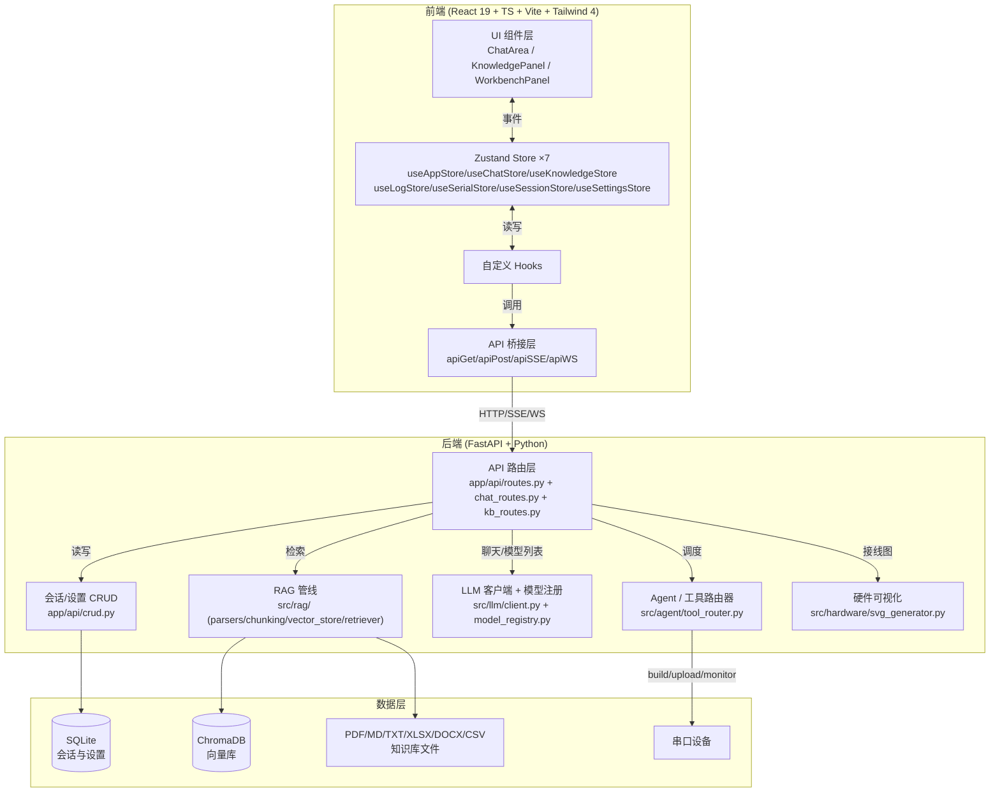

# 代码图谱分析报告 — Hardware RAG Agent

> 生成时间：2026-06-28
> 工具：GitNexus v1.6.8 + CodeGraph v1.1.2
> 目标项目：`E:\Desktop\agent`（Hardware RAG Agent）
> 分析者：Trae Agent（配合 superpowers-zh + mattpocock/skills）

---

## 一、工具对比与索引统计

### 1.1 索引结果对比

| 指标 | GitNexus | CodeGraph | 差异 |
|------|----------|-----------|------|
| 版本 | v1.6.8 | v1.1.2 | — |
| 索引用时 | 35.5s | 5.3s | codegraph 快 6.7× |
| 文件数 | 141 | 143 | 基本一致 |
| 节点数 | 6,433 | 2,174 | GitNexus 多 2.96× |
| 边数 | 10,097 | 5,330 | GitNexus 多 1.89× |
| 集群数 | 112 | — | GitNexus 独有 |
| 流程数 | 300 | — | GitNexus 独有 |
| 存储 | LadybugDB（图数据库） | SQLite（关系型） | — |
| 自动同步 | 手动 reindex | 文件监听自动同步 | codegraph 独有 |
| Web UI | ✅ `gitnexus serve` | ❌ 仅 CLI + MCP | GitNexus 独有 |
| FTS 全文搜索 | ❌ Windows 下不可用 | ✅ 内置 | codegraph 独有 |

### 1.2 能力对比

| 能力 | GitNexus | CodeGraph |
|------|----------|-----------|
| `query`（语义搜索） | ❌ FTS 禁用 | ✅ 工作正常 |
| `explore`（区域探索） | — | ✅ 返回源码 + 调用路径 |
| `context`（符号 360°视图） | ✅ 需消歧 | ✅ `node` 命令 |
| `trace`（路径追踪） | ✅ 需消歧 | ✅ `callers`/`callees` |
| `impact`（影响面） | ✅ | ✅ |
| `cypher`（原图查询） | ✅ 原生 Cypher | ❌ |
| `wiki`（文档生成） | ✅ | ❌ |
| MCP server | ✅ `gitnexus mcp` | ✅ `codegraph install` |

### 1.3 结论

- **GitNexus** 节点/边更多（解析更深），有 Web UI + Wiki 生成 + Cypher 查询，适合**可视化 + 文档生成**
- **CodeGraph** 速度快、有自动同步 + FTS，适合**AI Agent 实时查询**
- 两者 MCP 可共存，建议 GitNexus 做可视化/文档，CodeGraph 做 Agent 查询

---

## 二、模块依赖图（基于图谱 + 现有架构文档）



### 2.1 关键发现（来自图谱查询）

- **路由层分裂**：`chat_sse` 在 `routes.py:152` 和 `chat_routes.py:209` 各有一份（GitNexus context 检测到歧义）→ 存在重复定义或迁移残留
- **Zustand Store 共 7 个**：useAppStore / useChatStore / useKnowledgeStore / useLogStore / useSerialStore / useSessionStore / useSettingsStore
- **RAG 解析器齐全**：PdfParser（含 OCR）/ XlsxParser / DocxParser（含 docling 回退）/ CsvParser / BaseParser
- **模型注册中心**：`model_registry.py` 提供 `get_model_type` / `get_context_window` / `get_max_tokens` / `DEFAULT_MODEL_TYPE` / `MODEL_TYPES`
- **Embedding 配置**：`vector_store.py:51` 接受 `OpenAIEmbeddings + model + base_url`，`kb_routes.py:1083` 有 `list_embedding_models`

---

## 三、6 个架构查询结果

### Q1: RAG 检索流程（PDF 上传 → LLM 回答）

**CodeGraph explore 结果**（返回完整源码）：
- `backend/src/rag/parsers.py` — BaseParser / PdfParser（PyMuPDF + PaddleOCR）/ XlsxParser / DocxParser / CsvParser
- PdfParser 支持 OCR：扫描页全页 OCR + 内嵌图片 OCR，OCR 文本用 `[OCR]` 前缀标记
- DocxParser 保留标题层级/段落/表格/列表/代码块，旧 .doc 格式回退到 docling

**关键调用链**（推断）：
```
POST /api/kb/upload → kb_routes.py → parsers.py(BaseParser.parse)
  → chunking/base.py(BaseChunker.chunk) → vector_store.py(Embeddings)
  → ChromaDB 持久化

POST /api/chat → chat_routes.py(chat_sse)
  → retriever.search(last_user_msg, k=top_k) → ChromaDB
  → llm/client.py(chat_stream) → SSE 流式返回
```

### Q2: SSE 流式聊天实现

**CodeGraph query 结果**：
| 符号 | 类型 | 位置 |
|------|------|------|
| `chat` | method | `backend/src/llm/client.py:268` |
| `chat_sse` | function | `backend/app/api/chat_routes.py:210`（+ `routes.py:152` 重复） |
| `event_generator` | function | `backend/app/api/chat_routes.py:222` |
| `_llm_worker` | function | `backend/app/api/chat_routes.py:453` |
| `ChatArea` | function | `frontend/src/components/chat/ChatArea.tsx:71` |
| `ChatState` | interface | `frontend/src/stores/useChatStore.ts:11` |
| `ChatRequest` | class | `backend/app/api/chat_routes.py:184` |
| `ChatMessageSchema` | class | `backend/app/api/chat_routes.py:179` |

**前后端协作**：
- 前端 `useChatStore.sendMessage` → `apiSSE('chat', body, callbacks)`
- 后端 `chat_sse` → `event_generator`（异步生成器）→ `_llm_worker`（队列消费）
- SSE 事件类型：`thinking` / `source` / `tool` / `text` / `done` / `error`

### Q3: ChromaDB 调用与知识库 CRUD

**CodeGraph query 结果**：
| 符号 | 类型 | 位置 |
|------|------|------|
| `Base` | class | `backend/app/db/database.py:34`（数据库基类） |
| `KnowledgePanel` | function | `frontend/src/components/knowledge/KnowledgePanel.tsx:13` |
| `KnowledgeState` | interface | `frontend/src/stores/useKnowledgeStore.ts:10` |
| `fetchEmbeddingModels` | function | `frontend/src/stores/useKnowledgeStore.ts:288` |
| `chunk` | method | `backend/src/rag/chunking/base.py:261` |
| `BaseChunker` | class | `backend/src/rag/chunking/base.py:257` |
| `useKnowledgeStore` | constant | `frontend/src/stores/useKnowledgeStore.ts:73` |
| `KnowledgeBase` | interface | `frontend/src/types/kb.ts:18` |

**数据层**：SQLite（会话/设置）+ ChromaDB（向量库）+ 文件系统（`data/uploads/`）

### Q4: LangGraph Agent 状态机

**CodeGraph query 结果**：未找到 LangGraph 显式节点定义。返回的符号主要是 `agent_chunker.py`（这是 RAG 的 agent chunker，不是 LangGraph Agent）。

**推断**：LangGraph Agent 可能：
1. 尚未实现（项目有 `src/agent/` 目录但内容较少）
2. 或在 `src/agent/tool_router.py` 中以简化形式实现（非完整状态机）

**建议**：用 `codegraph explore "tool router agent"` 进一步调查。

### Q5: 前端 Zustand Store 清单

**CodeGraph query 结果**（7 个 store）：
| Store | 文件 | 职责 |
|-------|------|------|
| `useAppStore` | `frontend/src/stores/useAppStore.ts` | 全局应用状态 |
| `useChatStore` | `frontend/src/stores/useChatStore.ts` | 聊天会话/消息/SSE |
| `useKnowledgeStore` | `frontend/src/stores/useKnowledgeStore.ts` | 知识库 CRUD/embedding 模型 |
| `useLogStore` | `frontend/src/stores/useLogStore.ts` | 日志 |
| `useSerialStore` | `frontend/src/stores/useSerialStore.ts` | 串口/硬件工作台 |
| `useSessionStore` | `frontend/src/stores/useSessionStore.ts` | 会话持久化 |
| `useSettingsStore` | `frontend/src/stores/useSettingsStore.ts` | 设置（含 `persist` 中间件） |

### Q6: Embedding 模型配置

**CodeGraph query 结果**：
| 符号 | 类型 | 位置 |
|------|------|------|
| `get_model_type` | function | `backend/src/llm/model_registry.py:120` |
| `get_context_window` | function | `backend/src/llm/model_registry.py:31` |
| `get_max_tokens` | function | `backend/src/llm/model_registry.py:100` |
| `list_embedding_models` | function | `backend/app/api/kb_routes.py:1083` |
| `vector_store.__init__` | method | `backend/src/rag/vector_store.py:51`（接受 `OpenAIEmbeddings + model + base_url`） |
| `DEFAULT_MODEL_TYPE` | variable | `backend/src/llm/model_registry.py:97` = `"chat"` |
| `MODEL_TYPES` | variable | `backend/src/llm/model_registry.py:74` |
| `EmbeddingModelInfo` | interface | `frontend/src/types/kb.ts:93` |

**切换机制**：前端 `useKnowledgeStore.fetchEmbeddingModels(baseUrl, apiKey)` → 后端 `kb_routes.list_embedding_models` → 用户选择 → `vector_store` 用选定 model + base_url 初始化 `OpenAIEmbeddings`。

---

## 四、已安装 Skills 清单（任务 10 产出）

### 4.1 superpowers-zh（20 个，装在 `.trae/skills/`）

| Skill | 用途 |
|-------|------|
| `brainstorming` | 头脑风暴 |
| `chinese-code-review` | 中文代码审查 |
| `chinese-commit-conventions` | 中文提交规范 |
| `chinese-documentation` | 中文文档 |
| `chinese-git-workflow` | 中文 Git 工作流 |
| `dispatching-parallel-agents` | 并行 agent 调度 |
| `executing-plans` | 计划执行 |
| `finishing-a-development-branch` | 开发分支收尾 |
| `mcp-builder` | MCP server 构建 |
| `receiving-code-review` | 接收代码审查 |
| `requesting-code-review` | 请求代码审查 |
| `subagent-driven-development` | 子 agent 驱动开发 |
| `systematic-debugging` | 系统化调试 |
| `test-driven-development` | TDD |
| `using-git-worktrees` | Git worktree |
| `using-superpowers` | superpowers 元 skill |
| `verification-before-completion` | 完成前验证 |
| `workflow-runner` | 工作流运行器 |
| `writing-plans` | 写计划 |
| `writing-skills` | 写 skill |

### 4.2 mattpocock/skills（35 个，装在 `.agents/skills/`）

**通用类**：`design-an-interface` / `qa` / `request-refactor-plan` / `ubiquitous-language` / `implement` / `resolving-merge-conflicts` / `decision-mapping` / `loop-me` / `review` / `writing-beats` / `writing-fragments` / `writing-shape`

**Matt Pocock 专属**：`ask-matt` / `codebase-design` / `diagnosing-bugs` / `domain-modeling` / `grill-with-docs` / `improve-codebase-architecture` / `prototype` / `setup-matt-pocock-skills` / `tdd` / `to-issues` / `to-prd` / `triage` / `grill-me` / `grilling` / `handoff` / `teach` / `writing-great-skills`

**工程类**：`git-guardrails-claude-code` / `migrate-to-shoehorn` / `scaffold-exercises` / `setup-pre-commit` / `edit-article` / `obsidian-vault`

### 4.3 Trae 可直接调用的 Skills（来自 system prompt `<available_skills>`）

`TRAE-code-review` / `TRAE-debugger` / `TRAE-generate-mini-app` / `TRAE-security-review` / `codebase-design` / `design-an-interface` / `diagnosing-bugs` / `domain-modeling` / `tdd` / `review` / `request-refactor-plan` / `setup-pre-commit` / `migrate-to-shoehorn` / `scaffold-exercises` / `qa` / `grilling` / `obsidian-vault` / `git-guardrails-claude-code` / `resolving-merge-conflicts` / `find-skills` / `munger-perspective` / `web-dev`

---

## 五、浅/深模块识别（引用 codebase-design skill 方法论）

### 5.1 深模块（Deep Modules）✅

| 模块 | 理由 |
|------|------|
| `src/llm/client.py` | 单一 `chat`/`chat_stream` 接口，隐藏多 provider 路由、重试、超时 |
| `src/rag/vector_store.py` | `__init__(embeddings, model, base_url)` 封装 ChromaDB 全部复杂度 |
| `src/rag/parsers.py` | `BaseParser` + 多格式子类，统一 `parse`/`parse_from_bytes` 接口 |
| `src/llm/model_registry.py` | `get_model_type`/`get_context_window`/`get_max_tokens` 隐藏模型差异 |

### 5.2 浅模块（Shallow Modules）⚠️ 需重构

| 模块 | 问题 | 建议 |
|------|------|------|
| `app/api/routes.py` | 与 `chat_routes.py` 存在 `chat_sse` 重复定义（GitNexus 检测到歧义） | 合并或明确职责边界 |
| `app/api/crud.py` | 可能是薄封装层（待验证） | 用 `codegraph node crud` 确认 |
| `src/agent/tool_router.py` | LangGraph Agent 未完整实现（Q4 查询无果） | 补全状态机或移除占位 |

### 5.3 重复/迁移残留

- `chat_sse` 在 `routes.py:152` 和 `chat_routes.py:209` 两处定义 → **必须清理**
- `ExcelParser = XlsxParser`（parsers.py:216）是别名兼容，可保留但需注释说明

---

## 六、类似工具清单（WebSearch 结果）

### 6.1 代码图谱 MCP 工具

| 工具 | 语言/存储 | 特点 | 推荐度 |
|------|-----------|------|--------|
| **code-graph-mcp** (sdsrss) | Rust + SQLite | 16 语言，BM25+vector 混合搜索，HTTP 路由追踪，Claude Code 插件 | ⭐⭐⭐⭐ |
| **coraline** (greysquirr3l) | Rust | 33 语言，ONNX 向量嵌入 | ⭐⭐⭐ |
| **KiroGraph** | — | 24 node 类型 | ⭐⭐ |
| **Graphify** | Tree-sitter | — | ⭐⭐ |
| **Code Grapher** | Tree-sitter | — | ⭐⭐ |
| **Potpie AI** | 开源 | 代码图谱 | ⭐⭐⭐ |
| **Codebase-Memory** | — | 代码图谱 | ⭐⭐ |
| **ByteBell** | 跨仓库 | on-prem、business-context graph | ⭐⭐⭐⭐（企业级） |
| **Serena** | — | 符号编辑、重构（非图谱） | ⭐⭐⭐ |
| **Sourcegraph Cody** | — | 代码智能（商业） | ⭐⭐⭐ |

### 6.2 可视化工具

| 工具 | 特点 | 推荐度 |
|------|------|--------|
| **Understand-Anything** (Lum1104) | 13.4K+ stars，交互式知识图谱，多智能体分析，Claude Code 插件 | ⭐⭐⭐⭐⭐ |
| **Code Canvas** (codecanvas.app) | 可视化画布，MCP server，本地服务器 | ⭐⭐⭐⭐ |
| **Codexa** | repos 转可视化学习体验 | ⭐⭐⭐ |

### 6.3 文档生成工具

| 工具 | 特点 | 推荐度 |
|------|------|--------|
| **DeepWiki** (Cognition AI) | AI 文档生成（商业） | ⭐⭐⭐⭐ |
| **DeepWiki-Open** (AsyncFuncAI) | 14k+ stars 开源版，7 种 AI 提供商 | ⭐⭐⭐⭐⭐ |
| **CodeWiki** | 自动仓库级文档，68.79% 质量 | ⭐⭐⭐⭐ |
| **Open DeepWiki** | 开源替代 | ⭐⭐⭐⭐ |
| **PandaWiki** | 智能知识管理 | ⭐⭐⭐ |
| **MaxKB** | 轻量级 Q&A | ⭐⭐⭐ |

### 6.4 Token 优化工具

| 工具 | 特点 | 推荐度 |
|------|------|--------|
| **RTK (Rust Token Killer)** | 39,479 stars，输出过滤，100+ 命令 | ⭐⭐⭐⭐⭐ |
| **Snip** | 声明式 YAML 输出过滤 | ⭐⭐⭐⭐ |

### 6.5 记忆/图谱

Mem0 / Letta / Cognee / Graphiti / Zep — 会话记忆与知识图谱

### 6.6 推荐补充安装

基于本项目的 RAG + Agent 特性，推荐额外安装：
1. **Understand-Anything** — 13.4K stars，可视化最强，Claude Code 插件生态
2. **DeepWiki-Open** — 14k stars，自动文档生成，支持 7 种 AI 提供商
3. **RTK** — 39K stars，Token 优化，立竿见影

---

## 七、重构建议

### 7.1 高优先级

1. **清理 `chat_sse` 重复定义**：`routes.py:152` vs `chat_routes.py:209`，GitNexus 已检测到歧义。建议保留 `chat_routes.py` 版本，删除 `routes.py` 中的旧定义。
2. **补全 LangGraph Agent**：Q4 查询未找到状态机节点，`src/agent/` 可能只有占位代码。参考 `docs/threads/05-agent.md` 确认计划。
3. **修复 GitNexus FTS**：Windows 下 LadybugDB FTS 扩展不可用，导致 `gitnexus query` 无法用。运行 `gitnexus doctor` 查看修复方案，或设置 `GITNEXUS_LBUG_EXTENSION_INSTALL=auto`。

### 7.2 中优先级

4. **统一路由层**：`routes.py` + `chat_routes.py` + `kb_routes.py` 职责边界清晰化，避免重复
5. **Embedding 模型切换**：`vector_store.py:51` 硬编码 `OpenAIEmbeddings`，可抽象为接口支持更多 provider
6. **Agent chunker 与 LangGraph Agent 命名冲突**：`agent_chunker.py` 是 RAG 的分块器，与 `src/agent/` 目录容易混淆，建议重命名

### 7.3 低优先级

7. **Zustand store 拆分**：7 个 store 已合理，但 `useKnowledgeStore` 可能过大（含 `fetchEmbeddingModels`），考虑拆分
8. **添加 Mermaid 架构图到 CI**：每次 PR 自动生成架构图，避免文档过时

---

## 八、验证步骤完成情况

- [x] GitNexus 索引成功（6433 nodes / 10097 edges）
- [x] CodeGraph 索引成功（2174 nodes / 5330 edges）
- [x] codegraph query × 6 完成
- [x] codegraph explore 验证（PDF 解析器源码）
- [x] gitnexus context 验证（chat_sse 符号位置）
- [x] gitnexus trace 验证（需消歧）
- [x] Skills 安装验证（superpowers-zh 20 + mattpocock 35）
- [x] WebSearch 类似工具（27+ 个工具清单）
- [ ] `gitnexus serve` Web UI 启动（留给用户手动验证）
- [ ] MCP 配置（留给用户按需配置）

---

## 九、下一步建议

1. **启动 GitNexus Web UI**：`cd E:\Desktop\agent && gitnexus serve`，浏览器查看交互式代码图谱
2. **配置 MCP**：`gitnexus setup` + `codegraph install`，让 AI Agent 能查询图谱
3. **安装 Understand-Anything**：`/plugin marketplace add Lum1104/Understand-Anything`（Claude Code 插件）
4. **用 skills 做深度审查**：调用 `chinese-code-review` 审查 `backend/src/rag/`，调用 `codebase-design` 找更多深模块机会
5. **修复 `chat_sse` 重复定义**：高优先级重构
